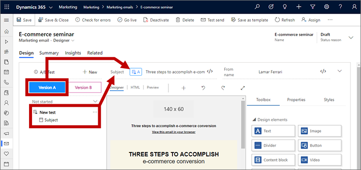

# Early access: Design and run A/B test on your email designs

[!INCLUDE [cc-marketing-early-access-2019w2](../includes/cc-marketing-early-access-2019w2.md)]

Use email A/B testing to find out which of two similar designs is likely to be most successful and then send the winning design automatically. You start by creating an initial design (the "A" version), and then use that as the basis to create a "B" version of the design in which you have modified a small part of it (such as the subject). Finally, choose your conditions for success (such as most opened or most clicked) and run the test as part of a customer journey.

The journey runs the entire test automatically. It starts by sending version A to a small part of your segment (for example 10% of contacts) while also sending version B to another part of the segment (typically also 10%). It waits for a period of time you choose (for example, 24 hours) and then analyzes the interaction results and chooses a winner based on your selected criteria (such as most opened). The journey then sends the winning design to the rest of the segment (the remaining 80%) automatically.

> [!NOTE]
> In the early access version of this feature, you'll be able to A/B test the message subject and/or sender name. In the final release, we expect also to enable testing on email content.

## Create a marketing email for A/B testing

To set up an A/B test, start by creating your basic design (this will be the A version) and then create a B version where just a small part of the design has changed. Each B version allows only one type of change (such as subject _or_ from address), but you can define several test for the same design, where the A version is always the same, but with a different B version for each test.

To set up A and B designs for a message:

1. Create your initial design as usual, as described in [Prepare marketing email messages](prepare-marketing-emails.md). Perfect the design as much as possible and be sure to check it for errors to make sure it can go live.

1. When your A design is finished, select the **A/B test** button.

    

1. The **A/B test** panel opens. This is where you'll see each test that you add for your current design (but so far, there aren't any). Select the **New** button at the top of this panel to open a drop-down list and then select one of the following:

   - **Subject**: Adds a subject test. This type of test lets you choose a different subject for the B version of your design.
   - **From name**: Adds a from-name test. This type of test lets you choose a different from-name for the B version of the design. Recipients will see this as the name of the sender of the message. This won't change actual the from-address, which will remain the same for both versions.

    In each case, you can choose to use [assist-edit](dynamic-email-content.md#use-assist-edit-to-place-dynamic-field-values) (**</>**) to define the subject or from-name using a dynamic expression for the A and/or B versions (as usual).

    

    > [!NOTE]
    > You can add as many tests as you like by repeating this step. Remember that the A version is the same for all tests, but the B version is specific for each test, so you can have many different B versions.

    > [!NOTE]
    > You can run each test just once, on a single email tile in a single journey. As soon as you start a journey with an email A/B test running, you won't be able to select that test for any other email tile. If you'd like to run several tests on a single design, then add more tests to **A/B test** panel. 

1. A new test of  your selected type is now added to the **A/B test** panel. Note the following:
   - Each test has a name (which defaults to "New test") and a type (which is shown below the name and indented).
   - You can change the name of any listed test by opening its ellipsis menu ( **…** ) and selecting **Rename**. This name is displayed in the customer journey email tile when you are choosing which test to run for that journey .
   - Select a test from the **A/B test** panel to work with that test.
   - Use the **Version A** and **Version B** buttons at the top of the **A/B test** panel to switch between the two versions of the selected test.
   - The parameter being controlled by your selected test shows either an **A** icon  or a **B** icon  to indicate what you are testing and which version is being shown (and editable). The icon changes to match the version button you have selected ( **Version A** or **Version B** ).

    

1. Select a test from the **A/B test** panel and then select the **Version B** button. Now change the design of the item you are testing (subject or from-address), which is now highlighted with a **B** icon 
. You can toggle back and forth using the **Version A** and **Version B** buttons to compare the versions for the selected test and continue to edit each version while it's being displayed. 

    > [!NOTE]
    > Even after you have enabled A/B testing you can still edit parts of your message that aren't part of any tests. When you to this,  your edits will affect all versions (the A version and all B versions), regardless of which test and version button are currently selected. But if you edit a setting that shows an **A** icon , then you are only editing the A version; and if you edit a setting that shows a **B** icon , you are only editing the B version of the selected test..

1. Continue working in this way until you have set up all of the tests you want to run on the current email design.
1. When you're done setting up your designs and tests, select **Go live** to make your message available for use with a customer journey.

## Prepare to execute your test from a customer journey

When you're email is ready to test, use a customer journey to send it. You can include A/B-test emails in any type of journey, regardless of complexity, and including journeys that you are using in a production campaign. The strategy is to send each design to a small part of the full segment being targeted by the journey, wait to see how those recipients react to each version of the message, and then send the best performing message to the rest of the segment. You can choose what the winning conditions are (most clicks or most opens), and also how long to run the test for.

To add an A/B test to a journey:

1. Set up your journey as usual, and be sure to include one or more email tiles where you can place your A/B-test email(s).

1. Select an email tile that included in your journey pipeline and open the **Properties** tab in the side panel to start configuring the tile.

1. In the **Marketing email message** field on the **Properties** panel, select the email message you set up for A/B testing. Note that when a message that has one or more A/B tests designed for it is selected for an email tile, that tile shows **A** and **B** icons in its corner. These are shown in gray for now because you haven't yet set up the test for this tile (they will turn blue after you enable the test).

    

1. Scroll down in the **Properties** panel until you see the **A/B testing** slider and then select it to turn on the test. This opens the A/B test settings.

    

    > [!NOTE]
    > If you select an email message that has A and B designs but don't enable A/B testing for the tile, then version A will be sent to all recipients.

1. Make the following settings to set up the test:
   - **Choose A/B test**: Your selected email design must have at least one test set up, but it might have more. Select the name of the test that you want to run on this tile. You can run at most one test at a time.
   - **A/B distribution**: Choose how many contacts (as a percentage of the total number of contacts in the target segment) you'd like to send each version of the design to during the test. The percentage chosen for the left drop-down list will receive design A, and the percentage chosen for the right will receive design B. Contacts to be included in the test are chosen at random, as is the version each will receive.
   - **Winning metric**: Choose whether to decide the winning design based on the click-through rate (how often a recipient clicked on a link in the message) or on the open rate (how often a recipient opened the message). In each case, the winner is the version that produced the most clicks or opens as a proportion of the total number of times that version was sent.
   - **Test duration**: Use these settings to establish how long the test should run. For best results, we recommend running each test for at least 24 hours, or longer if possible—especially if you are targeting a worldwide audience (to compensate for time zones). At the end of this time, the system will analyze the results and send the winning design to the remaining contacts in the segment. Contacts who received the "losing" design won't be re-sent the winning one.
   - **If the results are inconclusive, send**: Choose what to do if the test doesn't produce a clear winner. In this case, you can choose to send version A, version B, or a random 50/50 split of both versions to all remaining contacts.
1. Finish setting up your journey as usual and the go live.

## Inspect your test results

You can check the progress and results of your A/B tests at any time by examining the email tiles of your customer journey. To do so:

1. Open the customer journey.

1. Select the email tile where you are running an A/B test.

1. Scroll down to the bottom of the **Data** panel for the selected email tile. Here you'll see a display that shows the percentage of contacts that you sent each version to (including the winning version), how much time there is left in the test, and which design was declared the winner (provided the test has finished).

    

1. Select the **View details** link here to get even more information about the test results. This opens a dialog that shows KPIs for each design from the test. For more information about email KPIs and how to interpret them, see the [Insights glossary](insights-glossary.md).

    

### See also

[Design your digital content](design-digital-content.md)  
[Design elements reference](content-blocks-reference.md)  
[Prepare marketing email messages](prepare-marketing-emails.md)  
[Create automated campaigns with customer journeys](customer-journeys-create-automated-campaigns.md)  
[Customer journey tiles reference](customer-journey-tiles-reference.md)  

