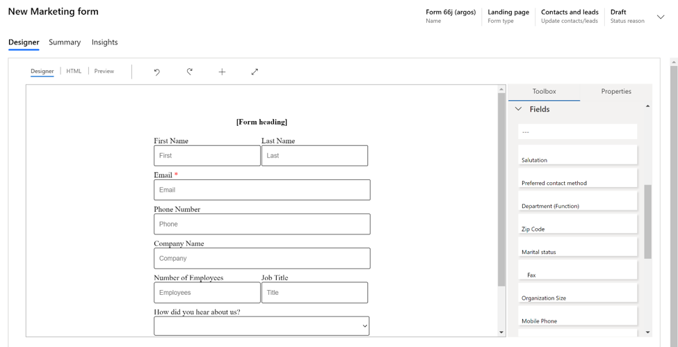

# Early access: Improved email content designer

> [!IMPORTANT]
> This is an early access feature, which means that it's currently available only on opted-in instances. You can opt in for early access on any instance, but we recommend that you do so only on trial, test, or sandbox instances, which will give you a chance to learn the new functionality before it shows up on your production instances later this year.
>
> For instructions on how to opt in and enable early access, see [Opt in to early access updates](https://docs.microsoft.com/power-platform/admin/opt-in-early-access-updates). For more information about the 2020 release wave 1 schedule, and for answers to frequently asked questions about the early access program, see [2020 release wave 1 features available for early access](https://docs.microsoft.com/dynamics365-release-plan/2020wave1/features-ready-early-access).
>
>We encourage all customers to provide feedback related to early access features on the [Dynamics 365 Marketing Forum](https://community.dynamics.com/365/marketing/f/dynamics-365-for-marketing-forum), your Microsoft contact or partner, and/or through [Microsoft Support](https://docs.microsoft.com/power-platform/admin/get-help-support).

## Improved email editor design and functionality

- New and improved email templates that use new layout capabilities to jumpstart the email design process.
- You can now click and drag to resize email content elements such as images, dividers, and buttons.
- Picture-over-picture and button-over-picture capabilities allow you to set background images and make email messages more attractive.
- New custom preheaders feature improves email message open rates.
- Selectable columns inside sections.
- Ability to add background images inside columns.
- Remove borders, margins, or padding from top-level email content.
- Improved color-picker control.
- Zero state for email editor when no sections are present.
- Contextual menu and enriched properties.
- Improved tile styles for elements.
- Ability to update selection tags with parent element.
- Enhanced email preview.
- Accessibility and design testing built into the email designer.
- Set rounded corners for images, borders, and buttons.

## Improvements to the pages and forms content editors

The email content designer improvements are also available in the forms and pages designers. Additionally, the fields view in the toolbox is improved the simplify the process of working with multiple custom fields. Form fields are also now searchable for easier navigation.

