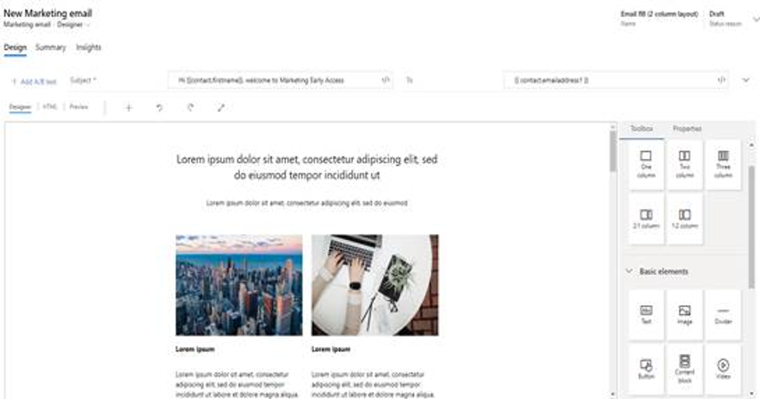

# Early access: Improved email content designer

> [!IMPORTANT]
> This is an early access feature, which means that it's currently available only on opted-in instances. You can opt in for early access on any instance, but we recommend that you do so only on trial, test, or sandbox instances, which will give you a chance to learn the new functionality before it shows up on your production instances later this year.
>
> For instructions on how to opt in and enable early access, see [Opt in to early access updates](https://docs.microsoft.com/power-platform/admin/opt-in-early-access-updates). For more information about the 2020 release wave 1 schedule, and for answers to frequently asked questions about the early access program, see [2020 release wave 1 features available for early access](https://docs.microsoft.com/dynamics365-release-plan/2020wave1/features-ready-early-access).
>
>We encourage all customers to provide feedback related to early access features on the [Dynamics 365 Marketing Forum](https://community.dynamics.com/365/marketing/f/dynamics-365-for-marketing-forum), your Microsoft contact or partner, and/or through [Microsoft Support](https://docs.microsoft.com/power-platform/admin/get-help-support).

## Improved email editor design and functionality

The improved email editor enables you to create eye-catching emails faster than ever. New email templates with updated layout capabilities give you a head start on the design process. More intuitive controls enable you to drag and resize email content elements including images, dividers, and buttons. Improved color picker controls offer support across browsers and mobile devices. Updated property controls allow you to set email-wide properties, creating a consistent look with just a few clicks.

The new email editor offers many customization choices. Picture-over-picture and button-over-picture capabilities add flexibility to your designs. To help boost email open rates, you can now add custom preheaders with tailored email message preview text. Options such as rounded corners and individually customizable columns offer even more design possibilities.

The email preview feature is also improved. You can now preview fields with resolved dynamic text. The enhanced preview means you’ll see exactly how your messages will look when customers receive them. The built-in accessibility checker helps you ensure that all recipients can view your messages.

## Improvements to the pages and forms content editors

The email content designer improvements are also available in the forms and pages designers. Additionally, the fields view in the toolbox is improved to simplify the process of working with multiple custom fields. Form fields are also now searchable for easier navigation.

