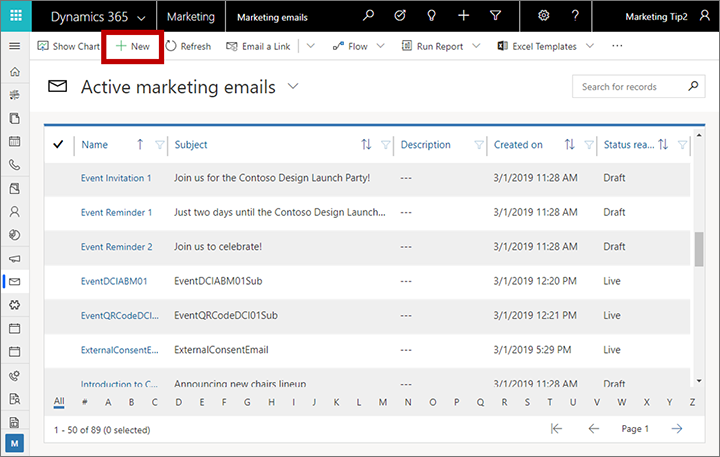
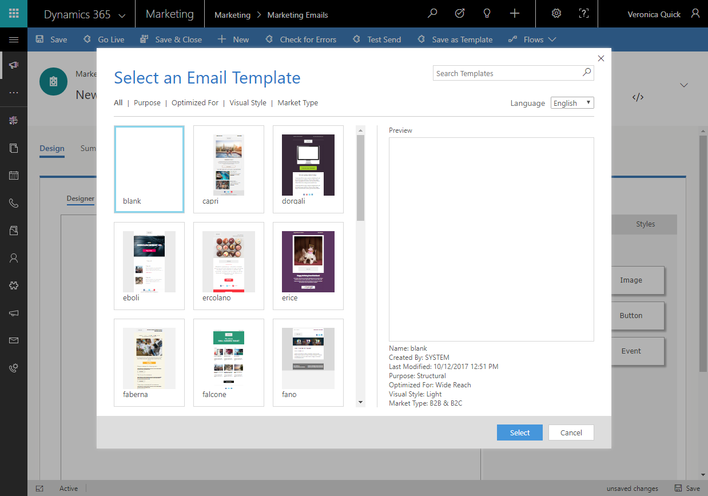
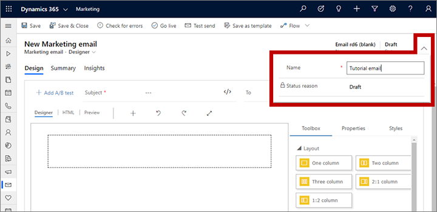
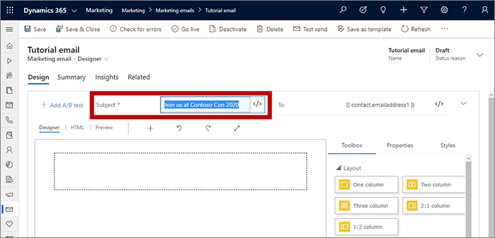

# Create a new email and design its content

Read this article to learn how to create an email message and design its content. See also the [email marketing overview](prepare-marketing-emails.md) for a summary of the full message creation, delivery, and analysis process for email marketing.

For a step-by-step tutorial on how to create and send your first marketing email message, see also [Create a marketing email and go live](create-marketing-email.md)

## Create a new email marketing message

To create a new email marketing message, go to **Marketing** > **Marketing Execution** > **Marketing emails** and select **New** on the command bar.

## Establish your basic layout by choosing the right template

The first thing you are asked when you create a new message is to select a template. Dynamics 365 Marketing includes many templates, each of which includes both structural and style elements. There's also a blank template, which lets you start from scratch with an empty message. After you select a template, you'll be in the email designer, where you can finish creating your email content.

When you create a new message from a template, the template content is copied into your new message. The message and template aren't linked, so when you edit the message, the template won't change. Likewise, any future changes that you make to a template won't affect any existing messages that were created using it.

You can also create your own custom templates. Custom templates can help you and others in your organization create new messages more quickly in the future. Design your templates so that they reflect your organization's graphical identity and fit closely with the types of campaigns you run most regularly. You can save any existing message as a template by selecting **Save as template** on the command bar. You can also work directly in the templates area (**Marketing** > **Marketing Templates** > **Email templates**) to view or edit existing templates and create new ones. When setting up a template, you can add various types of metadata (purpose, style, market type, and optimized for) which make each template easier to identify and find by using filters.

More information: [Work with email, page, and form templates](email-templates.md)

## Make basic and required settings

After choosing a template, a new email message opens showing the initial content from your selected template. We recommend that you start by making a few basic and required settings for the message. Though you can wait until later to make these if you prefer, you won't be able to save your work until you've entered the required settings at least. You can change any of these settings later if needed, even after saving your message.

### Enter a name for the message

Each email message must have a name, which identifies the message when you're looking at the list view or when selecting messages to include in a customer journey. To enter a name, select the **More header fields** button at the side of the header to open a drop-down dialog and then enter a **Name** for your new message.

### Enter a subject for the message

Enter a **Subject** for your message in the field provided at the top of the page. This is a very important setting because this is one of the first things recipients will see when they receive the email, and they may use this to decide whether or not to read the message.

### Other important settings

Once you have a name and subject, you'll be able to start saving your message. Other important settings are also provided above the design, together with the **Subject**, but these should already show default values that should work fine in most situations. To access all the header and preheader settings, click the expand caret to the right of the **To** box. The settings include:

- **To**: This must contain an expression for finding each address the message will be sent to. This should almost always be the dynamic expression provided by default, which is `{{contact.emailaddress1}}`.
- **From name**: This is the name that recipients will see as the sender when they receive the message. By default, this is the name of the user who created the message. Recipients are more likely to open your message if they see a name they recognize here.
- **From address**: This is the email address for the person who sent the message. By default, this is the email address of the user who created the message. The domain shown here should be authenticated as belonging to your organization, which can have a dramatic impact on deliverability.
- **Preview text**: Preview text allows you to create a custom preheader that displays in your recipient's inbox before they open the email message. The preheader is your chance to create a line that grabs the recipient's attention as soon as they see your message.

Each of these settings is repeated on the **Summary** tab. For complete details about how to use these settings, see [Set the sender, receiver, language and legal designation for a message](email-properties.md). We recommend that you don't change any of these settings until you've read that topic.

## Design your content

The email content designer resembles the other [digital content designers](design-digital-content.md) provided in Dynamics 365 Marketing. Work with it as follows:

- Use the **Design** > **Designer** tab graphical tool to design your content by using drag-and-drop, point-and-click operations. Add new elements to your design by dragging design elements from the **Design** > **Designer** > **Toolbox** tab to the canvas. Choose a design elements that already exists in your design, and then open the **Design** > **Designer** > **Properties** tab to configure it and style it. To style the overall message with basic fonts, colors, and background, open the **Style** tab.

- When you select a design element on the canvas, you'll usually see a formatting toolbar just above the element. The controls offered by the toolbar vary depending on which type of element you've selected. Most toolbars provide buttons to move, copy, or delete the selected element, in addition to specialized buttons that vary by element type. The toolbar also includes an arrow which allows you to quickly switch to the parent element that contains the selected element.

- When a text element is selected, you'll get a full formatting toolbar that you can use to apply basic text formatting like you would in Microsoft Word. It also includes an **[Assist edit](dynamic-email-content.md#assist-edit)** button , which you can use to add dynamic content such as a mail-merge field that displays the recipient's name. More information: [Use assist edit to place dynamic field values](dynamic-email-content.md#assist-edit)

- To resize an image, divider, or button, click to select the element. You will see small circles on the corners and sides of the element. Select a circle and drag to resize.

- Use the **Designer** > **HTML** tab to edit the raw HTML directly. You might use this to paste in an existing HTML design, or to fine-tune the code in ways that aren't supported by the graphical editor (such as custom attributes or logic). The HTML editor has two subtabs: **HTML Source** (for editing the design, including logical expressions and dynamic content) and **HTML Output** (which resolves all dynamic content to provide static HTML that you can use in other applications).

More information: [Design your digital content](design-digital-content.md)

> [!IMPORTANT]
> When you're designing email content, you should always try to minimize the size of your messages as much as you can. When it comes to the text and code content (not including referenced image content), we recommend that you always keep your files under 100 KB for the following reasons:
> 
> - Emails larger than 100 KB are often flagged as spam by spam filters
> - Gmail truncates messages after the first 102 KB of source text and coding.
> - Emails larger than 128 KB can't be delivered by a customer journey (the journey will [fail its error check](email-check-golive.md) if it includes messages larger than this)
> - Large emails take longer to load, which may annoy recipients.

> [!NOTE]
> Microsoft Outlook supports local customizations and plugins that can affect the way messages are rendered. In some cases, recipients using customized Outlook installations may see odd layouts or repeated page elements when viewing pages designed in Dynamics 365 Marketing. These effects can't be simulated by the designer. If necessary, you can use [test sends](email-preview.md) to see how your designs look in specific Outlook configurations.

## Add standard, required, and specialized links to your message

Marketing messages are delivered as HTML and therefore support hyperlinks. Some types of links provide access to special features that are hosted by Dynamics 365 Marketing, whereas others can simply be standard links to content anywhere on the web. A subscription center link is required before any message can pass the error check and go live, but other links are optional, so you can use them only as needed. 

The following list describes the types of links that are available. You'll use the [assist-edit](dynamic-email-content.md#assist-edit) feature to add most types of dynamic links as text in a text element, while other types of links are added by using a dedicated design-element type (such as an event element).

- **Standard links**: You can add standard links to any text content by highlighting the link text and selecting **Link** on the text toolbar. You can also add link URLs to many other types of design elements, including images and buttons. When your message goes live, Dynamics 365 Marketing replaces each link with a unique redirect URL that targets your Dynamics 365 Marketing server and identifies the message recipient, message ID, and the destination you specified for the link. When a contact clicks a link, Dynamics 365 Marketing logs the click and then forwards the contact directly to the URL you specified.
- **Event, survey, or landing page**: These links go to an event website, survey, or landing page. You can add them as text links in a text element, or as colorful call-to-action buttons. To create a button, drag an event, survey, or landing-page element to your email design and then configure which item the element should link to. To create a text link, select some text in a text element and then use the [assist-edit](dynamic-email-content.md#assist-edit) feature.
- **Subscription center (required)**: All marketing email messages must include a link to a subscription center. A subscription center includes mailing lists available from your organization, including an option for contacts to opt out of all marketing emails. Contacts might also be able to update their contact details here. Dynamics 365 Marketing includes a standard subscription center, which you can edit to contain your subscription lists and to reflect your graphical identity (you can also create additional pages to support multiple subscription options, languages, or brands). You'll add a subscription center link to your page by highlighting the link text and selecting **Link** on the text toolbar, and then using the [assist-edit](dynamic-email-content.md#assist-edit) feature to select the subscription center URL from the content settings.
- **Forward to a friend**: This type of link opens a form that contacts can use to forward a marketing email to their own friends or colleagues by entering recipients' email addresses. It's a good idea to include this type of service for your contacts because messages forwarded by using the forward form are counted correctly in your email results and analytics (messages forwarded by using a contact's local email client forward feature won't be registered in Dynamics 365 Marketing, and all message opens and clicks performed by the recipients who were forwarded the message will be credited to the original recipient). A forward-to-a-friend page ID can be included in each set of content settings, but none is provided out of the box, so you must create a forwarding page and add it to your content settings to use this feature. You add a forward-to-a-friend link to your page  by highlighting the link text and selecting **Link** on the text toolbar, and then using the [assist-edit](dynamic-email-content.md#assist-edit) feature to select the subscription center URL from the content settings.
- **View as a web page**: This link opens the marketing email message in a web browser. Some recipients will find this useful if their standard email client is having trouble rendering the message. You add this link to your page by highlighting the link text, selecting **Link** on the text toolbar, and then using the [assist-edit](dynamic-email-content.md#assist-edit) feature to select the view-as-webpage URL from the message object.

For more information about assist edit, content settings, and the message object, see [Add dynamic content to email messages](dynamic-email-content.md).

## Add dynamic content

Dynamic content is content that gets resolved just before a message is sent to a specific individual. You'll typically use dynamic content to merge information from the recipient's contact record (such as first and last name), to place special links, and to place information and links from the content settings. If you're comfortable working in code, you can also create custom logic that includes conditional statements, while loops, and more. You can use dynamic content in your message body and in the message header fields (subject, from address, and from name).

For complete details about these and other dynamic-content features, see [Add dynamic content to email messages](dynamic-email-content.md)

### See also

[Email marketing overview](prepare-marketing-emails.md)
[Create a marketing email](create-marketing-email.md)  
[Design your digital content](design-digital-content.md)  
[Accessibility and keyboard shortcuts](designer-shortcuts.md)
[Design elements reference](content-blocks-reference.md)  
[Work with email, page, and form templates](email-templates.md)  
[Upload and use images and files](upload-images-files.md)  

[!INCLUDE[footer-include](../includes/footer-banner.md)]