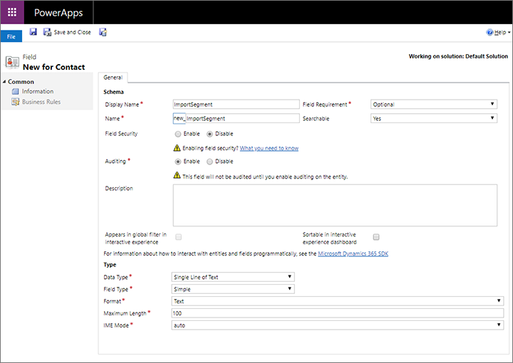
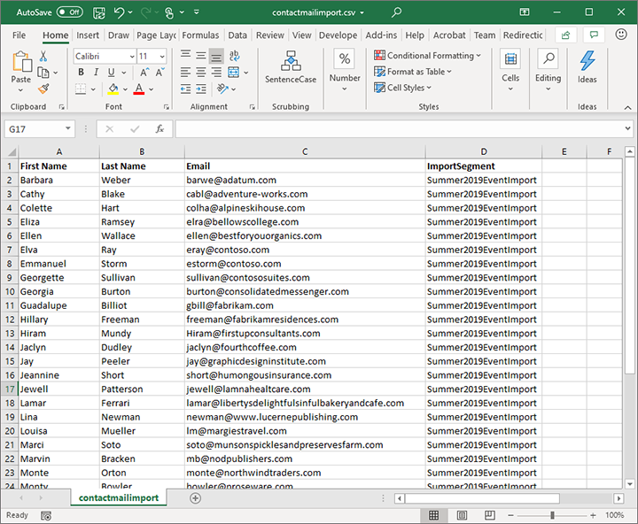
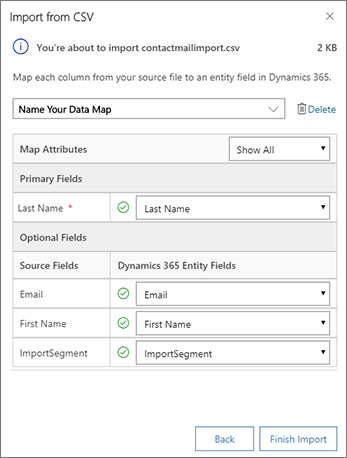
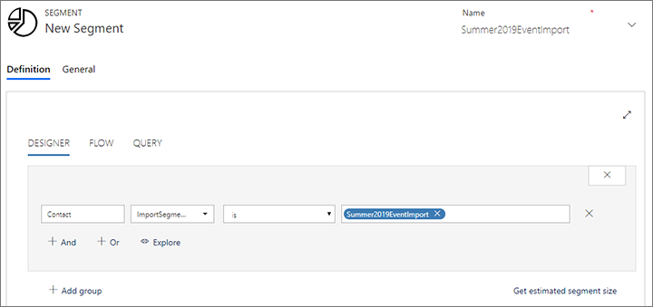
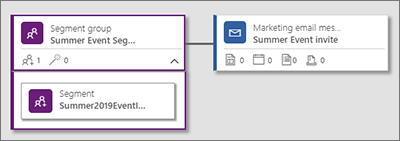

# Import and email all contacts from a spreadsheet

This tutorial provides an example of how to send marketing email messages to all of the contacts listed in a Microsoft Excel spreadsheet.

> [!NOTE]
> The scenario described here will import contacts from an Excel sheet into Dynamics 365, create a segment that finds those imported contacts, and then create a customer journey to email that segment. This scenario will only work when the incoming contacts aren't already present in your database. If you are using duplicate detection on import (which most people do), then any incoming contact that is found to match an existing contact will be dropped from the import and therefore not included in the segment of imported contacts. Please consider whether this scenario will meet your needs before trying to implement it.

> [!IMPORTANT]
> Never rent or buy mailing lists of contacts that haven't opted in to receive marketing emails from your organization. Using purchased or rented lists will likely produce a high number of hard bounces, spam complaints, spam-trap hits, and other issues that will reduce your sender reputation and with it your [email deliverability rates](get-ready-email-marketing.md). In many jurisdictions, sending unsolicited email without the recipient's consent will violate local regulations (such as the [GDPR](gdpr.md) in the European Union). If your email marketing campaigns generate too many bounces and spam complaints, you also risk losing your ability to send email with Dynamics 365 Marketing. It's your organization's responsibility to ensure that it complies with all relevant laws in the countries/regions targeted by your marketing campaigns.

## Step 1: Customize your contact entity

> [!NOTE]
> This step requires admin privileges, but only needs to be done once per instance. If you're not an admin, then please contact your admin for help with this step if it's not already been done on your instance.

If you don't already have one, then add a custom field to the contact entity to hold a value that identifies each contact that is part of a given spreadsheet. For instructions, see [How to create and edit fields](/powerapps/maker/common-data-service/create-edit-fields). Later, you'll be able to create a segment that looks for a specific value in this field and thereby finds all contacts that were listed in the original spreadsheet.

For this example, we'll assume you created a text field called "ImportSegment" for this purpose. Configure the field as follows (these are probably your default settings) and then publish the changes:

- **Field requirement**: Optional
- **Searchable**: Yes
- **Field security**: Disable
- **Data type**: Single line of text
- **Field type**: Simple

## Step 2: Prepare your spreadsheet

Create a spreadsheet with one row for each contact you want to import and email. Make sure your spreadsheet includes a column with values for each of the following (at minimum):

- Email address
- All fields used for duplicate detection on your instance (email address may be enough, but first and/or last names are often required too)
- All other required fields for the contact entity

Add a column for the custom field that you added in step 1 of this scenario, and then enter an identical value for all rows. Choose a value that is likely to be unique for your current import (for this example, we'll use "Summer2019EventImport").

If your spreadsheet doesn't already include column headings, then we recommend you add them to make it easier to map the rows when you import to Dynamics 365.

When you're done, export the excel spreadsheet to a comma-separated values (CSV) file.

## Step 3: Import the CSV file

Import the CSV file that you created in Step 2 into Dynamics 365 Marketing as described in [Import records from a CSV file](import-data.md#import-records-from-a-csv-file). As usual, take care when mapping the incoming columns to the correct data fields.

> [!NOTE]
> On import, Dynamics 365 Marketing will match the incoming contacts against existing contacts using the duplicate-detection rules established for your instance. If a match is found, then the incoming contact will be dropped and the existing contact will remain unchanged. This means that when a match is found, the matching contact won't be included in the segment that you will create later to email contacts from the imported file.

## Step 4: Create a segment that finds all contacts included in the spreadsheet

Now [create a profile-based dynamic segment](segmentation-lists-subscriptions.md) in Dynamics 365 Marketing that finds all of the contacts you just imported by querying the custom contact field you set up in step 1 to identify the import based on the value you established in step 2. Using the example values established so far, the query should look like this:

**Contact | ImportSegment | is | Summer2019EventImport**

Give the segment a name, then save and go live.

## Step 5: Create the email message and a customer journey that delivers it

If  you haven't already done so, then create, save, and go live with your email message as outlined in the [Email marketing overview](prepare-marketing-emails.md)

Now you're ready to send the email to your contacts. Create a new journey as usual. Be sure it starts with the segment you created to find your imported contacts and also includes the email you created to send to these contacts. More information: [Use customer journeys to create automated campaigns](customer-journeys-create-automated-campaigns.md)

Finish designing your journey as needed. When you're done, set the start date and time and then go live.

### See also

[How to create and edit fields](/powerapps/maker/common-data-service/create-edit-fields)
[Best practices for email marketing](get-ready-email-marketing.md)  
[Import data](import-data.md)  
[Email marketing overview](prepare-marketing-emails.md)  
[Working with segments](segmentation-lists-subscriptions.md)  
[Design dynamic demographic or firmographic segments](segments-profile.md)  
[Create automated campaigns with customer journeys](customer-journeys-create-automated-campaigns.md)

[!INCLUDE[footer-include](../includes/footer-banner.md)]