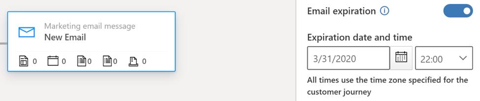
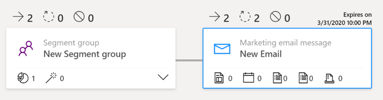

# Set expiration dates for selected email tiles in a customer journey

> [!NOTE]
> This functionality was previously available in December as a preview feature for commercial emails only. With the February 2020 early access release, you can set expiration dates for both commercial and transactional emails. Additionally, with improved reliability, messages won't be delivered after the expiry date (previously, in certain situations, messages could still be delivered up to six days after the expiry date due to delays and retries built into the system).

Some of your customer journeys may include email messages with time-sensitive content. Time-sensitive emails could include time-limited offers, holiday promotions, or a two-week reminder for an upcoming event. Because contacts might join the journey at any time, you can now prevent delivering outdated information by setting an expiration date for one or more selected email messages. Any contact who enters an email tile after its expiration date has passed will pass through the tile without being sent the message.

## Set an expiration date for an email message

1. Select the email tile in your customer journey.

2. Switch the **Email expiration** toggle within **Email properties** to **On**.

3. Set your static **Expiration date and time** (for example, March 31, 2020 at 22:00). Specified expiry times use the customer journey's time zone.

    

4. Once a journey is live, the expiration date is shown above the email tile:

    

## Identify expired-message results in insights

Each time a customer journey skips sending an expired message, the event is noted in the following insights:

- The message is counted as sent, but blocked (because of the expiration date).
- In accumulated KPIs and charts, expired messages are counted as blocked.
- In detailed insights, expired messages are listed under **Blocked** > **Other reasons**.