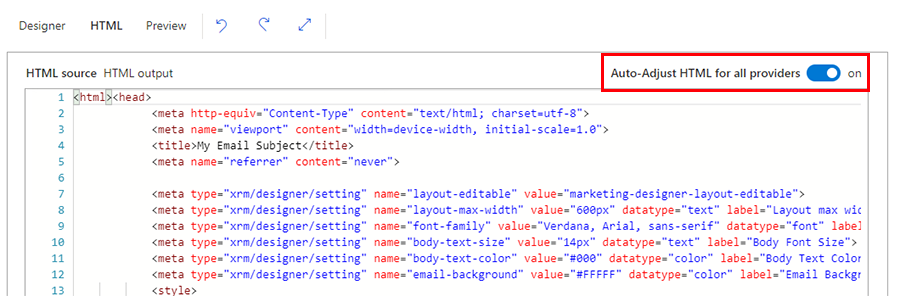

# Disable auto-adjustment of HTML for all providers

You can create beautiful emails in Dynamics 365 Marketing simply by dragging and dropping design elements onto the email canvas. When you create emails in the [email designer](email-design.md), Marketing applies some changes to the email HTML (visible in the **HTML** tab under **HTML Output**) to ensure that the email renders correctly across email providers (including Outlook) and across devices. 

In certain cases, you may want to create marketing emails using pre-made email templates. To use pre-mail templates, you can simply paste the HTML in the **HTML** tab. You may also want to apply email provider-specific adjustments. In this case, you can enable a per-email level switch to prevent the out of box auto-adjustment of email HTML.

> [!NOTE]
> You will need your administrator to [turn on the feature switch](admin-feature-switches.md) for the "Post-processing switch" functionality before you are able to access it in the email designer.

Under the **HTML** tab in any email in a Draft or Live Editable state, you will see a new switch on the HTML editor canvas header labeled **Auto-Adjust HTML for all providers**. By default, this functionality is switched on.

> [!div class="mx-imgBorder"]
> 

When creating or editing your email, you can toggle this switch to turn off auto-adjustment. You will see a confirmation dialog. Select the **Turn it off for this** button. This will turn off auto-adjustment for the email you are working on.

### See also

[Tutorial: Create a marketing email and go live](create-marketing-email.md)  
[Email marketing overview](prepare-marketing-emails.md)  
[Create a new email and design its content](email-design.md)  

[!INCLUDE[footer-include](../includes/footer-banner.md)]