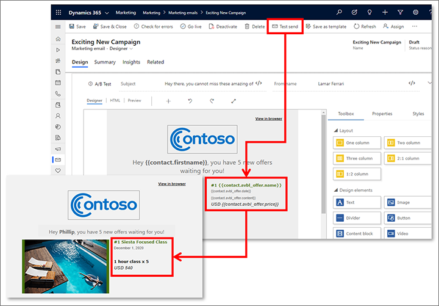

# Check your work using previews and test sends

Your marketing email messages will probably be seen by many potential customers, so you'll want to make sure they look just right when opened, regardless of which combination of device and email software each recipient is using. Dynamics 365 Marketing provides several tools to help you test and evaluate your design before you use it in an email campaign.

> [!IMPORTANT]
> Previews and test sends give you a fast, convenient way to test your design. However, not all features work with previews and test sends. The following limitations apply:
>
> - [For-each loops](dynamic-email-content.md#for-each) don't render.
> - [Subscription center links](set-up-subscription-center.md#test-sub-center) will open the subscription center page, but the page won't function.
> - You can't test send [confirmation-request messages](double-opt-in.md).
>
> To test these features, create a simple customer journey that targets a very small segment (such as one that includes a single contact with your email address) and sends the message  you want to test.

## Preview your message in the designer

The content designer provides two types of previews when you're designing a marketing email message:

- **Standard preview**: Go to the **Designer** > **Preview** > **Basic Preview** tab to see the standard designer preview and choose between various form factors, contacts, and content settings.
- **Inbox preview**: Go to the **Designer** > **Preview** > **Inbox Preview** tab to see real-world inbox previews that show your design exactly as it will appear in a wide variety of target email clients and platforms.

See the next sections for details about each of these types of previews.

> [!NOTE]
> Microsoft Outlook supports local customizations and plugins that can affect the way messages are rendered. In some cases, recipients using customized Outlook installations may see odd layouts or repeated page elements when viewing pages designed in Dynamics 365 Marketing. These effects can't be simulated by the standard or inbox preview displays. If necessary, you can use test sends to see how your designs look in specific Outlook configurations.

## Use the basic preview feature

Go to the **Designer** > **Preview** > **Basic Preview** tab to see an in-browser preview that simulates how your message will typically be rendered on various form factors (desktop, tablet, or phone) and orientations (portrait or landscape).

Use the form-factor icons on the left side of the **Designer** > **Preview** > **Basic Preview** tab to switch between the available form factors for the preview.

Use the following drop-down lists on the right side of the **Designer** > **Preview** > **Basic Preview** tab (under the **Properties** heading) to test the effects of your dynamic content and logic:

- **Contact**: Choose a representative contact record to supply field values. Field values from your selected contact, and other dynamic content that reacts to these values, will be shown in your preview.
- **Content Settings**: The content settings establish a marketing context for your message, and values stored here might affect your message content. The content settings also include information about your organization, including its postal address and the ID of a Dynamics 365 Marketing subscription center page. In a basic setup, you might have just one set of content settings for your entire organization. But in a more advanced configuration, you might reuse a single marketing email message in several different contexts (such as for different products or different events); in this case, the content settings can be different for each customer journey where you use the message. More information: [Use content settings to set up repositories of standard and required values for email messages](dynamic-email-content.md#content-settings).

## Use the advanced inbox preview feature

<iframe src="https://go.microsoft.com/fwlink/?linkid=2154667" frameborder="0" allowfullscreen=""></iframe>

Go to the **Designer** > **Preview** > **Inbox Preview** tab to see real-world inbox previews that show your design exactly as it will appear in a wide variety of target email clients and platforms. This feature renders your message by using native code from each of the listed target platforms, and then delivers your preview as an image file showing the precise results. As with the simple preview, you can use the **Designer** > **Preview** > **Inbox Preview** > **Properties** tab to choose a **Contact** record and **Resource Set** from which to draw dynamic values (see also the previous section).

The inbox preview is provided by a Microsoft partner called Litmus Software, Inc. ([litmus.com](https://litmus.com/)). Your Dynamics 365 Marketing license includes a limited number of inbox previews per month, and this quota is shared by your entire organization. After your organization has used all the available previews for the month, each user must set up their own Litmus account if they want to create additional previews. Personal Litmus quotas apply to individual users, not to the entire organization. When you've used all your free previews, you'll be given the option to sign in to Litmus directly from the **Inbox Preview** tab in Dynamics 365 Marketing. After you're signed in, the integration is seamless.

The **Inbox Preview** tab displays a grid of icons, each labeled with the name of a different destination platform or email client. Initially, each preview is dimmed and shows a key (locked) icon, which means that you haven't yet generated that preview by using your current design and settings. Select one of these icons to generate that preview and unlock its icon. Each time you unlock a preview, you'll use one preview from either your organization's or your personal quota. The unlocked preview remains available for viewing until you change the design or the **Properties** (dynamic text) settings, at which time all existing previews will no longer be valid and will be shown as locked again.

> [!NOTE]
> Litmus must be enabled for your instance before you can use it. More information: [Configure default marketing settings](mkt-settings-default-marketing.md)

## Preview dynamic text from contact information

The email preview resolves dynamic text from a selected sample contact record, allowing you to see exactly how an email message will look when it arrives in the recipient's inbox.

After you've [added dynamic content](dynamic-email-content.md) such as a contact's first name in the subject line, go to **Designer** > **Preview** > **Properties**. In the **Contact** box, select a contact whose information you'd like to use for the preview. The preview will automatically refresh and then display the resolved dynamic text from the contact that you chose.

You can even test send (see below) messages with dynamic data including dynamic field values, entity relationships, loops, and conditionals.

## Send a test message

Select **Test Send** on the command bar to send your current design to one or more email addresses. This command initiates an [error check](email-check-golive.md#error-check), and then, provided your message passes the error check, a flyout panel opens asking you to specify the following:

- **Email address**: Enter one or more target email addresses (comma-separated). You'll typically just use your own email address here.
- **Test contact**: Select a contact record to supply values for dynamic content (such as a first name in the salutation). For a live message, these values come from the contact record for each individual recipient.
- **Test content settings**: Select a content-settings record to supply values for dynamic content (such as a subscription-center URL or the sender postal address). For a live message, the content-settings record is specified by the customer journey that sends the message.

Select the **Save** button the bottom of the flyout panel to send the message to your specified email address(s).

> [!NOTE]
> You can test-send both draft and live email messages, so you don't have to go live to do a test send.

### See also

[Tutorial: Create a marketing email and go live](create-marketing-email.md)  
[Email marketing overview](prepare-marketing-emails.md)  
[Create a new email and design its content](email-design.md)  
[Add dynamic content to email messages](dynamic-email-content.md)  
[Set the sender, receiver, language, and legal designation](email-properties.md) 
[Check for errors, go live, and deliver](email-check-golive.md)

[!INCLUDE[footer-include](../includes/footer-banner.md)]