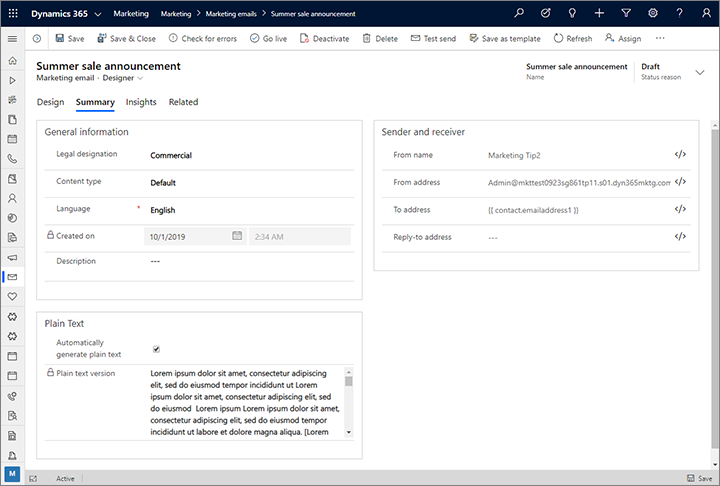

# Set the sender, receiver, language and legal designation for a message

When you're designing an email message, use the **Summary** tab to set a few basic options for it, including to:

- Set values or establish an expression for the sender name and sender address
- Set an expression for finding the recipient address from each contact record.
- Set the legal designation of the message, which affects the requirements for what the message must (and must not) contain.
- Set the language used by the email.
- View and edit the text-only version of your message.

## Set the legal designation to identify each message as either commercial or transactional

Most of the messages you send using Dynamics 365 Marketing will probably be commercial messages, which are bulk messages sent to many recipients and once. However, you can also use the solution to send transactional messages. Transactional messages must relate exclusively to a specific transaction between your organization and another individual or organization (such as a receipt, account statement, or consent request), and must not include advertisements or promotional content.

Transactional messages are typically regulated differently from commercial messages. They are considered personal communications, not promotional communications, and therefore have different content and consent requirements. In Dynamics 365 Marketing, the main practical different between transactional and commercial messages is that different validation rules apply. Specifically, commercial messages require a subscription-center link while transactional messages do not. Also, Marketing manages consent independently for each of these two types of messages.

By default, all new messages that you create will be commercial messages. To change the legal designation of a message:

1. Open the message.
1. Go to the **Summary** tab.
1. Set the **Legal Designation** to **Commercial** or **Transactional**, as required.

Take care not include promotional content in messages that you have set as transactional. It is your responsibility to be familiar with, and conform to, all relevant laws that apply in the countries/regions where you deliver commercial and transactional messages.

Each [contact record](manage-customer-information.md#contacts) has two settings that establish that contact's consent for receiving email messages from your organization. You can find these consent settings for any contact by opening the relevant contact record, going to the **Details** tab and looking in the **Contact preferences** section, which includes the following two settings:

- **Email**: This setting is among the standard fields for the contact record, and is included with nearly all Dynamics 365 applications. Contacts where this is set to **Do not allow** have indicated that do not want to receive any type of email from your organization, so Marketing will send neither commercial nor transactional messages to these contacts.
- **Bulk email**: This setting is added to the contact record when you install Marketing. Contacts where this is set to **Do not allow** have indicated that do not want to receive commercial email from your organization, but they may still allow transactional messages. Each contact can enable or disable this option for themselves using any subscription center (all subscription centers provide a check box for controlling this).

The following table shows the result of attempting to send a commercial or transactional email message to contacts with each combination of settings for these two options.

| Email        | Bulk email   | Commercial email | Transaction email |
|--------------|--------------|------------------|-------------------|
| Allow        | Allow        | Sent             | Sent              |
| Allow        | Do not allow | Not sent         | Sent              |
| Do not allow | Allow        | Not sent         | Not sent          |
| Do not allow | Do not allow | Not sent         | Not sent          |

## Set the email language

Use the **Language** field to specify the language of the current message. This affects the values shown for option-set fields in dynamic content.

Option sets provide a fixed set of values, which are stored as an index (incrementing integer), but displayed as text. For example, a field could be provided for selecting a T-shirt color where 1="red", 2="green", 3="blue", and so on. If you are supporting several languages, then each index value for the option set might have a different display value for each language. The value you choose for the **Language** here will determine which language is used to display option-set values in your email. If you select a language for which no values are defined, then another language will be shown instead (typically English, if it's available).

## Set sender and receiver options

In addition to the message description and plain-text version, the **Summary** tab also offers **Sender and receiver** settings. Usually you shouldn't edit these, but they can be useful in some scenarios.

> [!IMPORTANT]
> Domain authentication with DKIM is an increasingly important part of making sure your messages land in recipients' inboxes rather than getting filtered away as junk. DKIM helps prove that messages claiming to come from your organization really did come from it. It requires that the **From address** for each message you send uses a domain that you've authenticated using DKIM (email addresses use the form *account-name*@*domain-name*). By default, all new Dynamics 365 Marketing installations come with a pre-authenticated sending domain ending in "-dyn365mktg.com". You may also have authenticated one or more of your own sending domains (which we highly recommend).
> 
> When you create a new email, the **From address** is automatically set to the email address registered for your Dynamics 365 Marketing user account. However, if your email address uses a domain that is not yet authenticated using DKIM, then the initial **From address** will be modified to use an authenticated domain. The resulting **From address** will still show the *account-name* of the user creating the message, but will now show a DKIM-authenticated *domain-name* that's registered for your Marketing instance (for example, "MyName@contoso-dyn365mktg.com"), which will provide the deliverability benefit, but probably isn't a valid return address. You can overrule this by editing the **From address** after creating the message if needed, but this will probably lower your deliverability. If you want to send messages that show your real email address as the from address, then we highly recommend that you ask your admin to authenticate your email-address domain (if it's not already). More information: [Authenticate your domains](mkt-settings-authenticate-domains.md)

The following **Sender and receiver** settings are available:

- **From name**: This is the name shown to recipients as the person who sent the email. By default, this is the name of the user who created the email. You can edit this to use a static value, or choose the **[Assist edit](dynamic-email-content.md#assist-edit)** button  to define an alternative dynamic value.
- **From address**: This is the email address shown to recipients as the address of the person who sent the email. By default, this is the email address of user who created the message. You can edit this to use a static value, or choose the **[Assist edit](dynamic-email-content.md#assist-edit)** button  button to define an alternative dynamic value. (See also the **IMPORTANT** box at top of this section.)
- **To address**: This should almost always be set to **{{ contact.emailaddress1 }}**, which sends the message to each contact included in the customer journey that sends the email. You might change this to use a different email address field (such as emailaddress2), or enter a dynamic expression that chooses the best of several available email fields. Don't enter a static email address here because that will cause customer journeys to send the message just once to that static address rather than to each contact processed by the journey (insights will show that all other contacts were blocked).
- **Reply-to address**: This should usually be blank, which means that replies to the message will be sent to the **From address**. If you set a value here, replies to your message will be sent to this address rather than the displayed from address. You can edit this to use a static value, or choose the **[Assist edit](dynamic-email-content.md#assist-edit)** button  to define an alternative dynamic value. If you use this setting, we recommend that you use the same domain for the reply-to address as for the from address (email addresses use the form *account-name*@*domain-name*).

## Inspect and edit the text-only version of your message

The HTML mail standard allows for messages to include both an HTML version and a plain-text version of your content. The purpose of the plain-text version is to allow your message to be legible when shown by email clients that don't support HTML (or which have HTML turned off). Mail clients will only show one version to users, and unless you're dealing with a very special market, it will almost always be the HTML version. It's a bit like the system of providing alt-text for images.

So why bother with the plain-text version? To improve deliverability. One of the red flags that anti-spam systems look for is an email message that includes HTML content but no plain-text content (or plain-text content that doesn't match the HTML content). To help ensure that your marketing email messages don't get flagged as spam, Dynamics 365 Marketing generates a plain-text version of your HTML design and includes it when it sends the message. Usually you won't have to worry about the plain-text version, but you can still inspect and optimize it if you like.

Start by designing the HTML version of your message. When you're almost done, go to the **Summary** tab of your message, where you'll see various settings and metadata for the message. Scroll down to the **Plain Text** section to see the text that was auto-generated based on your HTML content.

- To fine-tune the text version, clear the **Automatically generate** check box to unlock the text field, and then edit the text as needed. From now on, though, your text version will no longer be linked to the HTML version and won't be updated to match any changes you make to the HTML.
- To go back to tracking the HTML version, reselect the **Automatically generate** check box. This will remove any customizations that you've made to the plain text and update it to match the current HTML design on an ongoing basis.

### See also

[Tutorial: Create a marketing email and go live](create-marketing-email.md)  
[Email marketing overview](prepare-marketing-emails.md)  
[Create a new email and design its content](email-design.md)  
[Add dynamic content to email messages](dynamic-email-content.md)  
[Check your work using previews and test sends](email-preview.md)  
[Check for errors, go live, and deliver](email-check-golive.md)

[!INCLUDE[footer-include](../includes/footer-banner.md)]