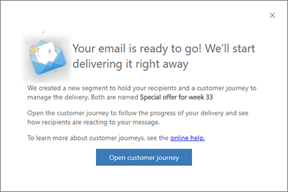

# Quickly design and deliver outbound marketing emails with quick send

> [!NOTE]
> The quick send functionality described in this article, **only** applies to outbound marketing. Real-time marketing has a new "[Send Now](email-without-journey.md)" feature that allows you to choose segments and send emails directly to an unlimited number of contacts.

Dynamics 365 Marketing provides a flexible and powerful framework for designing interactive email campaigns comprised of target segments, marketing email messages, customer-journey automation, and more. But sometimes, when all you want to do is write a quick email and send it to a few specific recipients, all of these extra components and capabilities can just get in the way. In this situation, use the _send now_ feature, which lets you design an email as usual and then just select **Send now** to choose your recipients and deliver the message. 

In the background, Dynamics 365 Marketing creates a static segment to contain your recipients and a customer journey preconfigured to send your message to that segment. The journey goes live automatically and starts sending right away. After this, you can open the generated customer journey to view results and insights as usual. Both the segment and the journey that are generated by this feature are easy to identify because Dynamics 365 Marketing assigns them the same name as the email message that generated them.

## Requirements and limits of the quick send feature

Compared to the [standard procedure](prepare-marketing-emails.md#process-overview-how-to-create-and-go-live-with-a-marketing-email) for sending marketing emails, in which you manually set up a segment and customer journey to send a message you've already designed, the quick send feature adds a few limitations. These are:

- You can send to a maximum of 30 contacts, selected one at a time (as with a static segment).
- Your message can include [dynamic expressions](dynamic-email-content.md), but you can't use relations. That means you can have just one hop (period) in your dynamic expressions, so for example, `{{contact.name}}` is supported but `{{contact.contact_account_parentcustomerid.name}}` isn't.
- Your message must still pass the standard error check, and must therefore include all the standard required content (including a subject, a subscription-center link, your organization's physical post address, and valid to and from addresses).

## Design and send an email with quick send

To use the quick send feature:

1. [Create a marketing email message](email-design.md) as usual. Be sure to include all the required elements and to set all required fields, including a **Subject** and a **Name** , and save the message.

    > [!NOTE]
    > The name is especially important because this name will also be applied to the segment and customer journey created by this feature. Always be sure to choose a meaningful name before selecting **Send now**.

1. Select [**Check for errors**](email-check-golive.md) on the command bar to make sure your message is ready to send. If errors are found, correct them and try again until your message passes the check.

1. Select **Send now** on the command bar.

1. The **Send new marketing email** dialog opens. The following settings and information are provided here. All settings are required, but some may already be filled out to match your message settings if you made them already. If your message is already live, then the **Subject** and **From** fields are read-only.

    - **Subject**: This is the subject that recipients will see. You probably set this up already when designing the email, but this can strongly affect your open rate, so be sure to check it one last time.
    - **From**: This is the user account whose name and email address will appear as the sender of the message. By default, all messages are initially configured to show the creating user's name and email address as the sender of the message, but you can choose another user here if you prefer.
    - **Recipients**: In this area, build the list of contacts you want to send your message to. To add a contact, use the **Look for contacts** field to find and select a contact record (repeat to add more contacts). Each time you select a contact from this field, it gets added to the **Recipients** list. To remove a contact you've added, select the left column to place a check mark on the target contact and then select the **Remove** button.

    

1. When you've added all the contacts you want to reach with your message, select **Send now**. Dynamics 365 Marketing now does the following:

    - **[Creates a static segment](segments-static.md)** that includes your selected contacts. The segment is given the same name as your email message.
    - **[Creates a customer journey](customer-journeys-create-automated-campaigns.md)** that is preconfigured to target the generated segment and deliver your email message to all the contacts it contains. It's also set to start running immediately.
    - [**Goes live**](go-live.md) with the segment, journey, and email.
    - **Starts sending the messages** as soon as possible.

1. Dynamics 365 Marketing lets you know that your messages are being sent and provides a button that will bring you to the customer journey it created for you. As with all customer journeys, you'll be able to open this journey to analyze its results and gain insights about your email deliveries.

    

## Find, view, and edit the generated segment

When you use quick send, Dynamics 365 Marketing generates a static segment that contains the contacts you selected while using the feature, and saves the segment using the same name as the email message you used to generate it.

> [!NOTE]
> If you have used the quick send feature more than once from the same email message, then you'll also have more than one segment with that name. In this case, you can use the **Created on** date column to tell them apart.

Once generated, quick send segments work exactly like any other static segment. You can find the segment by going to **Marketing** > **Customers** > **Segments** and then searching for your email name.

Unless you are very fast, Dynamics 365 Marketing would probably already have sent messages to most or all the contacts in the generated segment by the time you open it (so it usually won't help to remove any names here). But you could add new contacts to the segment if you forgot a few, provided you do so before the generated segment ends. Journeys generated by the quick send feature are usually scheduled to end after 24 hours, but you can edit the journey to extend this if needed.

Because the generated segment automatically goes live right away, you must select **Edit** on the command bar before you can edit it. Select **Save** when you're done to return to the live state. Provided you do this while the generated journey is running, the journey will deliver messages to the newly added contacts as soon as you save your changes. If you **Stop** the segment, then it will stop sending new contacts down the journey pipeline until you start it again—this could allow you to prevent some contacts from being processed if they haven't been already. More information: [Segment go-live operations and status](go-live.md#segment-go-live-operations-and-status)

For more information about how to edit static segments, see [Design static segments](segments-static.md).

## Open the generated customer journey and gain insights

The customer journey generated by the quick send feature brings everything together, manages the delivery, and displays results. Like the generated segment, the generated journey has the same name as the email message that created it. You can find the journey by going to **Marketing** > **Marketing execution** > **Customer journeys** and then searching for your email name.

> [!NOTE]
> If you have used the quick send feature more than once from the same email message, then you'll also have more than one customer journey with that name. In this case, you can use the **Created on** date column to tell them apart.

Journeys generated by the quick send feature have the following characteristics:

- A simple, two-tile pipeline that starts with a segment tile configured to use the generated segment, followed by an email tile configured to send the email that generated the journey.
- The journey goes live instantly and is set to start right away, so the start date and time are the same as the date and time the journey was generated.
- The journey is configured to run for 24 hours, but you can edit the journey to extend this if needed.
- As usual, the **Designer** tab shows insights about what happened at each tile, and the **Insights** tab provides general insights about the journey. More information: [Customer journey insights](insights.md#customer-journey-insights)

As with all other journeys, if you **Stop** the journey it will pause (and be editable) until you go live again. You can also select **Edit** to go into live-edit mode without pausing the journey. Your editing options are limited, however, because the journey has already been live. More information: [Customer journey go-live operations and status](go-live.md#customer-journey-go-live-operations-and-status)

[!INCLUDE[footer-include](../includes/footer-banner.md)]
