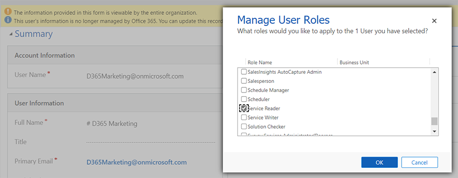

# Email sending data access and privileges

When core sending is composing an email, it needs to fill in dynamic email elements with actual data. Normally, the data is retrieved from core sending's own cache. In the case of 1-n relationships, which are used in `#each` statements, the data might be fetched directly from Dataverse.

## Grant data access permissions

To ensure proper email sending functionality, make sure that the Marketing user has all the necessary rights and privileges to access the entities they want to use inside an email.

- You can explicitly add *read* access to the entities you want to use. Learn more: [Record-level privileges](/power-platform/admin/security-roles-privileges#record-level-privileges)
- You can also provide global *read* access for the Marketing user by giving them a [Service Reader role](/power-platform-release-plan/2020wave2/data-platform/new-service-reader-service-writer-security-roles), as shown in the screenshot below. Learn more: [Manage user accounts, user licenses, and security roles](admin-users-licenses-roles.md)

    > [!div class="mx-imgBorder"]
    > 

## Errors from data access issues

If there is a data access issue, one of the following errors may occur:

- During email validation, validation will fail with a message indicating missing access rights and a list of affected entities.
- During email sending, if the data cannot be acquired one of two potential interactions will be shown: either a `MissingDataAccessRights` interaction, or an `Other` interaction specifying `MissingPrivilegesError`.

To resolve the above-listed errors, ensure that the Marketing user has the necessary access rights to all the entities inside the email by following the steps described above.
