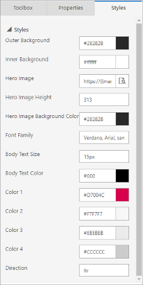

# Work with email, page, and form templates

Dynamics 365 Marketing comes with a wide variety of professionally designed templates. Most templates include a column layout, color scheme, sample content, and sample images, whereas others provide just a basic column layout without sample content. There are also blank templates, which provide no sample content or structure.

## Templates in Dynamics 365 Marketing

The templates included with Dynamics 365 Marketing provide:

- A starting point to help you work more quickly
- Advanced layouts based on responsive design techniques that help make content look good at any screen size
- A harmonious color palette with a manageable number of colors that you can easily adapt to your own organization's identity
- Tried-and-true designs that have been tested against a wide range of web and email clients to help ensure they will look great everywhere

The first thing you do each time you create a new message, page, or form is to choose a template.  You can easily work with the supplied content and styles using the designer, but the column layout is semi-permanently established by the template you choose (you can only change it using the HTML code editor).

When you create a new design, the selected template's content is copied into it. The design and template aren't linked, so when you edit the design, the template won't change; likewise, any future changes that you make to a template won't affect any existing designs that were created using it.

You can easily create custom templates to match your organization's communication needs and visual identity. You can save any existing email or customer journey as a template by selecting **Save as template** while the email or journey is open, or work directly in the relevant templates area to create them from scratch. You can also create page and form templates, but you can only do so by creating them in the templates area&mdash;no **Save as template** buttons are provided for these, but you could copy/paste the HTML from an existing page or form into a new template. When setting up a template, you can add various types of metadata (such as purpose, style, market type, and optimized for) which make each template easier to identify and easier to find by using filters in the **Select a template** dialog box shown to users each time they create a new email, page, or form design.

> [!IMPORTANT]
> The default templates are maintained as part of the solution and might be overwritten when Dynamics 365 Marketing is updated. Therefore, if you want to customize a default template then you should always save the result using a new name rather than saving it under its default name&mdash;otherwise your customizations could be overwritten during the next update.

## Style a template

All email and page templates included with Dynamics 365 Marketing provide style controls to help you quickly adapt them to the colors used by your organization or campaign. The style settings vary according to which template you choose. Designs based on a blank template don't provide styling controls unless you (or your system customizer) have programmed them to do so by using the right HTML markup.

Here are some common style settings provided by the out-of-the-box templates:

- **Outer background**: The color shown outside of your message content (behind the "paper")
- **Inner background**: The color shown behind your message content (the "paper color")
- **Hero image settings**: The hero image, when present, is usually the largest image on the page, generally located at or near the top of the message. These settings control the source URL of the image and the style settings that affect it. Use the browse button for the **Hero image** setting to choose an image from your Dynamics 365 Marketing image library.
- **Font and body text settings**: These set typographical options that apply to most of the text in your message, but usually not headings.
- **Colors**: A good graphic design shouldn't include too many colors, and the colors should harmonize with each other. Templates typically use two to four colors that you can set individually to match your preferred color palette. These colors typically map to heading text, call-to-action buttons, text-box backgrounds, and borders used in the design. The following naming conventions are used most typically (additional colors are sometimes provided):
  - **Color 1**: Primary buttons
  - **Color 2**: Secondary buttons or feature blocks
  - **Color 3**: Footer
- **Direction**: Depending on which language you're using, you'll choose either LTR (left-to-right) or RTL (right-to-left).

The settings provided for each template are set up using custom attributes in the template's HTML. You can edit and create these as needed when customizing or creating your own templates. More information: [Use custom attributes to enable designer features in emails, pages, and forms](custom-template-attributes.md).

### Details for email templates

Designing and using HTML templates that look good in each of the wide variety of email clients in use today can be a challenge. Read this section for details about which clients we support with the out-of-box templates, how you can preview and test them, and other special notes.

### Tested email clients

All email templates included with Dynamics 365 Marketing have been tested against a wide range of available email clients, as listed in the following tables. The templates should work flawlessly on most modern clients, but some design elements might degrade on older, less-used clients.

<table>
  <tr>
    <th>Desktop Clients</th>
    <th>Mobile Clients</th>
    <th>Web Clients</th>
    <th>Web Clients (cont.)</th>
  </tr>
  <tr>
    <td>Apple Mail 9/10 IBM Notes 9 Outlook 2000 Win 7 Outlook 2002 Win 7 Outlook 2003 Win 7 Outlook 2007 Win 7 Outlook 2010 Win 7 Outlook 2011 OS X 10.10 Outlook 2013 Win 7 Outlook 2013 120 DPI Win  Outlook 2016 OS X 10.10 Outlook 2016 Win 7 Windows 10 Email Win 10 Thunderbird</td>
    <td>Android 4.4 Android 5.1 Android 6.0 Gmail App IMAP Android 4.4 Gmail App Android 6.0 Gmail App iOS Inbox by Gmail iOS iPhone 5s iOS 7 iPhone 5s iOS 8 iPhone 6 iOS 8 iPhone 6 Plus iOS 8 iPhone 6s iOS 9 iPhone 6s Plus iOS 9 iPhone 7 iOS 10.3.2 iPad (Retina) iOS 10.3.2 iPad Mini iOS 10.3.2 iPad Pro (12.9 Inch) iOS,10.3.2</td>
    <td>AOL Explorer AOL Firefox AOL Chrome Comcast Explorer Comcast Firefox Comcast Chrome Freenet.de Explorer Freenet.de Firefox Freenet.de Chrome GSuite Explorer GSuite Firefox GSuite Chrome Gmail Explorer Gmail Firefox Gmail Chrome Inbox by Gmail Chrome Inbox by Gmail Firefox GMX.de Explorer GMX.de Chrome GMX.de Firefox Mail.ru Explorer Mail.ru Chrome Mail.ru Firefox</td>
    <td>Office 365 Explorer Office 365 Chrome Office 365 Firefox Orange.fr Explorer Orange.fr Chrome Orange.fr Firefox Outlook.com Explorer Outlook.com Chrome Outlook.com Firefox SFR.fr Explorer SFR.fr Chrome SFR.fr Firefox T-Online.de Explorer T-Online.de Chrome T-Online.de Firefox Web.de Explorer Web.de Chrome Web.de Firefox Yahoo! Mail Explorer Yahoo! Mail Chrome Yahoo! Mail Firefox</td>
  </tr>
</table>

### Known issues with specific email clients

The following known issues apply to the out-of-the-box email templates and custom messages when shown on specific email clients:

- **Gmail** has a size limit of 104 KB, so markup that exceeds this limit will be cut off. All out-of-the-box templates are smaller than this, so they shouldn't be affected unless they've been heavily customized.
- **Outlook 2007 and newer for Windows** have the following limitations, though these features are not currently supported by the email designer nor used in the out-of-the-box templates:
  - Borders around buttons are not supported.
  - Rounded corners might not be rendered correctly.
  - Background images aren't supported when they have text or button overlays.
  - Outlook supports local customizations and plugins that can affect the way messages are rendered. In some cases, recipients using customized Outlook installations may see odd layouts or repeated page elements. These effects can't be simulated by the designer or preview displays. If necessary, you can use [test sends](email-preview.md) to see how your designs look in specific Outlook configurations.
- **T-Online email clients** will render two buttons, regular **Button** and **VML** markup.
- The **Android 4.4 email client** shows only about 60&nbsp;percent of the template width. We haven't been able to verify whether horizontal scrolling is possible. As far as we know, this only affects the native Android client, not the native clients included with phones from most manufacturers, such as Samsung.
- **SFR.fr email clients** display a background color for some links.
- **Lotus Notes email clients** have general rendering issues with the templates.

### Litmus issues for email-design previews

Dynamics 365 Marketing provides both a simulated preview and an inbox preview for email messages. Inbox previews are more accurate because they're rendered for specific email clients. Inbox previews are provided by a Microsoft partner called Litmus Software, Inc. Litmus previews are created by rending your message on actual email clients and then returning a screenshot of the result to you. The following known issues can occur with inbox previews.

- **Missing footer**: Litmus screenshots sometimes fail to capture the entire message height.
- **Unable to scroll**: The returned preview is a static screenshot, which might include scrollbars for messages that are higher than the screen. You can't actually scroll the image using these.
- **The message is too high**: Sometimes Litmus renders extra content at the end of the email message.
- **Only half of the message is visible in the preview**: This can happen if Litmus takes a screenshot before the message is fully loaded. Try to reload the preview. If problems persist, then the message may include dynamic content that isn't resolved.
- **Outlook previews don't reflect custom plugins**: Outlook supports local customizations and plugins that can, in some cases, affect the way messages are rendered. Litmus provides screenshots based on a standard Outlook installation&mdash;without considering the affect of custom plugins and other local customizations. If necessary, you can use [test sends](email-preview.md) to see how your designs look in specific Outlook configurations.

### See also

[Email marketing overview](prepare-marketing-emails.md)  
[Create and deploy marketing pages](create-deploy-marketing-pages.md)  
[Design your digital content](design-digital-content.md)  
[Accessibility and keyboard shortcuts](designer-shortcuts.md)  
[Design elements reference](content-blocks-reference.md)
