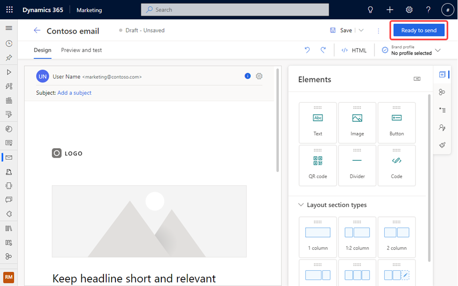

# Preview: Send emails without building a journey

> [!IMPORTANT]
> A preview feature is a feature that is not complete, but is made available before it’s officially in a release so customers can get early access and provide feedback. Preview features aren’t meant for production use and may have limited or restricted functionality.
> 
> Microsoft doesn't provide support for this preview feature. Microsoft Dynamics 365 Technical Support won’t be able to help you with issues or questions. Preview features aren’t meant for production use, especially to process personal data or other data that are subject to legal or regulatory compliance requirements.

> [!TIP]
> This article refers to a feature that is in preview and may not be enabled in your environment. If you don’t see this feature in your app, contact your admin who can activate it by going to **Settings > Overview > Feature switches**, scrolling to the **Email editor** area, enabling the **Send Now (preview)** feature switch, and saving the setting by selecting **Save** on the top right corner.

> [!CAUTION]
> Sending emails without building a journey currently only supports the [default consent profile](set-up-subscription-center.md#the-default-subscription-center). Custom subscription centers are not supported.

You can now send an email directly from the email editor without the overhead of creating a journey. From the email editor, select the **Ready to Send** option. This directs you to select the **Send** the email option where you can select a segment, preview its contents, and then send the email. The process builds a simple journey in the background to assist you in sending your email.

To begin your email sending process, follow these steps:

1. Go to **Real-time marketing** > **Channels** > **Emails** and select **+ New** in the top toolbar. Select the email template that you want to use. You can either use a predesigned template or create your own custom template by selecting **Skip**.
1. From the email editor, mark your email "Ready to Send" by selecting the **Ready to Send** button.

    > [!div class="mx-imgBorder"]
    > 

1. The button changes to **Send now** or **Schedule for later** and can be selected to start the flow. If you select **Schedule for later**, you're prompted to choose a date to send the email.
1. Select a segment and select **Preview** to preview the segment. You can only select published segments. 
    > [!NOTE]
    > If you have personalization in your email leveraging Contacts or Leads and you select a segment of the opposite type, you will not be allowed to move forward until the segment type matches the personalization type.
1. Select **Send** to send the mail. Your mail is queued up to be sent.
1. On the confirmation screen, select **View Customer Journey** to see the simple journey that was created to send the email. The journey name matches the name of your email. Select **View Segment** to view the segment to which the email was sent.