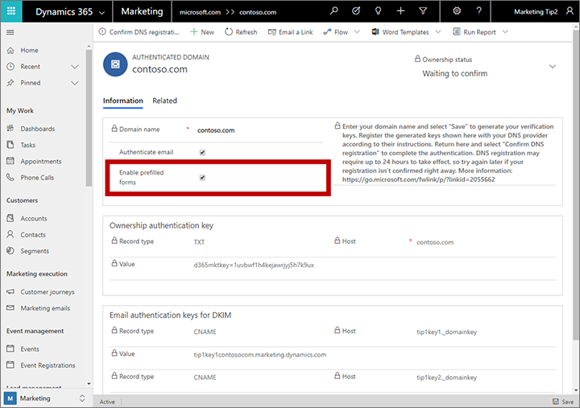
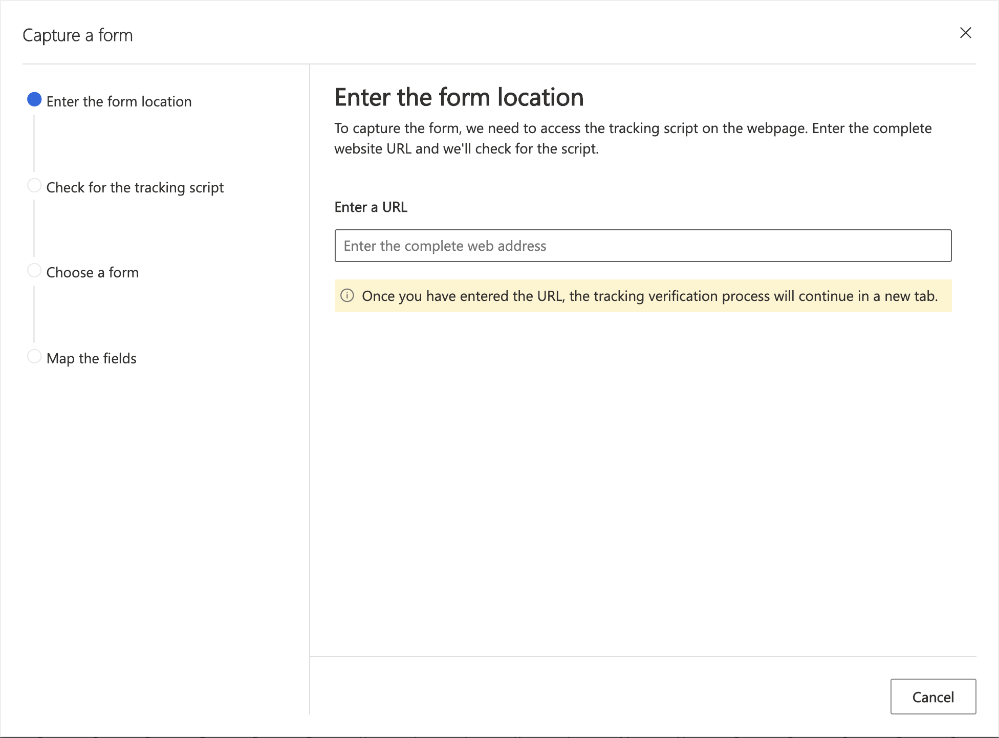
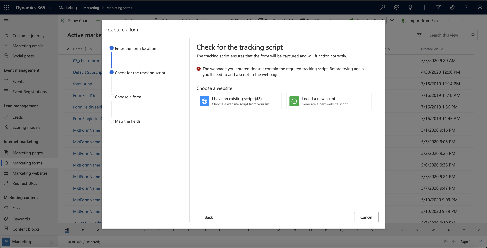
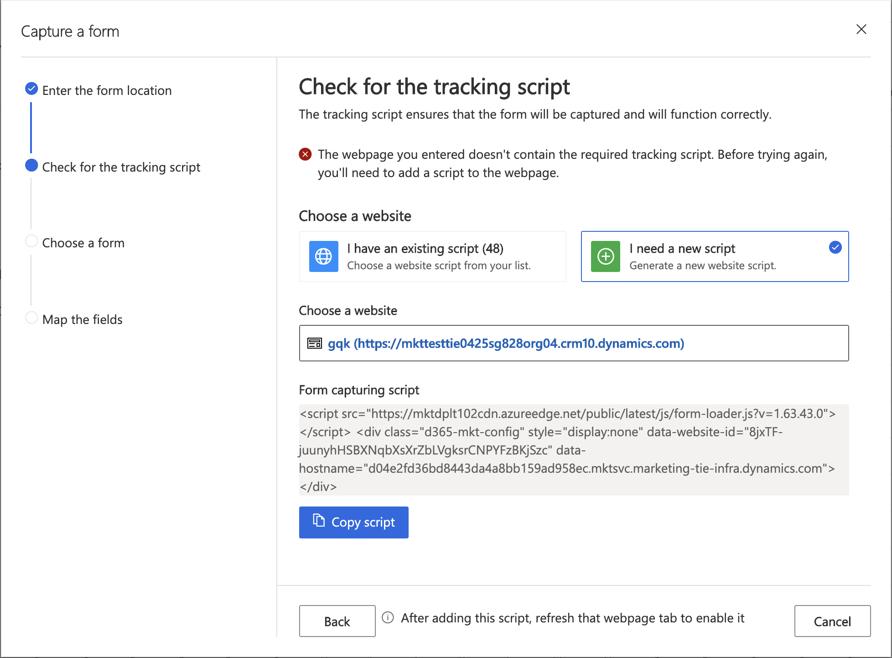
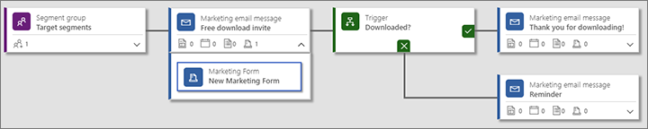
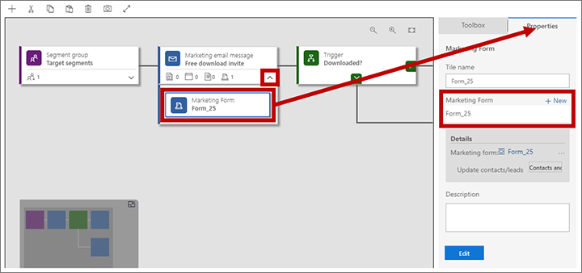
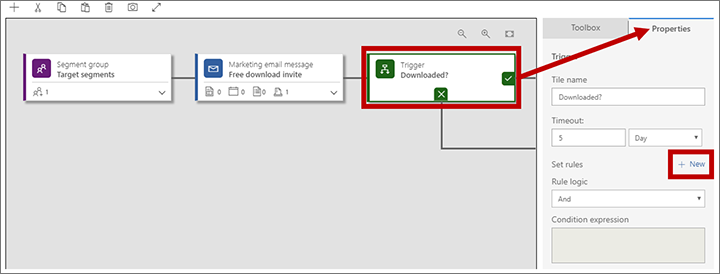
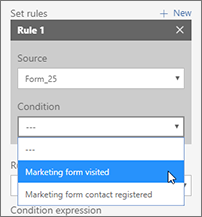
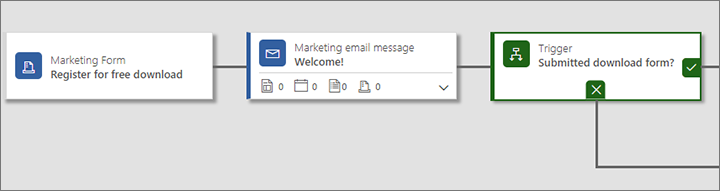

# Embed forms on external websites

Dynamics 365 Marketing provides a complete solution for designing, publishing, and hosting landing pages on a Power Apps portal running on your Dynamics 365 Marketing instance. However, you can also create or embed forms on your own external website that submit values back to Dynamics 365 Marketing. These external pages function similarly to native Dynamics 365 Marketing landing pages, so they will generate contacts and/or leads in your database when submitted. However, a few limitations apply, depending on how you implement the external forms.

There are two basic methods for integrating an external form page with Dynamics 365 Marketing:

- *Embed* a Dynamics 365 Marketing form on an external page
- Use *form capture* to integrate Dynamics 365 Marketing with a form created externally

The third way of publishing a marketing page is to place a [native marketing form](marketing-forms.md) on a [native marketing page](create-deploy-marketing-pages.md) created and published by Dynamics 365 Marketing on a Power Apps portal.

The following table summarizes the capabilities available with each of these approaches.

| Capability  | Embedded marketing form | Captured external form | Native marketing page |
| --- | --- | --- | --- |
| Form design | Dynamics 365 Marketing | External/CMS | Dynamics 365 Marketing |
| Page design and publishing | External/CMS | External/CMS | Dynamics 365 Marketing |
| Form prefill | Yes | No | Yes |
| Subscription center functionality | Yes | No | Yes |
| Forward to a friend functionality | No | No | Yes |
| Link to forms from email messages | Yes | Yes | Yes |
| Launch inbound campaigns | Yes | Yes | Yes |
| Use form visits or submissions as criteria for journey triggers | Yes | Yes | Yes |
| Requires Power Apps portal | No | No | Yes |
| Requires external website | Yes | Yes | No |
| Generate leads and/or contacts | Yes | Yes | Yes |
| Match and update leads and/or contacts | Yes | Yes | Yes |
| Requires form-capture script | No | Yes | No |
| Website-tracking script | Automatic | Recommended | Automatic |

## Embed a Dynamics 365 Marketing form on an external page

An embedded form is a marketing form that you design using the Dynamics 365 Marketing form designer, and which you then embed on an external page using JavaScript code generated for you.

### Create an embedded form

To design a form in Dynamics 365 Marketing that you can embed on an external website:

1. In Dynamics 365 Marketing, go to **Marketing** > **Internet marketing** > **Marketing forms**.

1. [Create the form](create-deploy-marketing-pages.md) and add the required fields to it as usual.

   - Configure all [field elements](content-blocks-reference.md#form-content-elements) just as you would with standard marketing forms.
   - Make [layout and style settings](design-digital-content.md#work-with-the-designer) just as you would with standard marketing forms.
   - You can use CSS on your external page to further style the imported marketing form. When you're done designing your form in Dynamics 365 Marketing, open its **Designer** > **HTML** tab to see the CSS classes assigned to each element.

1. Save the form and go live.

1. On going live, a **Form hosting** tab appears. Open it.

    

1. In the **Related marketing form pages** column, select **Add new form page** (open the ellipsis menu here to find this command if you don't see it). A quick-create flyout slides in. A _form page_ is a virtual page where you can make a few extra configuration settings for forms that will be embedded externally.

1. Use the quick-create form to set up your form options. The settings here are the same as the settings for a [form element](content-blocks-reference.md#the-form-element-for-marketing-pages) placed on a marketing page.

1. Select **Save** to create the new form page and go back to the **Form hosting** tab for your form.

1. If your form **does not** use prefill, complete the following steps:

    1. Go to **Settings** > **Advanced settings** > **Marketing settings** > **Authenticated domains**. A list of existing authenticated domains opens.

    1. Select **New** on the command bar to add a new domain.

    1. A new authenticated domain record opens. Make the following settings:

        - **Domain name**: Enter the name of the domain you want to authenticate.
        - Select the **Enable for forms hosting** check box.

1. If your form **does** use prefill (including all subscription center forms), you must authenticate the domain(s) where you'll use the form. More information: [Enable prefilling on embedded forms](#form-prefil)

1. Select the form page name in the **Related marketing form pages** column to open its settings and view the embed code.

1. Copy the embed code and paste it onto the page of your website where you want to use it.

 > [!NOTE]
 > Depending on what type of web server and CMS system you are using, you may need to adjust the code (for example, by escaping some special characters), or adjust your system settings to allow scripts such as this one to be pasted in. See your web server and CMS documentation for details.

### Enable prefilling on embedded forms

Form prefilling enables your forms to include prefilled values for known contacts. Prefilling makes your forms easier for contacts to use and can therefore help to increase your submission rates. The feature uses cookies to identify contacts that have previously submitted a form or opened a subscription center using a personalized link sent in email.

Because form prefilling requires the form to fetch contact values from your Dynamics 365 database, a few extra security measures are in place to help protect contacts' privacy. This means that contacts need to opt in for form prefilling and that you must authenticate each external domain where you'll embed the form. The solution only allows prefilled values to be shown to contacts whose contact record has the _allow-prefill_ flag set. Contacts can set or clear their allow-prefill flag themselves using a landing any page form, provided the form includes the setting. Dynamics 365 Marketing users can also edit a contact record directly to edit this setting for that contact.

To create a form with prefilling that you can embed on an external website:

1. Set up domain authentication for the external domain (website) where you will host your form and be sure to mark the **Enable prefilled forms** check box. You don't need to also enable email authentication on that domain, but you can. For instructions, see [Authenticate your domains](mkt-settings-authenticate-domains.md).

    

1. Create a form with the required fields and design elements as described in [Create, view, and manage marketing forms](marketing-forms.md).

1. Enable prefilling for the form as described in [Enable prefilling for forms](form-prefill.md).

1. Save the form and then go to the **Form hosting** tab (first available on save) to set up a _form page_ for it as described in [Create an embedded form](#create-embedded). Note that you don't need to add authenticated domains to the allow list on the **Form hosting** tab because authenticated domains provide even better security than the allow list provided here.

1. As described in [Create an embedded form](#create-embedded), copy the JavaScript code generated for the new form page and paste it onto a web page or CMS page for your website.

### Embed a subscription center as a hosted form

You can embed a subscription center form on an external site just as you can a standard landing page form. The only difference is that you must set the **Form type** to **subscription center**. Subscription centers require prefilling, so you must authenticate your external domain, set up the form, and embed the generated form code on your page as described in the previous section.

## Use form capture to integrate a form created externally

Form capture makes it possible for forms created on an external website to submit information directly to Dynamics 365 Marketing. The resulting solution works just like a native marketing page created in the marketing app, except that prefill isn't supported. This makes it easier for page designers to create forms that match the rest of their site's graphical design and features, and which also submit values to Dynamics 365 Marketing.

To enable form capture, you must generate a form-capture JavaScript in Dynamics 365 Marketing and add that script to your external form page. Then you'll be able to load that page into Dynamics 365 Marketing to map its fields to marketing fields. At run time, the form-capture JavaScript captures each form submission and submits the values to Dynamics 365 Marketing for processing and storage.

### Capture a new external form

To set up a form capture:

1. Use your CMS system and other coding tools to design a page with an input form that has the required fields and features.

1. Sign in to Dynamics 365 Marketing and go to **Marketing** > **Internet Marketing** > **Form fields**. Each of the records listed here establishes a mapping between a field available for use in a marketing form and an actual field from the contact and/or lead entity in the underlying database. Check to make sure that each of the fields required by your external form is correctly mapped here, and add any missing fields if necessary. More information: [Create and manage input fields for use in forms](marketing-fields.md)

1. Go to **Marketing forms** and select the **Capture form** button. This will start the form capture wizard that will take you through each step, starting with tracking script placement into your webpage.

1. **Enter the form location**: Enter the URL of the third-party page where the form capture wizard will check if there is a valid tracking script inserted. Your webpage will open in a new tab where the wizard will continuously check for tracking scripts. This enables the wizard to detect dynamically injected scripts. Leave this tab open until you are finished capturing your form.

    

1. Select the button in the new tab to proceed to the next steps in the form capture wizard.

1. **Check for a tracking script**: If this is your first time capturing this form and you need to generate a script for your website, select the **I need a new script** button. This will create a website entity, which you can access in the **Marketing websites** section and rename later. If you already have a script, use the dropdown list to find your script for the form’s web page.

    

    > [!NOTE]
    > Go to **Marketing** > **Internet Marketing** > **Marketing websites** to view your website entity records created via the wizard. Each of the website records listed here (if any) provide a website-tracking and a form-capture code for a specific website or sub-site.

1. **Place the script into your webpage**: Copy the tracking script and place it at the top of your webpage HTML code, or share it with your  developer to do so. In third-party pages, this is done via inserting embedded HTML codes.
After adding the script to your webpage, refresh the tab that contains your web page so that the update is visible to form capture wizard.

    

1. **Choose the form**: Once you refresh the webpage, you will see all available forms. You can select the form you'd like to capture.

1. **Map the fields**: Before exiting the wizard, map the fields from your form to the Dynamics 365 fields so that the entries can be logged and stored under the entities in your Marketing environment.

1. **Overview and go live**: After you exit the wizard, you will see an overview of the mapped fields. Make sure the fields are mapped correctly before going live to ensure that the form capture is successful.

1. Go to the **Summary** tab and finish setting up your marketing form just as you would a native marketing form. Be sure to provide a **Name** that makes sense, decide whether to update contacts, leads, or both, and choose your matching strategies for finding existing records to update. More information: [Form summary and configuration](marketing-forms.md#form-summary)

    > [!NOTE]
    > Form-capture forms don't support prefill, so don't try to set up prefilling for them.

1. Select **Save** on the command bar to save your marketing form.

1. Select **Go live** on the command bar to activate your new marketing form so that it can begin to accept data from your external form.

### Edit a live form-capture form

When a form-capture form is live, all its settings are read only. If you update your external form or need to edit your form-capture form for any reason, do the following:

1. Open the relevant marketing form record.
1. Select **Edit** on the command bar to put the record into the live-edit state. (The form remains active in this state.)
1. You can now make changes on the **Summary** tab as needed, but the field mappings on the **Design** tab remain locked. If you need to edit the field mappings, select **Sync form** on the command bar to load the latest version of your external form and unlock these settings.
1. Select **Save** on the command bar when you're done editing the record. Your changes are saved and the form goes live again automatically. (Select **Cancel edit** to discard your unsaved changes and go back to the live state.)

## Reference hosted or captured forms in emails and customer journeys

Once you have a captured or hosted form set up, you're ready to start using it in your marketing emails and customer journeys. Here, both hosted and captured forms work in exactly the same way.

### Link to an external form from an email message

Unlike local landing pages, there is no [design element](content-blocks-reference.md) dedicated to external forms. Therefore, use either a button element or a standard text link to your embedded form using its page URL from your webserver.

### Use external forms with journey triggers

Dynamics 365 Marketing includes a _marketing form_ tile for customer journeys. It works just like the marketing page tile, both to enable customer journey triggers to react to form visits and submissions, and to create inbound campaigns.

To set up a journey that invites contacts to visit an external form and then reacts to form visits and/or submissions:

1. Create and go live with a [marketing email message](email-design.md) that includes a link to the page where you are hosting the form.

1. Create a customer journey as usual.

1. Start the journey with a segment that targets the contacts you want to invite to visit your landing page.

1. At the location where you want the journey to send the message, add a **Marketing email message** tile that references your message.

1. Drag a **Marketing form** tile from the **Toolbox** onto your **Marketing email** message tile to add the form as a child of that message. Then follow this message tile with a **Trigger** tile.

    

1. Expand the Marketing email message tile to see the **Marketing form** tile you just added to it. Select the **Marketing form** tile, open the **Properties** panel, and configure it to reference the form record that created the JavaScript (form page) you have embedded on your external site.

    

1. Select the **Trigger** tile and open its **Properties** panel.

1. Select **New** next to the **Set rules** heading in the trigger properties.

    

1. A new rule is added to the trigger. Set the **Source** to the name of the **Marketing form** tile that you added to the **Marketing email message** tile, and set the **Condition** to **Marketing form visited** (to trigger when a contact loads the form) or to **Marketing form contact registered** (to trigger when a contact submits the form).

    

1. Continue designing your customer journey as required.

1. Save and go live.

### Use external forms with inbound campaigns

You can create an inbound campaign by placing a **Marketing form** tile at the start of a journey, and then configure the tile to reference the marketing-form record that created the embedded or captured form you are using on your external site. This will cause each contact that submits the form to be added to the journey, as though they had joined a segment targeted by the journey. You could already [do something similar for marketing pages hosted on a Power Apps portal](create-inbound-customer-journey.md), but now you can also do it with an externally hosted marketing form.

[!INCLUDE[footer-include](../includes/footer-banner.md)]