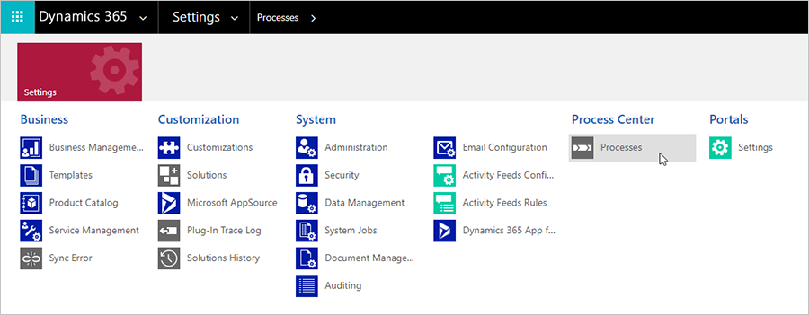
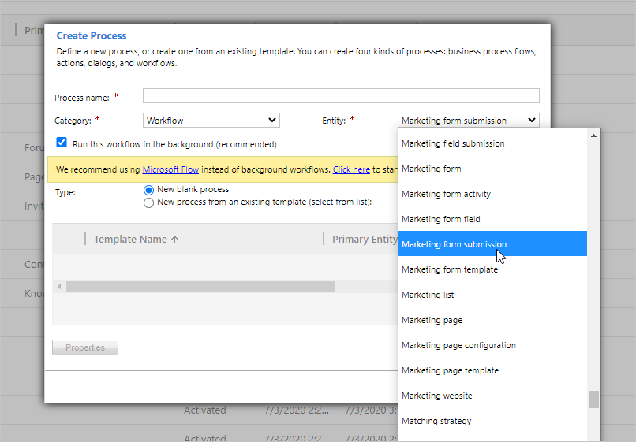
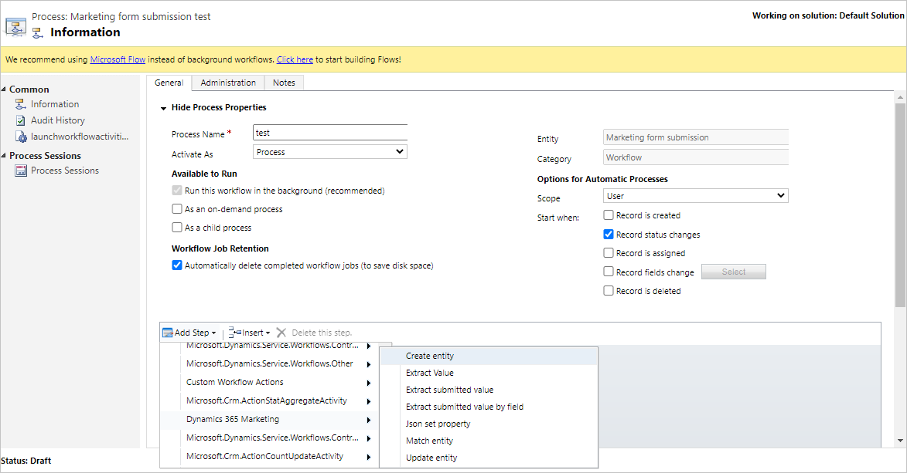

# Map form data to entities with custom Workflows

If you have configured a marketing form to collect form submissions without updating contacts or leads, you can create a Workflow to map the form submission data to any entity.
- Learn more about collecting form data without updating contacts or leads: [Create, view, and manage marketing forms](marketing-forms.md#do-not-createupdate-contacts-or-leads)
- Learn more about building workflows: [Use Workflow processes to automate processes that don't require user interaction](https://docs.microsoft.com/dynamics365/customerengagement/on-premises/customize/workflow-processes)

## Creating a Workflow

Create a Workflow to extract the values from a form submission. You can use this data to create a custom entity or to create or update any existing entity.

To create a Workflow:

1. In the navigation bar, go to **Settings** > **Process Center** > **Processes**.

    

1. Create new blank process, set the **Category** to **Workflow**, and add the entity that triggers your workflow. In this case, we'll add the Marketing form submission.

    

1. Next, you will start adding steps to your Workflow. You will find flexible options to handle entities under **Add Step** > **Dynamics 365 Marketing**.

    For example, you can start with **Extract a submitted value by field** to find a value inside a submission that you would like to store. Add a **Match entity** step to match the marketing form submission to the entity that you want to update. Add a **Json set property** step to be used in the other steps’ JSON properties.

    

## Example Workflow: Collecting credit card applications

In this example, We'll create a Workflow to update a custom entity called “Credit Card Applications.” The Workflow will allow a user to collect credit card applications through a Marketing form and store the data under the new customer entity.

1. To create a custom entity, in the navigation bar, go to **Settings** > **Customize the System** > **Entities**.
1. Create fields under your new custom entity to be used inside your form.
1. Go to **Settings** > **Processes** and create a new **Workflow** type process. In the **Entity** field, select the entity triggers your Workflow. In this case, we'll select **Marketing form submission**. Select **OK**.