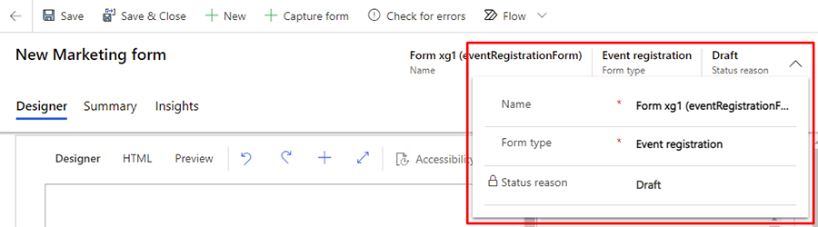
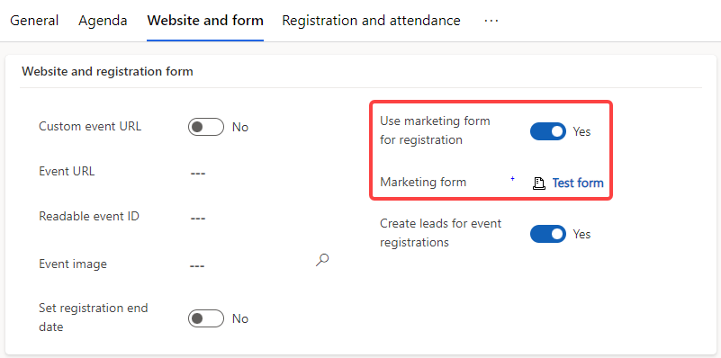

# Use marketing forms for event registration

The event management application now allows you to use marketing forms for event registrations. You can create forms with a variety of fields, embed forms on your website, and use the forms for event registration.

> [!NOTE]
> Forms are limited to free (non-recurrent) events and allow registration of one person at a time (instead of multiple people together).
>
> The event website also needs to be **updated to the February 2020 release (1.20.0) or later** for this functionality to be used for events hosted on the website. Learn more:  [Manually overwriting sample website](./developer/manually-overwriting-sample-website.md).

> [!TIP]
> To use marketing forms for event registration, your administrator must enable the **Event registration forms** feature switch at **Settings** > **Feature switches**.

## Create a marketing form for event registration

1. Go to **Outbound marketing** > **Internet marketing** > **Marketing forms** to go to the list of all forms currently available on your instance.
2. Select **New** in the command bar.
3. Choose the **eventRegistrationForm** template.
4. The template will load into the form designer.

    > [!div class="mx-imgBorder"]
    > 

## Settings in the header

The header settings are available at the top of the page. To edit the header settings, select the **More header fields** button (which looks like a down-pointing chevron) at the right side of the header. 

> [!div class="mx-imgBorder"]
> 

The button opens a drop-down dialog with the following settings:

- **Name:** Enter a name for the form. The form name you enter is the name you'll see in the forms list and when adding the form to an event page.
- **Form type:** For event registration marketing forms, leave the selected form type set to Event registration.

## Design customization, validating, and going live

You can [customize your registration form's design and check for errors](marketing-forms.md#design-and-validate-your-form-content) just as you would with any marketing form. You can even add custom fields or multi-select buttons. If no errors are returned after you validate your form, you are ready to [go live to make your form available for use](marketing-forms.md#go-live-to-make-your-marketing-form-available-for-use).

## Connect your event registration form to an event

1. Ensure that your event registration form is in a **live** state.
1. Go to **Outbound marketing** > **Event management** > **Events** and choose your event.
1. Select the **Website and form** tab. Set the **Use marketing form for registration** toggle to **Yes**.
1. Select your form using the **Marketing form** lookup.
1. To save your changes, select the **Save** button.

> [!div class="mx-imgBorder"]
> 

[!INCLUDE[footer-include](../includes/footer-banner.md)]
