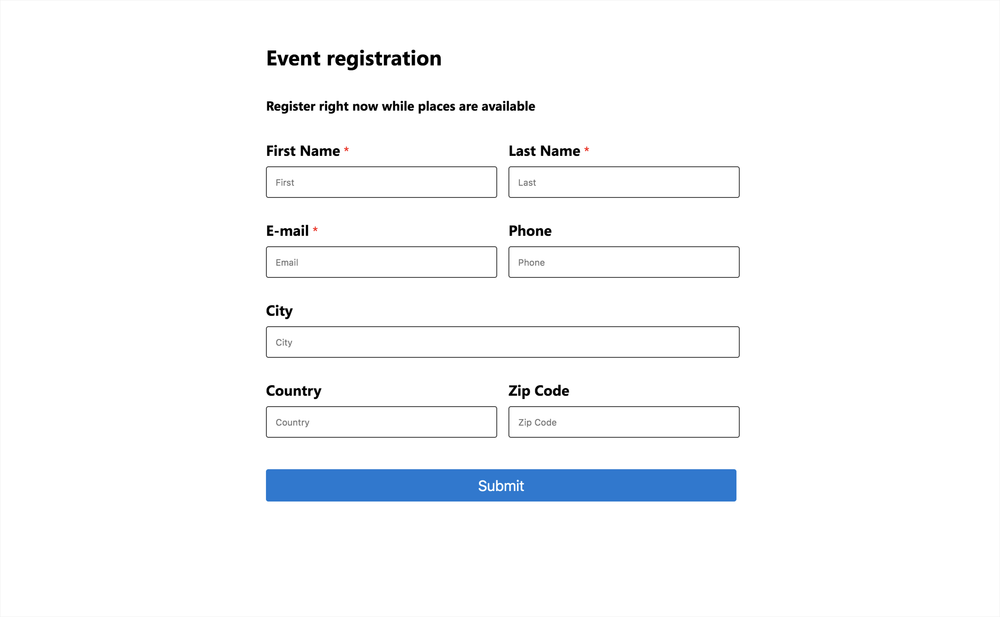

# Early access: Marketing forms for event registration

> [!IMPORTANT]
> This is an early access feature, which means that it's currently available only on opted-in instances. You can opt in for early access on any instance, but we recommend that you do so only on trial, test, or sandbox instances, which will give you a chance to learn the new functionality before it shows up on your production instances later this year.
>
> For instructions on how to opt in and enable early access, see [Opt in to early access updates](https://docs.microsoft.com/power-platform/admin/opt-in-early-access-updates). For more information about the 2020 release wave 1 schedule, and for answers to frequently asked questions about the early access program, see [2020 release wave 1 features available for early access](https://docs.microsoft.com/dynamics365-release-plan/2020wave1/features-ready-early-access).
>
>We encourage all customers to provide feedback related to early access features on the [Dynamics 365 Marketing Forum](https://community.dynamics.com/365/marketing/f/dynamics-365-for-marketing-forum), your Microsoft contact or partner, and/or through [Microsoft Support](https://docs.microsoft.com/power-platform/admin/get-help-support).

The event management application now allows you to use marketing forms for event registrations. You can create forms with a wide variety of fields, embed forms on your website, and use the forms you create for event registration.

> [!NOTE]
> For the early access version of this feature, forms are limited to free (non-recurrent) events and allow registration of one person at a time (instead of multiple people together).

## Create a marketing form for event registration

1. Go to **Marketing** > **Internet marketing** > **Marketing forms** to go to the list of all forms currently available on your instance.
2. Select **New** in the command bar.
3. Choose the **Event Registration Form** template.
4. The template will load into the form designer.

      

## Settings in the header

The header settings are available at the top of the page no matter which tab is shown. To edit the header settings, select the **More header fields** button (which looks like a down-pointing chevron) at the side of the header to open a drop-down dialog with the following settings:

- **Name:** Enter a name for the form. This is the name you'll see in the forms list and when adding the form to an event page.
- **Form type:** For event registration marketing forms, leave the selected form type set to Event registration.

## Customizing, validating, and going live

You can [customize your registration form’s design and check](https://docs.microsoft.com/dynamics365/marketing/marketing-forms#design-and-validate-your-form-content) for errors just as you would with any marketing form. You can even add custom fields or multi-select buttons. If no errors are returned, you are ready to [go live to make your form available for use](https://docs.microsoft.com/dynamics365/marketing/marketing-forms#go-live-to-make-your-marketing-form-available-for-use).