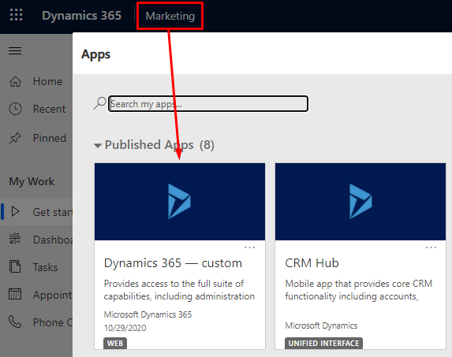
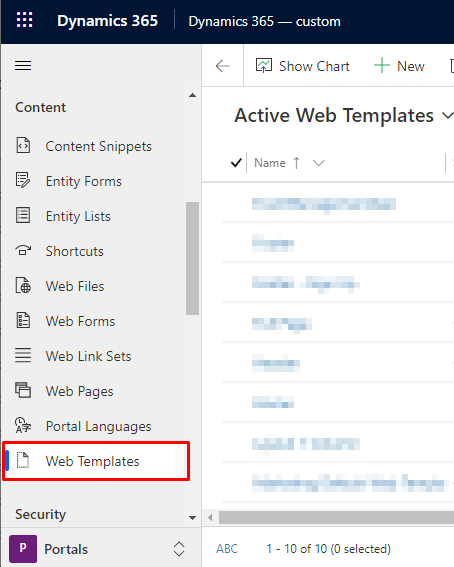
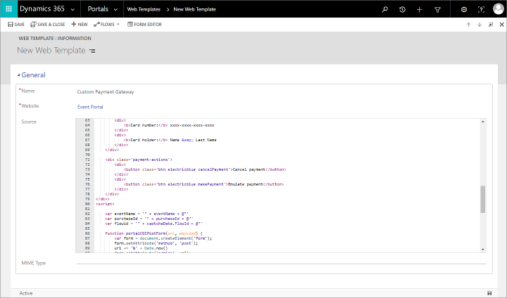
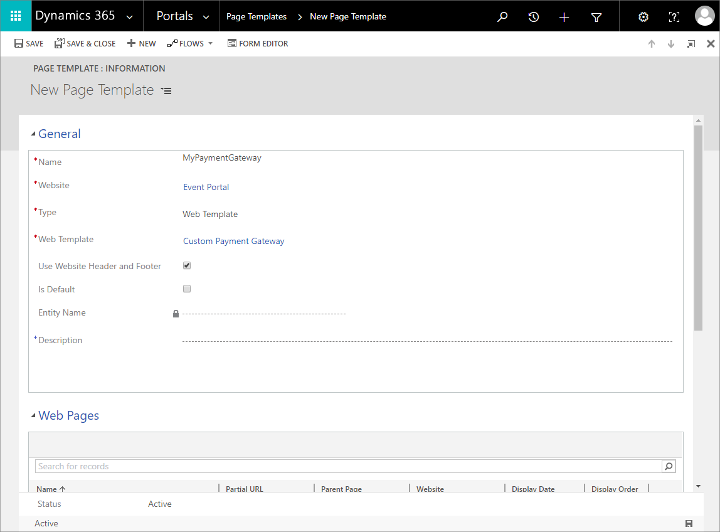
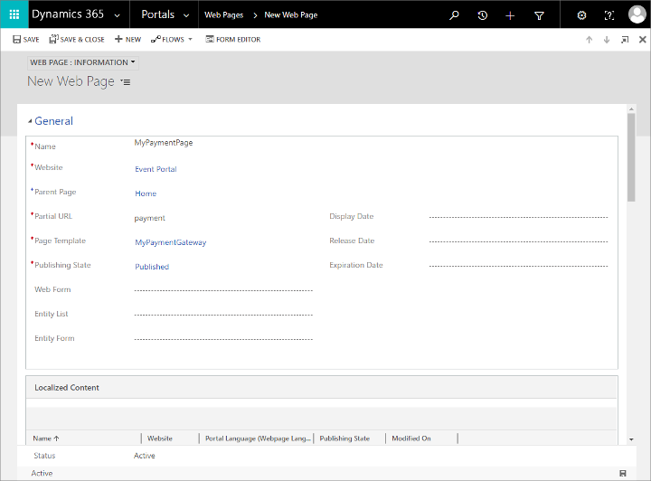
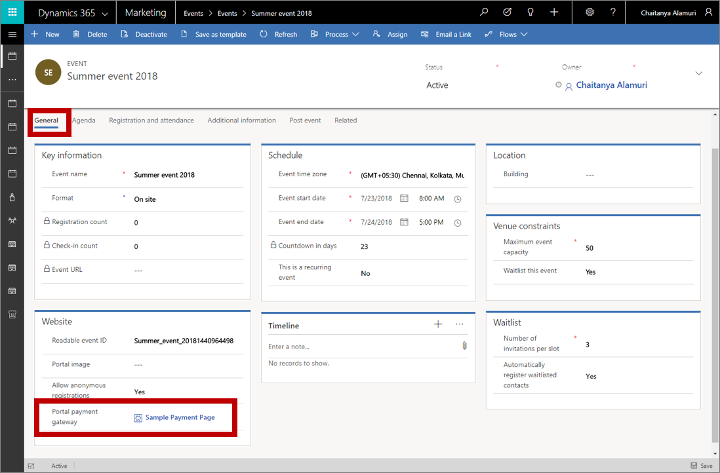

# Set up online payment for events

[!INCLUDE[cc-data-platform-banner](../includes/cc-data-platform-banner.md)]

If you have one or more events where contacts must purchase a pass, then your contacts will probably appreciate being able to pay for their passes online while they are registering for the event on your event website.

To enable online payment, you must make an agreement with a third-party payment provider who can authenticate and capture payment details. Your payment provider will supply you with details about how to implement their system, which you'll usually do by adding code supplied by your provider to a web page running on your event website. You'll typically also need to tell your provider the URL to request from Dynamics 365 Marketing to indicate a successful payment.

Once your new payment gateway is in place on your event website, you can configure your various events to use it, or assign it as the default for all new events.

The procedure for building and enabling a payment gateway depends on [how you host your event website](set-up-event-portal.md):

- If you are hosting the event website on a Power Apps portal, then see  [Create a payment gateway when hosting on the Power Apps portal](#portal) for instructions.
- If you are hosting the event website on an external server, then see [Create a payment gateway when hosting on an external site](#external) for instructions.

## Create a payment gateway when hosting on the Power Apps portal

### Add a new payment gateway to your event website

To add a new payment page to your event website:

1. Make an agreement with a third-party payment provider and prepare a web page that provides a payment front end, as described in their documentation.

1. Sign in to Dynamics 365 Marketing and go to the custom app by choosing **Dynamics 365—custom** from the app selector.  

    > [!div class="mx-imgBorder"]
    > 

1. In the custom app, use the area switcher at the bottom left of the page to open **Portals**. Then go to **Content** > **Web Templates**

    > [!div class="mx-imgBorder"]
    > 

1. Select **+ New** on the control bar to create a new web template.

1. Enter a **Name** for your template and set the **Website** to the **Event Portal**. Then paste the web-page code you developed for the gateway into the **Source** field.  

    

1. Save your template by selecting the **Save** button at the bottom-right corner of the window.

1. Go to **Portals** > **Website** > **Page Templates** and select **+ New** on the command bar to create a new page template.

    

    Make the following settings:

    - **Name**: Enter a name for your page template.
    - **Website**: Select the **Event Portal**.
    - **Type**: Set to **Web Template**.
    - **Web Template**: Select the web template that you created earlier in this procedure.

1. **Save** your page template.

1. Go to **Portals** > **Content** > **Web Pages** and select **+ New** on the command bar to create a new web page.  

    

    Make the following settings:

    - **Name**: Enter a name for your web page.
    - **Website**: Select the **Event Portal**.
    - **Parent Page**: Select **Home**.
    - **Partial URL**: Enter a folder name that you want to show in the URL path for this page. This text must form part of a valid URL, so use only letters, numbers, hyphens, and underscores (avoid spaces, special characters, invalid URL characters, and slashes). This value becomes part of the page URL using the following pattern: `https://<YourPortalDomain>/<PartialURL>/`.
    - **Page Template**: Select the page template that you created earlier in this procedure.
    - **Publishing State**: Set to **Published**.

1. **Save** your page. Your new payment gateway is now available to your event website.

### Set the payment gateway for an event

To assign a payment gateway to an event:

1. In the Marketing app, go to **Events** > **Event** > **Events** to open the events list.

1. Find and open an existing event or create a new one.

1. On the **General** tab of the **Event** form, scroll down to the **Website** section and select your payment gateway page in the **Portal payment gateway** field.  

    

1. Restart your portal or refresh its server cache to make sure your new setting takes effect right away. For instructions, see [How can I fix occasional portal issues?](setup-troubleshooting.md#restart-portal).

> [!NOTE]
> The payment gateway is only displayed for events that have at least one event pass configured for them. More information: [Set up event passes](set-up-event.md#event-passes)

### Receive payment confirmation

For details about how to develop the system for receiving payment and finalizing registrations, see [Develop a system to finalize event registration](#finalize-registration) later in this topic.

## Create a payment gateway when hosting on an external site

If you are hosting the event website on your own web server, then you must download and customize the event website to include the payment option as needed. Your payment provider will give you the instructions you need to interact with their system.

For more information about how to download the latest version of the event website, customize it, build it, and then deploy it on a Power Apps portal or external website, see [Build and host a custom event website](developer/event-management-web-application.md).

For details about how to develop the system for receiving payment and finalizing registrations, see [Develop a system to finalize event registration](#finalize-registration) later in this topic.

> [!NOTE]
> When you are hosting on an external site, the **Payment gateway** and **Allow anonymous registration** settings for the event record have no effect. You can implement these preferences by customizing the site directly.

## Develop a service to finalize event registration

After a contact submits their registration and payment details, the following events occur:

1. The event website sends a registration request to the Dynamics 365 Marketing "register" endpoint.
1. Dynamics 365 Marketing creates a temporary event registration, associates it with the current browser session, and then opens a page that links or redirects to your payment provider and forwards the payment details.
1. On capturing payment, the payment provider must confirm with Dynamics 365 Marketing by calling a custom back-end service created by you. Your custom service must authenticate against your Dynamics 365 Marketing instance and trigger a custom action called `msevtmgt_FinalizeExternalRegistrationRequest` (described later in this section).
1. When your back-end service triggers the custom action, Dynamics 365 Marketing finalizes the registration by turning the temporary registration into a standard registration record that users can see in the system. For registrations that include several attendees, a separate registration record is created for each of them.

You'll probably need assistance from a developer to create the custom back-end service. You (or your developer) can use any implementation technology you like to create it.

Your back-end service must authenticate against your Dynamics 365 Marketing instance to enable the service to execute the custom actions needed to finalize the workflow. More information: [Authenticate to Microsoft Dataverse with the Web API](/powerapps/developer/common-data-service/webapi/authenticate-web-api)

Depending on your payment provider, your back-end service may also be able to apply additional checks to the transaction. This isn't strictly required to finalize the registration, but it is good practice. If you need additional purchase details to verify the transaction, you can get the data by executing the custom action `msevtmgt_GetPurchaseDetailsAction`. It expects the input parameter `PurchaseId`, which is the ID of the temporary event registration. The output result of this custom action returns the event name, purchase amount, currency name, ISO currency code, and currency symbol.

Starting with version 1.12.10024 (June 2020), the custom action `msevtmgt_ListDetailedPurchaseInfo` can be used to retrieve additional purchase details. It expects the input parameter `PurchaseId`, which is the ID of the temporary event registration. The output result of this custom action returns the event name, purchase amount, currency name, ISO currency code, currency symbol, and a list of attendees.

After your back-end solution has verified payment, it must invoke the `msevtmgt_FinalizeExternalRegistrationRequest` (or `adx_FinalizeExternalRegistrationRequest` if you are using a version prior to 1.13 (April release 2019)) custom action against your Dynamics 365 Marketing instance. This custom action requires the following input parameters:

- `PurchaseId`: The ID of the temporary event registration that was generated after the contact submitted their registration and payment details.
- `ReadableEventId`: A value that uniquely identifies the event. One way that you can see this is by opening the relevant event record, going to the **General** tab and finding the **Readable event ID** field.
- `UserId`: Identifies the contact who made the purchase. This is the ID for the contact record in Dynamics 365.

For more information about how to execute custom actions, see [Use Web API actions](/powerapps/developer/common-data-service/webapi/use-web-api-actions).

### See also

[Set up the event website](set-up-event-portal.md)

[!INCLUDE[footer-include](../includes/footer-banner.md)]