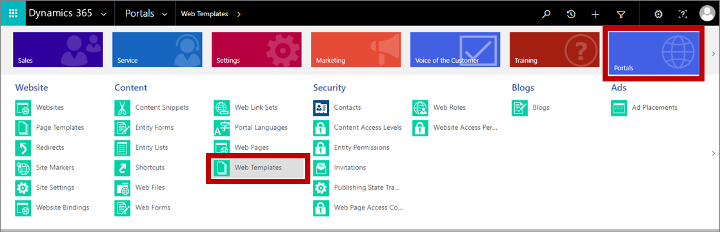
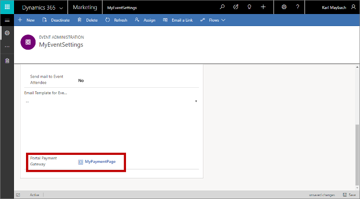

<!--Note to author: Change date to date of publication-->

# Set up a custom payment page for the event portal

If you have one or more events where contacts must purchase a pass, then your contacts will probably appreciate being able to pay for their passes online while they are registering for the event on your event portal.

To enable online payment, you must make an agreement with a third-party payment provider who can authenticate and capture payment details. Your payment provider will supply you with details about how to implement their system, which you'll usually do by adding code supplied by your provider to a web page running on your event portal. You'll typically also need to set up a confirmation page, to which the payment provider redirects on successful payment.

Once your new payment gateway is in place on your event portal, you can configure your various events to use it, or assign it as the default for all new events.

## Add a new payment gateway to your event portal

To add a new payment page to your event portal:

1. Make an agreement with a third-party payment provider and prepare a web page that provides a payment front end, as described in their documentation.

1. Sign in to [!INCLUDE[pn-dynamics-365](../includes/pn-dynamics-365.md)] and go to the custom app by choosing **Dynamics 365—custom** from the app selector.  

    

1. In the custom app, use the horizontal navigator at the top of the page to open **Portals** > **Content** > **Web templates**.  

    

1. Select **+ New** on the control bar to create a new web template.

1. Enter a **Name** for your template and set the **Website** to the **Event Portal**. Then paste the web-page code you developed for the gateway into the **Source** field.  

    

1. Save your template by selecting the **Save** button at the bottom-right corner of the window.

1. Go to **Portals** > **Website** > **Page Template** and select **+ New** on the command bar to create a new page template.  

    

    Make the following settings:

    - **Name**: Enter a name for your page template.
    - **Website**: Select the **Event Portal**.
    - **Type**: Set to **Web Template**.
    - **Web Template**: Select the web template that you created earlier in this procedure.

1. **Save** your page template.

1. Go to **Portals** > **Content** > **Web Pages** and select **+ New** on the command bar to create a new web page.  

    

    Make the following settings:

    - **Name**: Enter a name for your web page.
    - **Website**: Select the **Event Portal**.
    - **Parent page**: Select **Home**.
    - **Partial URL**: Enter a folder name that you want to show in the URL path for this page. This text must form part of a valid URL, so use only letters, numbers, hyphens, and underscores (avoid spaces, special characters, illegal URL characters, and slashes). This value becomes part of the page URL using the following pattern: `https://<YourPortalDomain>/<PartialURL>/`.
    - **Page Template**: Select the page template that you created earlier in this procedure.
    - **Publishing State**: Set to **Published**.

<!--Note to author: Could "invalid" replace "illegal" in the previous list's 4th bullet? Illegal sounds like it breaks a law.-->

1. **Save** your page. Your new payment gateway is now available to your event portal.

## Set the payment gateway for an event

To assign a payment gateway to an event:

1. In the Marketing app, go to **Events** > **Event** > **Events** to open the events list.

1. Find and open an existing event or create a new one.

1. On the **General** tab of the **Event** form, scroll down to the **Website** section and select your payment gateway page in the **Portal payment gateway** field.  

    

1. Restart your portal to refresh its server cache and make sure your new setting takes effect right away. For instructions, see [How can I restart the portal?](setup-troubleshooting.md#restart-portal).

> [!NOTE]
> The payment gateway is only displayed for events that have at least one event pass configured for them. [!INCLUDE[proc-more-information](../includes/proc-more-information.md)][Set up event passes](set-up-event.md#event-passes)

## Set a default payment gateway for all new events

Administrators can set the default payment gateway for all new events by going to **Settings** > **Advanced Settings** > **Event Management** > **Event Administration**. From there, either open the event administration record listed or, if no record is listed, create a new one. On the Event Administration page, set the **Portal Payment Gateway** to the name of your payment page.

This setting becomes the default for all new events, but you can change it for any specific event by following the procedure in Set the payment gateway for an event.

[!INCLUDE[proc-more-information](../includes/proc-more-information.md)][Event management settings](events-settings.md).
