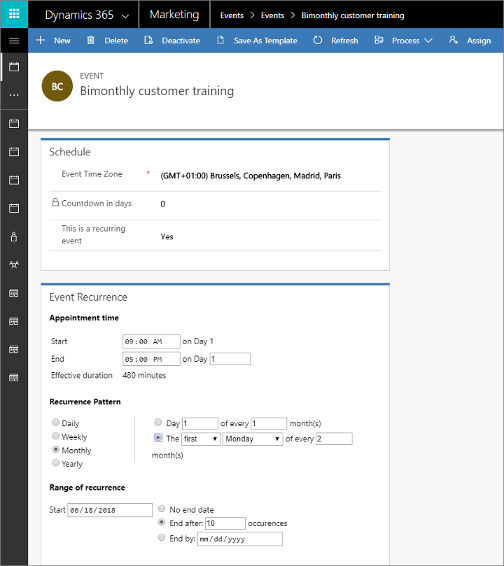
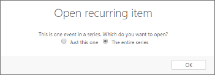
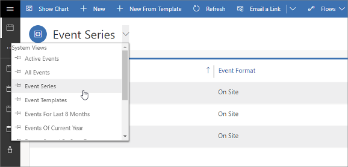
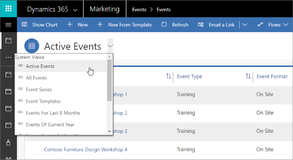
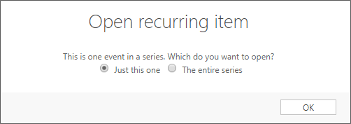
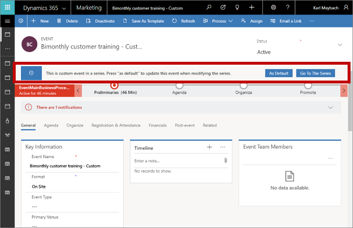

# Create and manage recurring events

If you host an event that occurs regularly, such as a monthly partner call, annual developers conference, or quarterly earnings presentation, then you might benefit by setting up a recurring event. Recurring events provide many benefits in situations like these, including:

- Generate several identical events all at once.
- Take advantage of flexible scheduling options, which let you schedule events that occur yearly, monthly, daily, bi-monthly, semiannually, and more. You can even schedule each event to occur, for example, on the second Tuesday every other month.
- Manage the entire series from a single source. For example, if you change the name of the event series, all uncustomized events that are a part of the series will also get the new name.
- Customize individual event occurrences. For example, you could schedule the August event of the series to start in the third week of the month, while leaving all other monthly occurrences at the first week of the month.
- Maintain a common schedule for each recurrence. Sessions in an event series are scheduled in relation to the starting date of each event occurrence (for example, a welcome speech at 8:00 AM on day 1, workshop at 1:00 PM on day 2, and so on). This way, the agenda for each individual event occurrence always follows the start date of the occurrence.

## Set up a recurring event

To set up a recurring event:

1. [Open the Events work area](open-events.md) and go to **Events** > **Event** > **Events** to open the events list view.

1. Select **+ New** on the commend bar to create a new event.

    > [!TIP]
    > It is usually best to create a recurring event from scratch rather than edit an existing single event into a recurring event.

1. Set up your event by giving it a name and making other basic settings on the **General** tab as usual, but don't leave the **General** tab yet.

    > [!IMPORTANT]
    > When you're setting up a recurring event, set the recurring schedule before you add any sessions to the agenda. This ensures that your sessions are correctly created as recurring sessions (with relative start dates) rather than absolute sessions (that have a fixed calendar date and therefore won't recur).

1. In the **Schedule** section on the **General** tab, set **This is a recurring event** to **Yes**. The **Event recurrence** section opens.  

    

1. Use the settings in the **Event recurrence** section to establish the pattern for your schedule of occurrences. The example shown in the previous screenshot creates a series where each event runs from 9:00 AM – 5:00 PM on the first Monday every other month, and which ends after 10 occurrences.

    > [!NOTE]
    > The maximum number of recurrences is 150. If you enter a combination of settings that would produce more than 150 recurrences, you will get a warning and won't be able to save the event until you adjust your settings.

1. Select **Save** in the bottom-right corner of the window.

1. Continue to set up your event using all the available tabs as needed. More information: [Set up an event](set-up-event.md)

## Edit all events in a series

When you set up a recurring event, all the events in that series maintain a link to the series itself. That means you can edit all the noncustomized occurrences at once to, for example, change the venue for all occurrences.

To edit all non-custom events in a series:

1. [Open the Events work area](open-events.md) and go to **Events** > **Event** > **Events** to open the events list view.
1. Do one of the following:
    - Find any occurrence of your target event series in the list and select that event to open it. The **Open recurring item** dialog opens; select **The entire series** to edit the entire series (rather than just the event occurrence you happen to have selected). 
    
      

    - Open the view selector (located just above the list) and choose **Event Series**. The list now shows just one row for the event series you have set up. Select an event series to open it.  
    
      

1. Edit the event series as required and save your settings.

## Customize individual occurrences from a series

You can customize any individual event that belongs to an event series—for example, to move the summer occurrence of a quarterly event to an outdoor venue. Customized events stop tracking updates that you make to the series itself. If you change your mind later, you can revert any customized event to make it track the series settings again, but this will drop all custom settings for that occurrence.

To change a single event that is part of a series:

1. [Open the Events work area](open-events.md) and go to **Events** > **Event** > **Events** to open the events list view.

1. Set the view selector to **Active Events** (or almost anything other than **Event Series** or **Event Templates**). You should now see a list of individual event occurrences (and non-recurring events).  

    

1. Find and select the event occurrence that you want to customize. The **Open recurring item** dialog opens; select **Just this one** to edit the event occurrence you have selected (rather than the whole series). Then select OK to make the current occurrence a custom occurrence.  

    

1. Edit your custom occurrence as required and save your settings.

## Revert a custom occurrence to a standard occurrence

Customized event occurrences from a series don't track changes made for the series itself. But you can still revert a customized occurrence to return it to a standard occurrence, which will then adopt all current settings for the series and return to tracking the series.

To revert a customized event-series occurrence to a standard occurrence from that series:

1. [Open the Events work area](open-events.md) and go to **Events** > **Event** > **Events** to open the events list view.

1. Set the view selector to **Active Events** (or almost anything other than **Event Series** or **Event Templates**). You should now see a list of individual event occurrences (and non-recurring events). 

    

1. Find and select the custom occurrence that you want to revert. The **Open recurring item** dialog opens; select **Just this one** to edit the custom occurrence and then select **OK**.  

    

1. In the banner at the top of the page, choose **As Default** to revert the current custom occurrence to a standard occurrence.  

    

1. Confirm the operation and then save your settings.

### See also

[Event planning and management](event-management.md)  
[Set up an event](set-up-event.md)

[!INCLUDE[footer-include](../includes/footer-banner.md)]