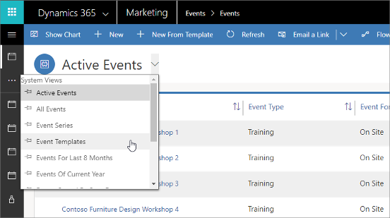

# Create and use event templates

[!INCLUDE[consolidated-sku-rtm-only](../includes/consolidated-sku-rtm-only.md)]

If you often create similar events, then you can save time by setting up one or more event templates. Each template can hold all the same settings as a standard event, including:

- Basic event setup (name, description, type, and so on)
- Event venues
- Event sessions and speakers
- Event passes

When you create an event from a template, the main template record and all its related records are copied to create new, standard records. No link to the template remains, so you can now work with your new event just as you would with an event that you created from scratch.

## Event template limitations

Creating a template from an event is essentially the same as creating an event from an event. There are, however, a few differences between the operations. It's handy to know the differences between templates and creating an event from an event because some plugins are sensitive to whether the clone is a template or an event.
  
The following information isn't copied to templates:

- The start/end date of the session's speaker engagements
- The start/end date of the event's speaker engagements
- The event room reservations
- Session room reservations
- Webinar configurations
- Teams meetings and calendar items

Learn more: [Create an Event from another Event](event-from-event.md).

> [!NOTE]
> Session speakers aren't part of the event, but are linked to from each session. These links are preserved in the template and included in events created based on a template, but the speaker records themselves are not copied or otherwise affected.

## Save an event as a template

You can save any event as a template. To do so, open the event and select **Save as template** on the command bar.

## Create an event from a template

To create a new event based on a template:

1. [Open the Events work area](open-events.md) and go to **Events** > **Event** > **Events** to open the events list.
1. Select **Create from template** on the command bar.
1. The **Create from template** dialog opens. Use it to find the template you want and then select **OK**.
1. Your new event is created. Give it a new name, set its start date, and then select **Save** in the bottom-right corner of the window.

> [!NOTE]
> When you create an event based on a template, it will initially show the start date, end date, and session schedule that was saved with the template. You can change the start and end date of the event and all of its sessions all at once simply by changing the event **Start date**; all other dates and times will be adjusted accordingly.

## View and edit your event templates

To view the event templates available on your system:

1. [Open the Events work area](open-events.md) and go to **Events** > **Event** > **Events** to open the events list.

2. Open the view selector (located just above the list) and choose **Event templates**.  

    

3. The list now shows only event templates. You can open and work with these templates just as you can with standard events. Changes you make to a template won't affect events that were created based on that template.

### See also

[Event planning and management](event-management.md)  
[Set up an event](set-up-event.md)

[!INCLUDE[footer-include](../includes/footer-banner.md)]
