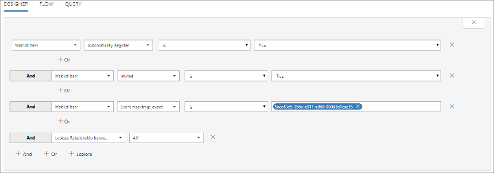

# Set up and manage an event waitlist

You can assign a maximum capacity to each event when needed. When the number of registrations reaches that capacity, the system won't accept any more active registrations, but you can still allow new registrants to add themselves to a waitlist.

Read this topic to learn how to set up a waitlist and how to invite contacts on the list when space becomes available.

## How the waitlist works

The waitlist holds a list of contacts that submitted a registration after an event was fully booked. The waitlist registers the time and day that each contact registered, so when space becomes available, contacts are either automatically registered or offered an invitation to register in the same order that they joined the waitlist. Each contact chooses whether to be automatically registered when they join the waiting list.

When new space becomes available, the waitlist reacts as follows:

1. The oldest existing waitlist record is identified by checking the registration date/time.

1. The identified waitlist record changes its **Invited** field from **No** to **Yes** to indicate that space is now available for that contact. In addition, one of the following occurs, depending on whether the contact is using automatic registration:

    - If the waitlist record has **Automatically register** set to **Yes** , then an event registration record is generated for the contact and the associated waitlist record is hidden. You should create a segment that finds these contacts (where (Automatically-register = Yes) and (Invited = Yes)) and then use a customer journey to send them a notification email that they are now registered.
    - If the waitlist record has **Automatically register** set to **No** , then nothing happens right away. You should create a segment that finds these contacts (where (Automatically-register = No) and (Invited = Yes)) and then use a customer journey to send them an email that invites them to visit the event portal to accept the free slot.

## Enable a waitlist for an event

To enable or disable the waitlist for any event:

1. Go to the events list (**Events** > **Event** > **Events**), then open or create an event.

1. Open the **General** tab and in the **Key information** area, find the **Waitlist this event** field.  
    

1. Set **Waitlist this event** to **Yes** to enable the waitlist. Set to **No** to disable it.

## View the waitlist

To see who is currently on the waitlist for any event:

1. Go to the events list (**Events** > **Event** > **Events**), then open or create an event.

1. Open the **Registration & Attendance** tab and scroll down to the **Waitlist** section. (Note that the **Waitlist** section is only shown for events where the waitlist is enabled.)  
    

    Here you'll find a list of each contact that is waiting to be invited to this event. You can see the following information for each of them:

    - **Contact**: Shows the name of the contact that registered. This is a lookup value taken from the actual contact record. Select the name to open the contact record. Double-click anywhere else on a row to open the waitlist item itself.
    - **Automatically register**: Shows whether this contact chose to be registered automatically when space becomes available.
    - **Invited**: Shows whether this contact is now eligible to be invited. This value is initially set to **No** but will automatically change to **Yes** when space becomes available, provided this contact is not set to register automatically, _and_ this contact is next in line.
    - **Event**: Shows the name of the event.
    - **Created on**: Shows the date the contact submitted their waitlisted registration.

## Send notifications or invites for newly available places

When space becomes available for a waitlisted contact, you need to let them know. You can automate this using the standard segmentation and customer journey features of Dynamics 365 for Marketing. The way you set up the segment varies slightly depending on whether you are using automatic registration or invite-based manual registration.

### Make sure the waitlist entity is being synced

The segmentation engine used by Marketing relies on database information being synced from your main customer database to an external service that is optimized to work with big data, analytics, and segmentation. To maximize the performance of your system, you should only sync those specific entities that you want to use in your segmentation. If you are using waitlists, then you must sync the waitlist entity to enable you to find and communicate with waitlisted contacts.

Talk to your system administrator to make sure the waitlisted entity is being synced. If you are the admin, then go to **Settings** > **Advanced settings** > **Marketing settings** > **Customer insights sync** and make sure the **Waitlist Item (msevtmgt\_waitlistitem)** entity is marked. More information: [Choose entities to sync with the customer-insights services](marketing-settings.md#dci-sync)

### Create a segment that finds waitlisted contacts to invite

To create a segment that finds contacts that _are not_ using automatic registration, but which should now be invited to register, do the following:

1. Go to the events list ( **Events** > **Event** > **Events** ), then open your event.

1. Check the address bar in your browser, which should show a URL such as:  

    `https://<MyOrg>.crm.dynamics.com/main.aspx?appid=c8cba597-4754-e811-a859-000d3a1be1a3&pagetype=entityrecord&etn=msevtmgt_event&id=5acc43d5-356e-e811-a960-000d3a1cae35`  

    Find the part of the URL that starts with `&id=`, which is followed by the ID number of your current record. Copy that number (the value only) and use it in your expression

1. Go to **Marketing** > **Customers** > **Segments** and select **+ New** from the command bar.

1. Fill out the **General** tab with a name and description for your new segment.

1. Open the **Definition** tab. A default contact group is provided, but you don't want a contact group, so select the close button to remove this default group.  
    

1. The default group closes, leaving behind a **Select a profile or relationship** drop-down list. Select **Waitlist item** from here.  
    

1. Complete the row to create the logical expression:  
**Waitlist Item | Automatically register | is | False**.  
    

1. Select **+ And** to add a second clause using an AND operator. Use it to create the logical expression:  
**Waitlist Item | Invited | is | True**

1. Select **+ And** to add a third clause. Use it to create the logical expression:  
**Waitlist Item | Event msevtmgt\_event | is | &lt;YourEventID&gt;**

    Where _&lt;YourEventID&gt;_ is the event ID you found at the start of this procedure.

1. Select **+ And** to add a fourth clause. Use it to create the logical expression:  
**msevtmgt\_waitlistitem\_contact\_msevtmgt\_contact\_&lt;YourOrg&gt; | All&ast;**

    This last clause links from the waitlist entity to the contact entity. All segments must resolve to a contact record, so this clause links the found waitlist records to their related contacts and returns that list of contacts.

1. Your final segment should resemble the following screenshot. Select **Save** at the bottom-right corner of the window to save your settings.  
    

1. Select **Go Live** from the command bar to activate the segment.

### Create a segment that finds waitlisted contacts that have been registered automatically

To create a segment that finds contacts that _have already_ been registered automatically, but need to be informed about it, create a segment almost like the one described in the previous section, but this time look for waitlist records where **Automatically register** is **true**. The full set of clauses is:

**Waitlist Item | Automatically register | is | True**  
**AND Waitlist Item | Invited | is | True**  
**AND Waitlist Item | Event msevtmgt\_event | is | &lt;YourEventID&gt;**  
**AND msevtmgt\_waitlistitem\_contact\_msevtmgt\_contact\_&lt;YourOrg&gt; | All&ast;**

### Create a customer journey to send invitations or notifications to waitlisted contacts

To deliver messages to your waitlist members, just set up a simple customer journey that uses an appropriate segment (such as those described in the previous sections) followed by an email tile that sends a message that matches that segment. Set the journey to run for the entire registration period of your event. That way, each time a waitlist record gets moved to invited = true, the related contact will be added to the segment and will get processed by the journey.

Each email message should inform the recipient about what has happened (auto registered, or invited to register), and include an event block to link to the relevant event portal. The event link is especially important for invites where auto-register is not enabled.

For a journey sending invites to waitlist contacts that aren't auto-registered, consider adding an event tile as a child of the email-message tile so you can add a trigger that reacts to registration and follows up as needed.

The following example shows a journey that has two parallel paths, one for auto-registered contacts and one for invited (manual-register) contacts. Note that both email messages show a child event tile, and that the invite flow includes a trigger, which is set to react by sending a welcome mail to contacts that register.

More information: [Use customer journeys to create automated campaigns](customer-journeys-create-automated-campaigns.md), [Prepare marketing email messages](prepare-marketing-emails.md)

# Create and use event templates

If you often create similar events, then you can save time by setting up one or more event templates. Each template can hold all the same settings as a standard event, including:

- Basic event setup (name, description, type, etc.)
- Event venues
- Event sessions and speakers
- Event passes
- Custom registration fields

When you create an event from a template, the main template record and all its related records are copied to create new, standard records. No link to the template remains, so you can now work with your new event just as you would with an event that you created from scratch.

**NOTE**: Session speakers aren't part of the event, but are linked to from each session. These links are preserved in the template and included in events created based on a template, but the speaker records themselves are not copied or otherwise affected.

## Save an event as a template

You can save any event as a template, to do so, open the event and select **Save as template** on the command bar.

## Create an event from a template

To create a new event based on a template:

1. Go to **Events** > **Event** > **Events** to open the events list.
2. Select **Create from template** on the command bar.
3. The **Create from template** dialog opens. Use it to find the template you want to use and then select **OK**.
4. Your new event is created. Give it a new name, set its start and end dates and then select **Save** in the bottom-right corner of the window.
**IMPORTANT**: If your template includes sessions, then each session will keep the schedule they had when the template was saved. You'll need to adjust the schedule of each individual session to ensure that they fit into the new event dates and times.

## View and edit your event templates

To view the event templates available on your system:

1. Go to **Events** > **Event** > **Events** to open the events list.
2. Open the view selector (located just above the list) and choose **Event templates**.

3. The list now shows only event templates. You can open and work with these templates just as you can with standard events. Changes you make to a template won't affect events that were created based on that template.

# Create and manage recurring events

If you host an event that occurs regularly, such as a monthly partner call, annual developer's conference, or quarterly earning presentation, then you might benefit by setting up a recurring event. Recurring events provide many benefits in situations like these, including:

- Generate several identical events all at once.
- Take advantage of flexible scheduling options, which let you schedule events that occur yearly, monthly, daily, bi-monthly, semiannually, and more. You can even schedule each event to occur, for example, on the second Tuesday every other month.
- Manage the entire series from a single source. For example, if you change the name of the event series, all uncustomized events that are a part of the series will also get the new name.
- Customize individual event occurrences. For example, you could schedule the August event of the series to start in the third week of the month, while leaving all other monthly occurrences at the first week of the month.
- Maintain a common schedule for each recurrence. Sessions in an event series are scheduled in relation to the starting date of each event occurrence (for example, a welcome speech at 8:00 AM on day 1, workshop at 1:00 PM on day 2, etc.). This way, the agenda for each individual event occurrence always follows the start date of the occurrence.

## Set up a recurring event

To set up a recurring event:

1. Go to **Events** > **Event** > **Events** to open the events list view.
2. Select **+ New** on the commend bar to create a new event.
**TIP**: It is usually best to create a recurring event from scratch rather than edit an existing single event into a recurring event.
3. Set up your event by giving it a name and making other basic settings on the **General** tab as usual, but don't leave the **General** tab yet.
**IMPORTANT**: When you're setting up a recurring event, set the recurring schedule before you add any sessions to the agenda. This ensures that your sessions are correctly created as recurring sessions (with relative start dates) rather than absolute sessions (that have a fixed calendar date and therefore won't recur).
4. In the **Schedule** section on the **General** tab, set **This is a recurring event** to **Yes**. The **Event recurrence** section opens.

5. Use the settings in the **Event recurrence** section to establish the pattern for your schedule of occurrences. The example shown in the previous screenshot creates a series where each event runs from 9:00 AM – 5:00 PM on the first Monday every other month, and which ends after 10 occurrences.
6. Select **Save** in the bottom-right corner of the window.
7. Continue to set up your event using all the available tabs as needed. More information: [Set up an event](https://docs.microsoft.com/en-us/dynamics365/customer-engagement/marketing/set-up-event)

## Edit all events in a series

When you set up a recurring event, all the events in that series maintain a link to the series itself. That means that you can edit all the non-customized occurrences at once to, for example, change the venue for all occurrences.

To edit all non-custom events in a series:

1. Go to **Events** > **Event** > **Events** to open the events list view.
2. Do one of the following:
  - Find any occurrence of your target event series in the list and select that event to open it. The **Open recurring item** dialog opens; select **The entire series** to edit the entire series (rather than just the event occurrence you happen to have selected).

  - Open the view selector (located just above the list) and choose **Event series**. The list now shows just one row for event series you have set up. Select an event series to open it.

3. Edit the event series as required and save your settings.

## Customize individual occurrences from a series

You can customize any individual event that belongs to an event series, for example to move the summer occurrence of a quarterly event to an outdoor venue. Customized events stop tracking updates that you make to the series itself. If you change your mind later, you can revert any customized event to make it track the series settings again, but this will drop all custom settings for that occurrence.

To change a single event that is part of a series:

1. Go to **Events** > **Event** > **Events** to open the events list view.
2. Set the view selector to **Active events** (or anything other than **Event series** or **Event templates** ). You should now see a list of individual event occurrences (and non-recurring events).

3. Find and select the event occurrence that you want to customize. The **Open recurring item** dialog opens; select **Just this one** to edit the event occurrence you have selected (rather than the whole series). Then select OK to make the current occurrence a custom occurrence.

4. Edit your custom occurrence as required and save your settings.

## Revert a custom occurrence to a standard occurrence

Customized even occurrences from a series don't track changes made for the series itself. But you can still revert a customized occurrence to return it to a standard occurrence, which will then adopt all current settings for the series and return to tracking the series.

To revert a customized event-series occurrence to a standard occurrence from that series:

1. Go to **Events** > **Event** > **Events** to open the events list view.
2. Set the view selector to **Active events** (or anything other than **Event series** or **Event templates** ). You should now see a list of individual event occurrences (and non-recurring events).

3. Find and select the custom occurrence that you want to revert. The **Open recurring item** dialog opens; select **Just this one** to edit the custom occurrence and then select **OK**.

4. In the banner at the top of the page, choose **As default** to revert the current custom occurrence to a standard occurrence.

5. Confirm the operation and then save your settings.