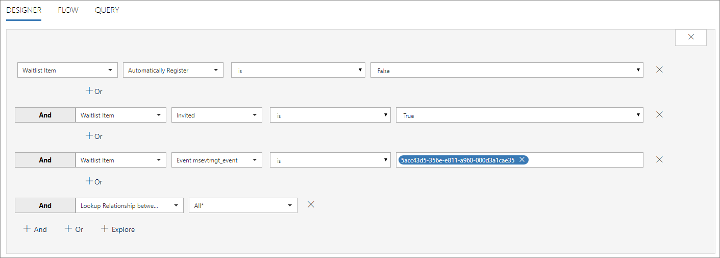

# Set up and manage an event waitlist

[!INCLUDE[cc_applies_to_update_9_0_0](../includes/cc_applies_to_update_9_0_0.md)]

You can assign a maximum capacity to each event or session when needed. When the number of registrations reaches that capacity, the system won't accept any more active registrations, but you can still allow new registrants to add themselves to a waitlist.

Read this topic to learn how to set up a waitlist and how to invite contacts on the list when space becomes available.

> [!IMPORTANT]
> Event-level and session-level waitlisting is only available for on-site events. Hybrid and webinar events don't support waitlisting.

## How the waitlist works

The waitlist holds a list of contacts who submitted a registration through the event website after an event or session was fully booked. The waitlist registers the time and day that each contact registered, so when space becomes available, contacts are either automatically registered or offered an invitation to register in the same order that they joined the waitlist. You can choose whether contacts will be automatically registered when space becomes available for them, or whether they should instead be sent an invitation to register manually.

For events or session already at capacity, visitors to the event website can only join the waitlist, but [!INCLUDE[pn-marketing-business-app-module-name](../includes/pn-marketing-business-app-module-name.md)] users from your organization can still add new registrations by opening the [event record](set-up-event.md) and doing one of the following:

- If you are using event-level registration, go to the **Registration and attendance** tab for the event and add new registrations to the **Event registration** list here.
- If you are using session-level registration, go to the **Agenda** tab and open the relevant session. Then go to the **Registration and attendance** tab for the session and add new registrations to the **Session registration** list here.

Registrants added to the **Event registration** or **Session registration** lists in this way will join the event immediately without getting placed on the waitlist. Users can also add registrants directly to the session or event **Waitlist** from here.

When new space becomes available, the waitlist reacts as follows:

1. The oldest existing waitlist record is identified by checking the registration date/time.

1. The identified waitlist record changes its **Invited** field from **No** to **Yes** to indicate that space is now available for that contact. In addition, one of the following occurs, depending on whether the contact is using automatic registration:

    - If the waitlist record has **Automatically register** set to **Yes**, then an event registration record is generated for the contact and the associated waitlist record is hidden. You should create a segment that finds these contacts (where (Automatically-register = Yes) and (Invited = Yes)) and then use a customer journey to send them a notification email that they are now registered.
    - If the waitlist record has **Automatically register** set to **No**, then nothing happens right away. You should create a segment that finds these contacts (where (Automatically-register = No) and (Invited = Yes)) and then use a customer journey to send them an email that invites them to visit the event website to accept the slot.

## Enable a waitlist for an event

To enable or disable the waitlist for any event (for both event-level and session-level registration):

1. [Open the Events work area](open-events.md), go to the events list (**Events** > **Event** > **Events**), and then open or create an event.

1. Open the **General** tab and find the **Venue constraints** area.

    

1. Make the following settings:

    - **Maximum event capacity** (event-level registration only): Enter the maximum number of people who can attend your event. The waitlist will only take effect after this number of contacts have registered. This setting isn't shown if you are using [session-level registration](session-level-registration.md); in this case, set the capacity for each session individually. 
    - **Waitlist this event**: Set to **Yes** to enable the waitlist feature and reveal the **Waitlist** section, which contains the other settings described here.
    - **Number of invitations per slot**: When an extra space becomes available, the system will invite this many contacts from the waitlist, in the same order they joined. Often you will set this to one, but if you are using manual waitlist registration, then you might choose a higher number to increase the chance that at least one contact will follow through with the registration. When a slot opens, the system changes this many waitlist records' **Invited** field from **No** to **Yes**.
    - **Automatically register waitlisted contacts**: Set to **Yes** to automatically register the next contact in line when space becomes available. When this is set to **Yes**, all waitlist records for this event will therefore have their **Automatically register** fields set to **Yes**. When this is set to **No**, then you can choose whether or not to allow contacts to choose this option for themselves while joining the waitlist.
    - **Contact can choose to be registered automatically**: This option is only shown when  you aren't using automatic registration. Choose **Yes** to provide a check box on the registration form where contacts can choose  to be registered automatically. Choose **No** to use manual registration for all contacts. The **Automatically register** field for each waitlist record will be assigned to match either this option or the choice made by contacts when they join the waitlist.

## View the waitlist

To see who is currently on the waitlist for any event or session:

1. [Open the Events work area](open-events.md), go to the events list (**Events** > **Event** > **Events**), and then open the event.

1. If you are using [session-level registration](session-level-registration.md), then go the the **Agenda** tab for the event and open the session you want to view.

1. Open the **Registration and attendance** tab for your selected event or session and scroll down to the **Waitlist** section. (Note that the **Waitlist** section is only shown when the waitlist is enabled.)  

    

    Here you'll find a list of each contact who is waiting to be invited to this event or session. You can see the following information for each:

    - **Contact**: Shows the name of the contact that registered. This is a lookup value taken from the actual contact record. Select the name to open the contact record. Double-click anywhere else on a row to open the waitlist item itself.
    - **Automatically register**: Shows whether this contact chose to be registered automatically when space becomes available.
    - **Invited**: Shows whether this contact is now eligible to be invited. This value is initially set to **No** but will automatically change to **Yes** when space becomes available, provided this contact is not set to register automatically, _and_ this contact is next in line.
    - **Event**: Shows the name of the event.
    - **Created on**: Shows the date the contact submitted their waitlisted registration.

## Send notifications or invites for newly available places

When space becomes available for a waitlisted contact, you need to let them know. You can automate this using the standard segmentation and customer journey features of [!INCLUDE[pn-marketing-business-app-module-name](../includes/pn-marketing-business-app-module-name.md)]. The way you set up the segment varies slightly depending on whether you are using automatic registration or invite-based manual registration; and whether you are using session-level or event-level registration.

### Make sure the required entities is being synced

The segmentation engine used by Marketing relies on database information being synced from your main customer database to an external service that is optimized to work with big data, analytics, and segmentation. To maximize the performance of your system, you should only sync those specific entities that you want to use in your segmentation. If you are using waitlists, then you must sync the waitlist entity to enable you to find and communicate with waitlisted contacts. If you are using session-level waitlisting, then you should also sync the session entity.

Talk to your system administrator to make sure the waitlisted entity is being synced. If you are the admin, then go to **Settings** > **Advanced settings** > **Marketing settings** > **Customer insights sync** and make sure the **Waitlist Item (msevtmgt\_waitlistitem)** entity is selected; for session-level waitlisting, also select the **Session (msevtmgt\_session)** entity. [!INCLUDE[proc-more-information](../includes/proc-more-information.md)] [Choose entities to sync with the marketing insights service](marketing-settings.md#dci-sync)

### Create a segment that finds waitlisted contacts to invite

To create a segment that finds contacts who _are not_ using automatic registration, but who should now be invited to register, do the following:

1. Go to **Marketing** > **Customers** > **Segments** and select **+ New** from the command bar. A new segment record opens with the **Definition** > **Designer** tab showing.
    

    Do the following:

    - Enter a **Name** for the segment at the top of the page.
    - Select the close button to remove the default contact group from the **Designer** area. Many of your segments will probably start and end with the contact entity, but for this example we will start with waitlist items instead.

1. When default contact group closes, it's replaced by a **Select a profile or relationship** drop-down list. Select **Waitlist item** from here. (If you don't see the **Waitlist item** entity listed here, then you probably need to set up syncing for this entity as described in the previous section; note that it can take up to half an hour for a new entity to appear in this list after the first sync.)    
    

1. Complete the row to create the logical expression:  
**Waitlist Item | Automatically register | is | False**.    
    

1. Select **+ And** to add a second clause using an AND operator. Use it to create the logical expression:  
**Waitlist Item | Invited | is | True**

1. Select **+ And** to add a third clause. Use it to create *one* of the following the logical expressions:

    - For event-level registration:    
    **Waitlist Item | Event (event) | is / is in | _&lt;YourEventName&gt;_**  
    Where _&lt;YourEventName&gt;_ is the name of the event.
    - For session-level registration:    
    **Waitlist Item | Session (session) | is / is in | _&lt;YourSessionName&gt;_**  
    Where _&lt;YourSessionName&gt;_ is the name of the session.
1. Select **+ And** to add a fourth clause. Use it to create the logical expression:  
**Waitlist item -> Contact (contact) | All&ast;**

    This clause links from the waitlist entity to the contact entity. All segments must resolve to a contact record, so this clause links the found waitlist records to their related contacts and returns that list of contacts.

1. Select **+ And** to add a fifth clause. Use it to create the logical expression:  
**Contact | All&ast;**

    This clause adds all the matching contacts to the segment. 

1. Select **Save** at the bottom-right corner of the window to save your settings. Your final segment should resemble the following screenshot:    
    

1. Select **Go Live** from the command bar to activate the segment.

### Create a segment that finds waitlisted contacts who have been registered automatically

To create a segment that finds contacts who _have already_ been registered automatically, but need to be informed about it, create a segment almost like the one described in the previous section, but this time look for waitlist records where **Automatically register** is **true**. The full set of clauses is one of the following:

- For event-level waitlists:  
**Waitlist Item | Automatically register | is | True**  
**AND Waitlist Item | Invited | is | True**  
**Waitlist Item | Event (event) | is / is in | _&lt;YourEventName&gt;_**  
**Waitlist item -> Contact (contact) | All&ast;**  
**Contact | All&ast;**
- For session-level waitlists:  
**Waitlist Item | Automatically register | is | True**  
**AND Waitlist Item | Invited | is | True**  
**Waitlist Item | Session (session) | is / is in | _&lt;YourSessionName&gt;_**  
**Waitlist item -> Contact (contact) | All&ast;**  
**Contact | All&ast;**

### Create a customer journey to send invitations or notifications to waitlisted contacts

To deliver messages to your waitlist members, set up a customer journey that uses an appropriate segment (such as those described in the previous sections) followed by an email tile that sends a message that matches that segment. Set the journey to run for the entire registration period of your event. That way, each time a waitlist record gets moved to invited = true, the related contact will be added to the segment and will get processed by the journey.

Each email message should inform the recipient about what has happened (auto registered, or invited to register), and include an event element to link to the relevant event website. The event link is especially important for invites where auto-register is not enabled, but even auto-registered attendees may still need to purchase a ticket on the event website.

For a journey sending invites to waitlisted contacts who aren't auto-registered, consider adding an event tile as a child of the email-message tile so you can add a trigger that reacts to registration and follows up as needed.

The following example shows a journey that has two parallel paths, one for auto-registered contacts and one for invited (manual-register) contacts. Note that both email messages show a child event tile, and that the invite flow includes a trigger, which is set to react by sending a welcome mail to contacts who register. After a few days, the trigger sends contacts who don't register down the bottom path, where a workflow removes unresponsive contacts from the waitlist so other waiting contacts can be invited (this requires that you create a [custom workflow](../customize/workflow-processes.md) to handle this).

[!INCLUDE[proc-more-information](../includes/proc-more-information.md)] [Use customer journeys to create automated campaigns](customer-journeys-create-automated-campaigns.md), [Prepare marketing email messages](prepare-marketing-emails.md), [Customer journey tiles reference](customer-journey-tiles-reference.md)

### See also

[Event planning and management](event-management.md)  
[Set up session-level registration and waitlisting](session-level-registration.md)  
[Set up an event](set-up-event.md)
