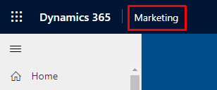
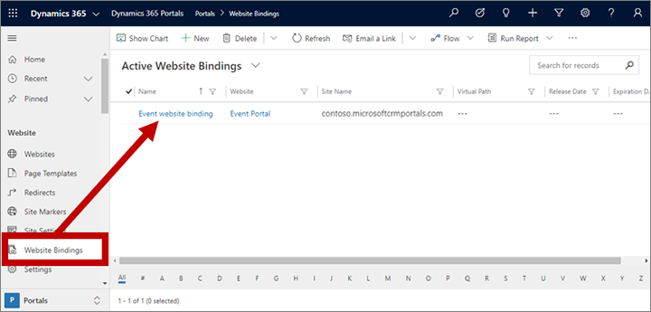
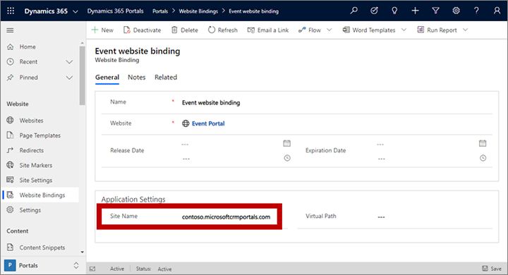
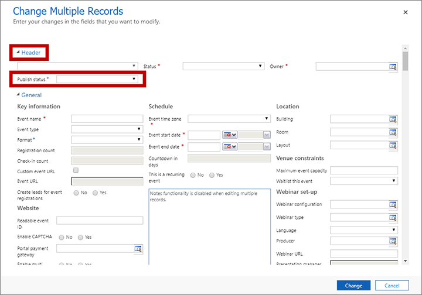

# Change the URL for event websites hosted on Power Apps portals

If you chose to [integrate with a Power Apps portal](portal-optional.md) when you installed Dynamics 365 Marketing, then you were able to choose an initial subdomain for the portal. The resulting URL for the portal takes the form: **_MySubdomain_.microsoftcrmportals.com**. That URL then becomes the standard domain at which your event website is hosted under a path such as **_MySubdomain_.microsoftcrmportals.com/events/_EventID_**. Each time you go live with an event, a link to that event on the event website is added to the event record (in the **Event URL** field on the **General** tab for the event). This is also the URL that you will share with contacts who want to register for your event.

If you aren't satisfied with the subdomain name you chose when you installed Marketing, then you can change it any time (however, the base domain must still be **microsoftcrmportals.com**).

> [!WARNING]
> Changing the subdomain of your portal will affect all Dynamics 365 Marketing features that are integrated with that portal, including the event website for all events and all marketing pages that are published there. This means that all existing links to those resources will no longer work after you change the subdomain. The most important of these is your subscription center, which must be accessible, by law in many countries/regions, via a link in all marketing email messages that you send. Be sure to plan carefully when you choose to change your portal subdomain to ensure that all the email campaigns you are running will continue to provide valid links to your subscription center, event website, and all marketing pages linked to by your marketing email messages. It is your organization's responsibility to ensure your marketing initiatives are in full conformity with all relevant laws and regulations.

## Change the default portal URL for events and pages

To change the URL for your portal and the default URL for your events and pages:

1. If you haven't already done so, change the subdomain for your Power Apps portal by following the instructions given in [Change the base URL of a portal](../portals/change-base-url.md). Be sure to read the warning in the introduction to this topic before changing this.

1. In Dynamics 365 Marketing, select **Marketing** in the top ribbon to change apps, then select **Power Apps portals**.

    > [!div class="mx-imgBorder"]
    > 

1. You are now in the Portals app. Go to **Portals** > **Website** > **Website bindings**.

1. A list of website bindings opens. Often, there will be just one. Select the binding for your event portal to open it. This same website is normally used for both the event website and all marketing pages on the same portal.

    

1. Edit the **Site name** field to match the new name you selected as your portal base URL. Enter the full domain and subdomain, such as **_MySubdomain_.microsoftcrmportals.com**.

    

## Update existing events and marketing pages records

After you've changed your portal subdomain, all new events will show the new base URL in their **Event URL** field on going live. However, all existing events will still show the old URL, which no longer works.

Marketing pages published to the same portal are also affected in similar ways. Like events, pages provide a clickable link to the page itself (in the **Full page URL** field on the **Summary** tab), which will continue to show the old (nonfunctioning) URL until you update them.

> [!IMPORTANT]
> After changing your portal subdomain, you _must_ update the URL for all events and pages that you link to in any marketing email that you will send now or in the future. When you send the message, each of these links uses the then-current value the URL fields of those resources. This occurs at email send time, not email publish time, so provided you change the URL for each page and event record, all email messages that are already live will use the new URL when they are sent by a customer journey. You don't need to modify or republish the messages themselves.

> [!WARNING]
> If your subscription center is hosted on your portal, then it is especially important that you update its URL as described in the following procedure. If you don't, you risk sending marketing email messages that violate local laws. Also, after you change this URL, all the marketing emails you previously sent will no longer contain a working unsubscribe link, so you should consider sending an announcement about the change to all of the contacts you market to. It is your organization's responsibility to ensure your marketing initiatives are in full conformity with all relevant laws and regulations.

To update the URL for any existing, live event or page record after changing your portal URL, you must stop and then republish each individual record. To do this:

1. Open the event or page.
1. Select **Stop** on the command bar.
1. Select **Go live** on the command bar. The **Event URL** or **Full page URL** field is now updated, so all marketing emails that refer to these events and pages will now use the correct new URL.
1. Repeat this procedure for each page or event record that you are still using. We recommend that you do it for all events and pages in your system.

You can update the URLs for many events at the same time, but you'll still need to update marketing pages one at a time. To update several events at once:

1. Go to **Marketing** > **Event management** > **Events** to open the events list.

1. Place a check mark in the left column for each event you want to change. Or select the check mark in the head of the table to select all the events currently displayed. (If you have several pages of events in your list, you can't select events on other pages, so you'll need to repeat this procedure for each page if you need to update all events.)

1. Select **Edit** on the command bar. The **Change multiple records** dialog box opens. Expand the **Header** section here.

    

1. Set the **Header** > **Publish status** drop-down list to **Draft** and then select the **Change** button to apply your change.

1. You return to the events list. Select the same set of events as before and then select **Edit** on the command bar once again.

1. Set the **Header** > **Publish status** drop-down list to **Live** and select the **Change** button to apply your change.

1. All the events you selected now show the updated **Event URL**.

### See also

[Set up the event website](set-up-event-portal.md)

[!INCLUDE[footer-include](../includes/footer-banner.md)]