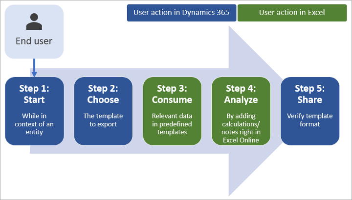
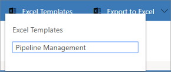

# Export data to Word or Excel files

You can export Dynamics 365 Marketing data to a Word or Excel template to create standardized documents that you can share with people who don't use Dynamics 365.

> [!TIP]
> You can export the templates that are included in Dynamics 365, modify them, and then reimport them as new templates. This can give you a running start on creating your own custom Excel templates.

## Generate a Word document with Dynamics 365 Marketing data

You can export information from a single record by using a Word template, which formats the information into a readable and sharable document.

To export Dynamics 365 Marketing data by using a Word template, do the following:

1. Open a record, such as a single contact, with information you want to use in your document.

2. On the command bar, select **Word Templates**, and then under **Word Templates**, choose the template want to use. If you don't see the template you are looking for, consider the following:
   - Only templates built for the selected record type (entity) will be displayed. For example, you won't see a template created for accounts when you are working with a contact.
   - If you are looking for a brand-new template, you might need to refresh the page to see it. Either refresh your browser or close and reopen Dynamics 365 Marketing.

After you select your Word template, Dynamics 365 Marketing creates a Word document from the record you selected.

Several sample Word templates, for a variety of entities, are included out of the box. Your administrator can add more as needed, either by customizing the standard ones or creating new ones from scratch. More information: [Manage Word templates](manage-word-templates.md)

## Generate an Excel workbook with Dynamics 365 Marketing

You can export information from a multiple-record list by using an Excel template, which formats the information and generates graphs to create a readable and sharable workbook.

The process for using an Excel template looks like this:

### Step 1: Select an entity to analyze

In Dynamics 365 Marketing, select a record type (entity) to export to an Excel workbook.

For example, go to **Marketing** > **Lead management** > **Leads**.

### Step 2: Export Dynamics 365 Marketing data by using an Excel template

On the command bar, select **Excel Templates** to open a list of available templates, and then choose the one you want to use for the export.

Dynamics 365 Marketing generates your Excel workbook and downloads it to your computer.

### Step 3: Analyze your Dynamics 365 Marketing data in Excel

What you see in the Excel workbook is based on two things:

- **Rows**: Your Excel workbook includes a row for each record that was visible in the view you exported from.
- **Columns**: The columns correspond to the fields in a record. The template you used determines which columns appear in the table in the exported Excel file.

### Step 4: Share the results with others

Save a copy either online or to your computer, and then share the workbook or link with others for their review and input.

### See also

[Manage Excel templates](manage-excel-templates.md)  
[Manage Word templates](manage-word-templates.md)  
[Business management settings](business-management-settings.md)

[!INCLUDE[footer-include](../includes/footer-banner.md)]