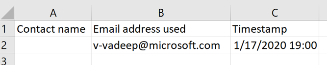

# Early access: Export customer journey insights into a .CSV file

> [!IMPORTANT]
> This is an early access feature, which means that it's currently available only on opted-in instances. You can opt in for early access on any instance, but we recommend that you do so only on trial, test, or sandbox instances, which will give you a chance to learn the new functionality before it shows up on your production instances later this year.
>
> For instructions on how to opt in and enable early access, see Opt in to early access updates. For more information about the 2020 release wave 1 schedule, and for answers to frequently asked questions about the early access program, see 2020 release wave 1 features available for early access.
>
>We encourage all customers to provide feedback related to early access features on the Dynamics 365 Marketing Forum, your Microsoft contact or partner, and/or through Microsoft Support.

You can now export all customer journey interactions into a .CSV file for further analysis or reporting. You can easily export interactions from the same category (e.g., Delivered emails) with just a click of a button.

  

## Export a .CSV file

1. Go to **Insights** and select the interaction category you want to export (e.g., **Delivered emails**).

2. Select the **Export to CSV** button in the right top corner of a selected table.

3. That’s it! The .CSV file is automatically downloaded with the same columns and data as the table you selected to export.

  

> [!IMPORTANT]
> You cannot download different categories of interactions (e.g., **Sent** + **Delivered** + **Blocked** + **Delivery failed**) all at once into one file.
