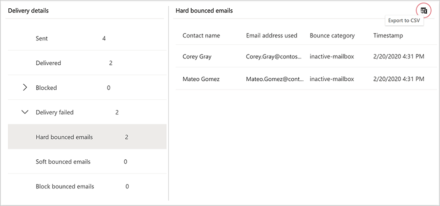

# Export customer journey insights into a .CSV file

You can now export all customer journey interactions into a .CSV file for further analysis or reporting. You can easily export interactions from the same category (for example, Delivered emails) with just a click of a button.

## Export a .CSV file

1. Go to **Insights** and select the interaction category you want to export (for example, **Delivered emails**).

2. Click the **Export to CSV** button in the right top corner of the selected table.

3. The .CSV file is automatically downloaded with the same columns and data as the table you selected to export.

    

> [!IMPORTANT]
> You cannot download different categories of interactions (e.g., **Sent** + **Delivered** + **Blocked** + **Delivery failed**) all at once into a single file. You must export each category individually.

[!INCLUDE[footer-include](../includes/footer-banner.md)]