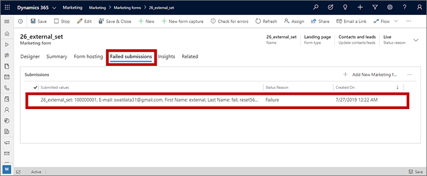
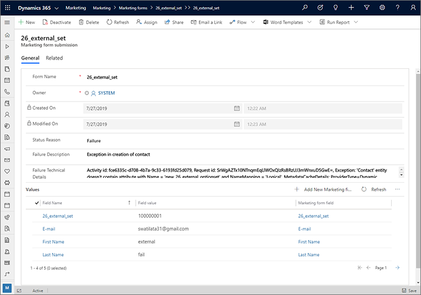

# Edit and resubmit form submissions

Marketing forms must be designed to submit values for all mandatory fields and fields used in contact matching, lead matching, and duplicate detection. For option-set fields, forms must also provide valid index values that map correctly to available values in the database.

Every now and then, errors in form design or changes to system settings can cause form submissions to fail. When a submission fails, the system will store what it can of the erroneous submission so you can examine it later and possibly recover key information from it. This information can also help you learn how to correct your form designs and/or system settings to prevent failed submissions in the future.

Optionally, you can configure the system to also keep all incoming form submissions, including submissions that were successful and have already been processed and applied to your database. This will give you the chance to edit and resubmit both successful and failed submissions.

On resubmitting an edited submission, you'll be able to choose whether your update should count as a new form-submit interaction, or if it should be recorded as the original submission.

## Why submissions can fail

Submissions can fail for any of the following reasons:

- **Bad option set values**: Option set fields are usually presented as drop-down lists in forms. For each option presented by the drop-down list, the database stores both a display value (shown by the form) and an index value (an integer submitted and stored in the database, which maps each index value to a display value). An error can occur if the form submits an index value that isn't available in the database. This might happen if the database has changed since the form was designed, or if the form design includes an error that allows bad values to be submitted.
- **Mismatch of option sets between leads and contacts**: You can create forms that update or create both a contact and/or a lead. In this case, each field value from the form should be stored by two records from two different entities. Because the fields for each entity are created and updated separately, it can happen that one entity is updated, but not the other. As a result, submissions may fail some or all of the time when option set values don't match.
- **Missing required fields for matching strategies**: Matching strategies enable the system to match incoming form submissions to existing records. When a match is found, the system will typically update the existing record rather than create a new one. Each matching strategy establishes a set of fields to use when matching, and only identifies a match when all fields named by the matching strategy have matching values in both an existing record and the incoming submission. However, if the form doesn't include values for all of the matching-strategy fields, then the submission will fail. In this case, you either need to change the matching strategy or change the form to include all matching-strategy fields as required fields for the form. Remember that your contacts and leads may be using different matching strategies, so forms that affect both of these entities must also meet matching-strategy requirements for both entities too. More information: [Set matching strategies](mkt-settings-matching.md)
- **Incompatible customizations on the contact or lead entities**: Sometimes, customizations applied to the contact and/or lead entities will interfere with form submissions. For example, you may have a custom business process flow that has made a field mandatory, but that field is missing or not mandatory on your form. Custom plug-ins that affect contact or lead creation can also prevent new records from being created for these entities in response to form submissions.

## Find and inspect incoming submissions

To find incoming submissions:

1. Go to **Marketing** > **Internet marketing** > **Marketing forms** to open a list of existing forms.
1. Find and open the form you want to inspect.
1. Go to the **Form submissions** tab. Incoming forms that haven't been processed yet are listed here as pending. If any failed submissions have been received, you'll see them listed here too. If you've configured the form to [store all incoming submissions](#keep-all), then you'll also see successful submissions here. The **Status Reason** column reports the pending/success/fail status of each submission.

    

1. To inspect a submission, select and open it from this list (for example, with double-click). A new page opens showing details of the submission, including a failure description (if relevant), technical details, and a list of values submitted.

    

1. Do the following:

    - For failed submissions, inspect the information provided in the **Failure Description** and **Failure Technical Details** fields to troubleshoot your form issues. You may discover how to adjust your form and/or system settings to prevent future submission failures. See [Why submissions can fail](#why-fail) for more information about what can go wrong and how to fix it.
    - Inspect the **Values** table to see what was submitted for each field in the form.
    - To modify a field value, select it in the list to open a page where you can edit it. Then select **Save** in the bottom corner of the window and select the back button in your browser to return to the submission.
    - To add a missing field value, select the **New marketing field submission** button at the top of the **Values** table to open a page where you can choose a marketing form field to submit to, and a value to submit to that field. Then select **Save and close** on the command bar to go back to the submission.

1. Repeat the previous step until you've gathered all the information you need and edited the field values as needed. Then select **Save** in the bottom corner of the window and select the back button in your browser to return to the form record.

1. If you changed any form values and would like to resubmit the form, then go back to the Form submissions tab, find and select the submission you'd like to resubmit, and select the **Retry submission** button at the top of the **Submissions** list. A pop-up dialog opens asking you whether you'd like to create a new interaction record for your resubmission.

    - Select **Yes** to store your resubmission as a new interaction. With this option, your various insights will indicate that the contact submitted the form one more time with your new values.
    - Select **No** to update the original interaction. With this option, your various insights will indicate that the contact had submitted the form with your updated values in the first place.

1. Your updated submission will probably show a **Status reason** of **Pending** for a short time while the system process it. To update the status, select the **Refresh** button at the top of the **Submissions** list to refresh the display. Eventually you will see whether your new submission ended as a **Success** or **Failure**. If you aren't showing successful submissions, then the submission will simply disappear on success.

> [!NOTE]
> Forms of type **Subscription center** and **Forward to friend** do not create submissions under the **Form submissions** tab. To view subscription center activity, go to **Marketing** > **Internet marketing** > **Marketing forms**, open the subscription center you want to examine, and click the **Insights** tab.

## Choose whether to keep all incoming submissions or just failures

The **Form submissions** tab always lists all incoming submissions for the current form that haven't been processed yet (pending). Failed submissions will also always be listed here so you can inspect,  possibly fix, and resubmit them. However, you can choose whether to also keep successfully processed submissions here. Either way, all successfully processed submissions will be applied to your database, and you'll always be able to see these submissions on the **Insights** > **Submissions** tab (but you can't edit or resubmit from there).

To set this option for any specific marketing form:

1. Go to **Marketing** > **Internet marketing** > **Marketing forms** to open a list of existing forms.
1. Open or create the form you want to apply this option to.
1. Go to the **Summary** tab.
1. In the **Submission behavior** section, set the **Store form submission** option to one of the following:
    - **No**: To only keep a record pending and failed submissions on the **Form submissions** tab.
    - **Yes**: To also keep a record of all successfully processed submission here.

> [!NOTE]
> If you change this option from **No** to **Yes**, your change will only apply to future submissions. You won't see processed submissions that were made while this option was set to **No**.

Your administrator can establish a site-wide default setting that for this option, which will apply to all newly created forms. More information: [Configure landing pages](mkt-settings-landing-pages.md)

### See also

[Create, view, and manage marketing forms](marketing-forms.md)  

[!INCLUDE[footer-include](../includes/footer-banner.md)]