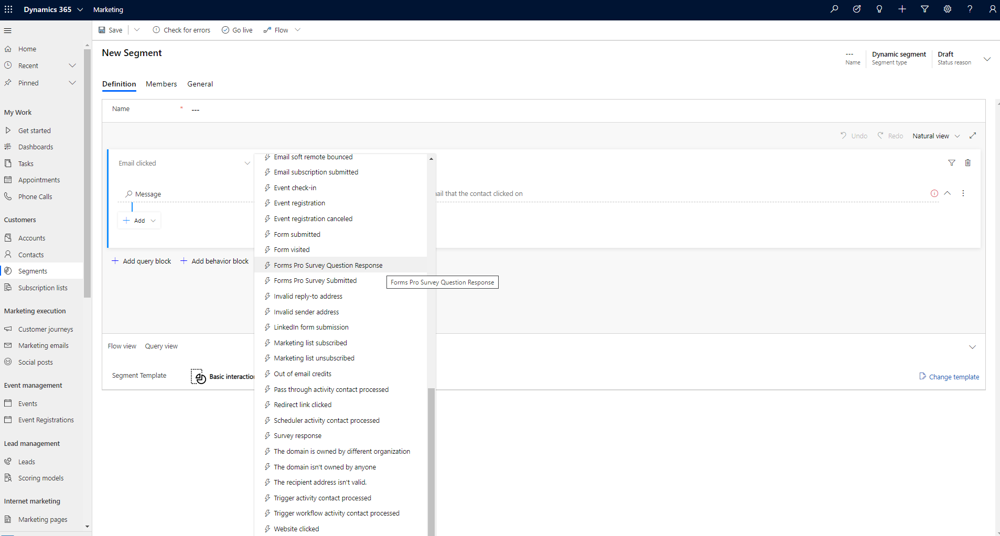
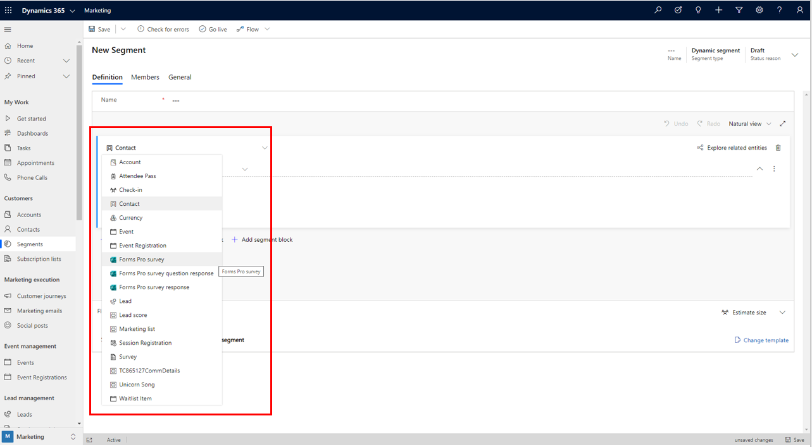
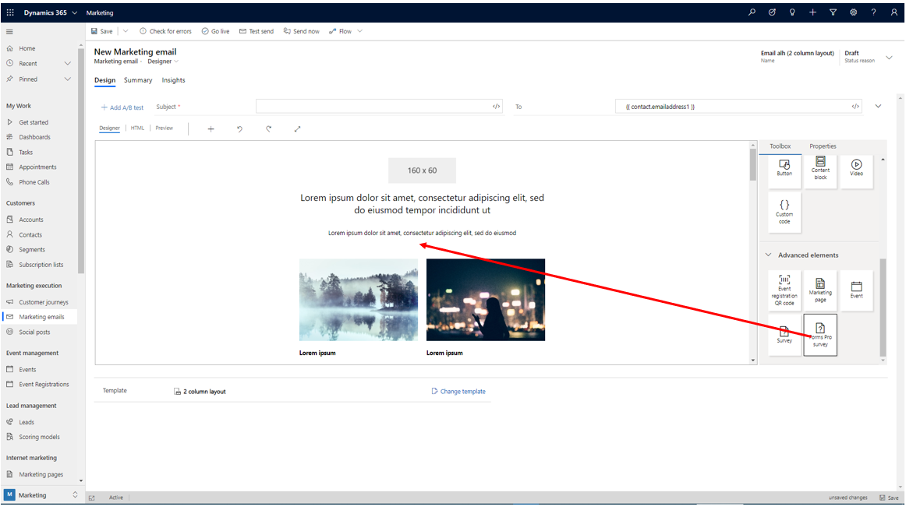
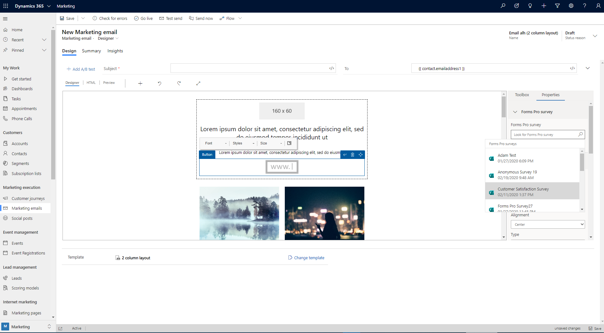
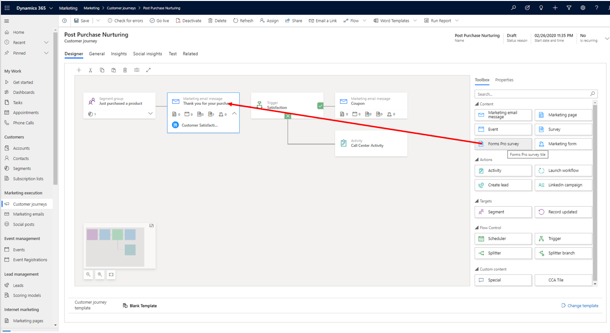
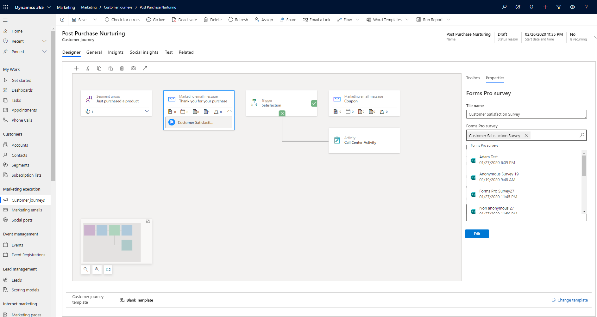
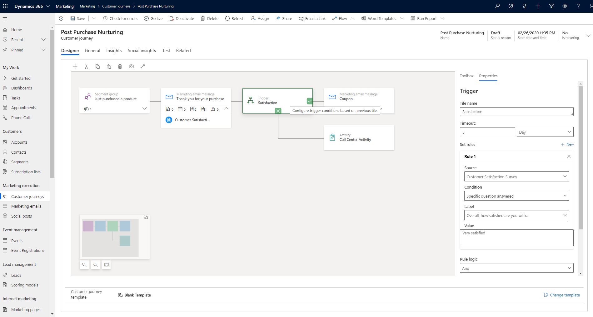

# Forms Pro integration with Dynamics 365 Marketing

Surveys are a critical feedback component for customer-obsessed organizations. Dynamics 365 Marketing with [Forms Pro](https://docs.microsoft.com/forms-pro/) integration brings a rich set of capabilities for asking for feedback about your customers' needs. These survey capabilities help you make data-driven decisions and apply your findings to your marketing initiatives. Marketers can automate survey experiences and use data generated from surveys for advanced segmentation and customer profiling.

> [!NOTE]
> You will need your administrator to [turn on the feature switch](admin-feature-switches.md) for the "Forms Pro Marketing integration" functionality before you are able to access it in the email designer.

## Create your survey in Forms Pro

All surveys that you [create in a Forms Pro environment](https://docs.microsoft.com/forms-pro/create-survey) are ready to use in Marketing. All survey data are available in CDS for segmentation.

## Forms Pro segmentation options

You can segment based on previous Forms Pro surveys, which allows you to act based on feedback from your customers. Your entire Forms Pro dataset is available for your marketing scenarios. With Forms Pro data, you can segment based on surveys, survey responses, specific questions answered, etc.

To use Forms Pro survey data in segments:

1. Go to **Customers** > **Segments** in the left navigation bar.
1. Create a new [dynamic segment](segmentation-lists-subscriptions.md#create-and-go-live-with-a-new-segment) by clicking **New** > **New Dynamic Segment** in the top menu.
1. You can choose from Forms Pro data options depending on whether you create an [interaction based or a profile based segment](segmentation-lists-subscriptions.md#segments-in-dynamics-365-marketing).

    Interaction-based segment Forms Pro options:

    

    Profile-based segment Forms Pro options:

    

## Forms Pro survey links in email messages

To add a Forms Pro survey to an email message, go to the[email content designer](email-design.md). Then go to **Toolbox** > **Advanced elements** > **Forms Pro**. Drag and drop the **Forms Pro** element into your email.

In the **Properties** tab, choose the survey you would like to use.

After you choose a survey, you can customize the email styling just as you would with any other email message.

## Forms Pro automation in customer journeys

Marketing gives you the option to automate customer journey actions based on Forms Pro survey data.

To add a Forms Pro survey to customer journey, go to the [customer journey designer](customer-journeys-create-automated-campaigns.md#design-your-journey). Then go to **Toolbox** > **Content** > **Forms Pro survey**. Drag and drop the **Forms Pro survey** tile onto your marketing email tile.

In the **Properties** tab, choose the survey you would like to use.

In the **Properties** tab, check the **is anonymous** box if you do not want to distribute a named survey.

You can add a trigger to further understand how contacts engage with the survey.

You can use following trigger options:
- Trigger based on source (email or survey)
- Trigger based on a specific question
- Trigger based on an answer

### See also

[Create marketing forms](marketing-forms.md)