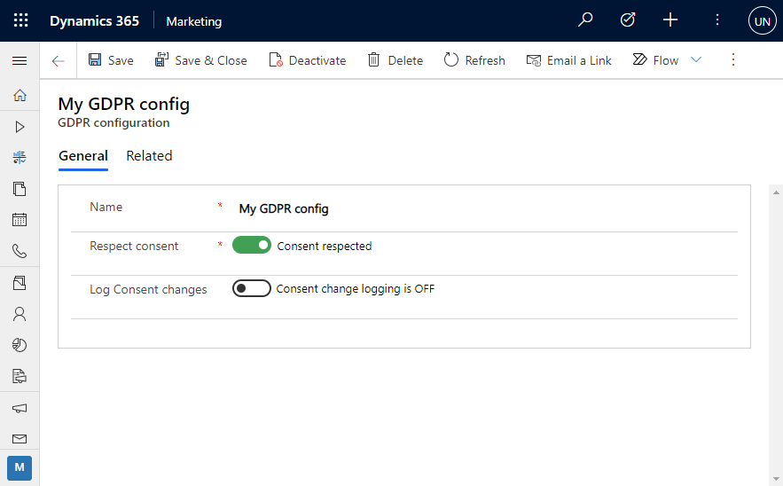
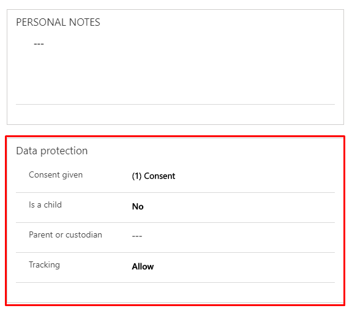
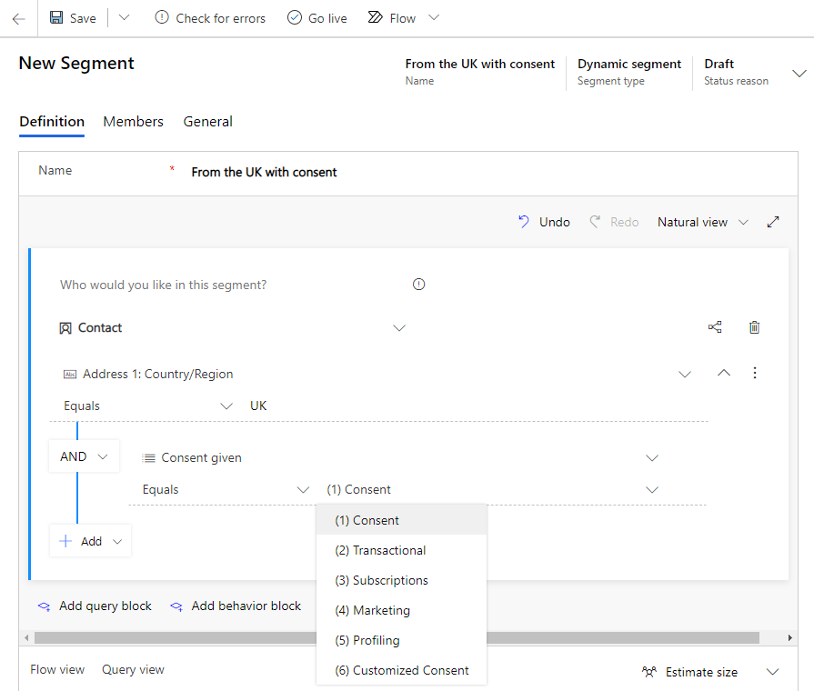
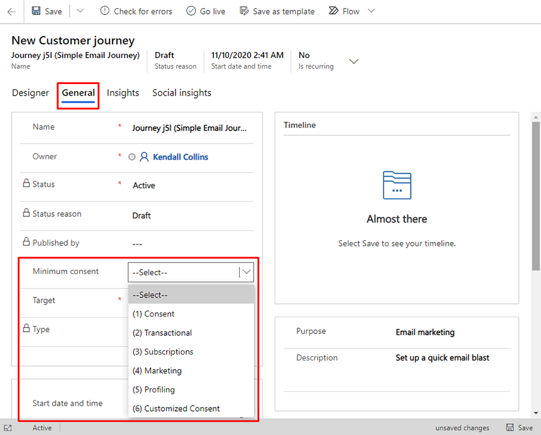
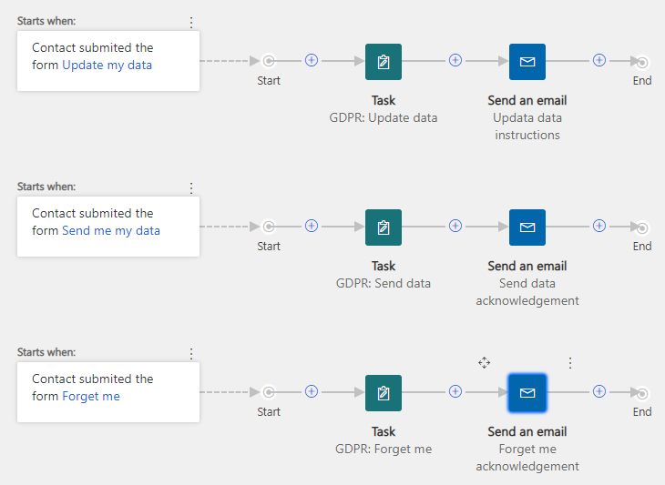
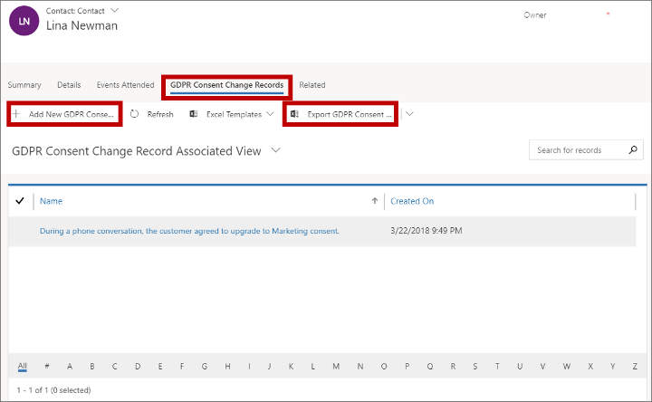
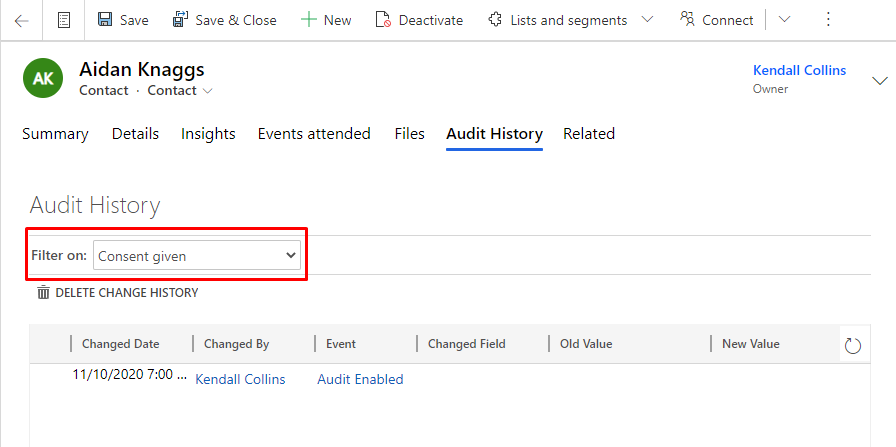

# Data protection and the GDPR

[!INCLUDE[cc-data-platform-banner](../includes/cc-data-platform-banner.md)]

The [General Data Protection Regulation (GDPR)](https://ec.europa.eu/justice/data-protection/reform/index_en.htm) is a European Union (EU) directive that imposes new rules on companies, government agencies, non-profits, and other organizations that offer goods and services to people in the EU, or that collect and analyze data tied to EU residents. The GDPR applies no matter where you are located.

Dynamics 365 Marketing is prepared to help organizations work in compliance with the GDPR when using the system, but some development work, consultancy assistance, or both, is still necessary. As part of a comprehensive, organization-wide effort, most organizations need to review and update all their information systems to come into complete compliance.

## Learn more about the GDPR

Here are some resources where you can learn more about how to bring your Dynamics 365 systems into compliance with the GDPR:

- [Microsoft Dynamics 365 and GDPR](/dynamics365/get-started/gdpr/index). This webpage includes links to resources, white papers, blogs, and other information related to various Dynamics 365 applications and the GDPR.
- [Supporting Your EU GDPR Compliance Journey with Dynamics 365 Marketing](https://servicetrust.microsoft.com/ViewPage/TrustDocuments?command=Download&downloadType=Document&downloadId=b26973bd-68c3-4507-b446-61a7f1b1f1f2&docTab=6d000410-c9e9-11e7-9a91-892aae8839ad_FAQ_and_White_Papers). This white paper (downloadable PDF) will help you build a basic understanding of the GDPR and relate that to Dynamics 365 Marketing.
- [Data Protection Resources](https://servicetrust.microsoft.com/ViewPage/TrustDocuments?docTab=6d000410-c9e9-11e7-9a91-892aae8839ad_FAQ%20and%20White%20Papers). This webpage includes links to compliance guides, white papers, FAQs, security reports, penetration tests, risk assessment tools, and other resources that apply to a wide range of Microsoft products.
- [Microsoft Trust Center](https://www.microsoft.com/trustcenter). This webpage includes links to information about how new features in Microsoft 365 help you secure personal data and meet strict GDPR privacy requirements.
- [Microsoft Compliance Manager](https://aka.ms/compliancemanager). This webpage includes links to information about control management, integrated task assignment, evidence collection, and audit-ready reporting tools to streamline your compliance workflow.

## Prepare Dynamics 365 Marketing for GDPR compliance

Most Dynamics 365 installations are customized to meet the specific needs of each organization that uses it. Some organizations have in-house developers, and some organizations work with external partners or consultants to implement their customizations. Either way, you must customize your Dynamics 365 Marketing system to enable its built-in GDPR compliance tools to function correctly.

Among other things, you must be able to identify all data structures (including tables, entities, and fields) that contain personal information. You should establish mechanics that allow you to easily discover, deliver, update, and/or delete this data when requested by your customer.

- For more information on how Dynamics 365 helps you with essential data tasks like discovering, managing, protecting, and reporting for your GDPR compliance see the guide [Microsoft Dynamics 365 helps enable data privacy for GDPR compliance](https://www.microsoft.com/TrustCenter/CloudServices/dynamics365/GDPR) in the [Microsoft Trust Center](https://www.microsoft.com/trustcenter).
- For details about how to use the Dynamics 365 API to implement custom GDPR-related functionality for your Dynamics 365 Marketing system, see the [Developer Guide (Marketing)](developer/marketing-developer-guide.md).
- If you're looking for a partner to help you come into compliance, try searching in our [Microsoft Solution Providers database](https://www.microsoft.com/solution-providers/search).

The rest of this topic describes how to work with the GDPR compliance tools in Dynamics 365 Marketing. The instructions assume that the system has already been customized as required.

## Overview of GDPR features in Dynamics 365 Marketing

Under the GDPR, the topic of consent has become a core tenet and is included in the data protection law. Consent is understood as "any freely given, specific, informed, and unambiguous indication of the data subject's wishes by which he or she, by a statement or by a clear affirmative action, signifies agreement to the processing of personal data relating to him or her."

Dynamics 365 Marketing allows you to request, capture, and store consent. It lets you design your marketing activities to respect the consent given by your audience. It is important that you include relevant information in your marketing objects (like landing pages and email marketing message) that unambiguously informs your audience about the data you collect and the purpose of your processing. Your audience must have the option to give consent freely, make an informed decision, and be able to review, update, or revoke consent at any time.

To help you with consent management and other GDPR-related workloads, Dynamics 365 Marketing has the following capabilities:

- A default collection of hierarchical consent levels is provided out of the box, where higher levels of consent include lower levels.
- Contact records include a field that stores the level of consent each contact has granted your organization.
- You can configure each customer journey to only process contacts that have given a minimum-required level of consent.
- You can configure each lead-scoring model to only compute scores for leads associated with contacts that have given a minimum-required level of consent.
- You can create marketing pages with marketing forms that encourage contacts to grant a level of consent while being unambiguously informed. The consent is stored in each contact's record.
- You’ll be able to use various mechanics in Dynamics 365 Marketing to extract all information related to a specific contact and share relevant information with that contact when requested.
- You'll be able to use mechanics to have Dynamics 365 Marketing "forget" (delete) all information about a specific contact when requested.
- You'll be able to find and update information about a specific contact when requested.
- You'll be able to provide means for your contacts to ask to view, retrieve, update, and delete their consent and data, and to use Dynamics 365 Marketing to model the fulfillment on your side.

The consent levels provided out of the box are just recommendations. It is up to you to decide the relevance of each level, and how you would like to use it in your marketing activities. The following table summarizes each supplied consent level and how it is typically used. Consent levels are hierarchical, so higher levels include all lower levels.

| Level | Consent level name | Description |
|-------|--------------------|-------------|
| 0 | (none) | No consent has been given by the contact. The organization should not reach out to the individual or perform data processing or automated decision making until consent is given. Regardless of the given consent, individuals can submit information using an online form (landing page) provided by the organization.    |
| 1 | Consent | The individual allows the organization to reach out only to confirm consent or obtain a higher level of consent. A typical example is a re-consenting customer journey that sends an email containing a link to a subscription center page where the individual can give consent.    |
| 2 | Transactional | The individual consents to be sent transactional messages that relate to specific, existing business between the two parties. These messages can't include marketing or promotional content. Examples include bank statements, order receipts, and membership status messages.  |
| 3 | Subscriptions | The individual consents to receive messages that include offers to sign up for mailing lists or other subscribed content.   |
| 4 | Marketing | The individual agrees to receive marketing messages and promotional content. |
| 5 | Profiling | The individual allows the organization to use demographic and behavior information (such as website visits, email opens, and email clicks) for automated decision making. It is the organization's responsibility to classify which of their processing activities fall under the category of automated decision making. Examples include automatic calculation of credit limits or loan promises based on available data, and calculation mechanics using rule-based or predictive calculations. Children shall never be subject to such profiling and automated decision making. |

In addition, special privacy protection is required for minors (children), requiring additional consent by a parent or guardian.

> [!IMPORTANT]
> The accounts entity does not store any GDPR consent information&mdash;only contact entities include it. Lead-scoring models that operate on the account level aren't able to respect the consent of the contacts that belong to that account, but they can still score account leads based on interactions generated by all of those contacts. That means that you must be careful not to use automatic lead scoring for automated decision making (profiling) related to account-based leads if those decisions affect individuals. You can still use the feature to score account leads, but you must not use it for indirect contact scoring if the score is used for automated decision making. More information: [Account-based marketing](account-based-marketing.md)

## Enable GDPR features in Dynamics 365 Marketing

By default, GDPR features such as consent management are disabled on new Dynamics 365 Marketing installations. To enable or disable the features:

1. Go to **Settings** > **Advanced settings** > **Marketing settings** > **Data protection tools**.

1. A list of **Active GDPR configurations** opens. If a configuration already exists, then select that one to open it. If no configuration yet exists, select **+ New** on the command bar. You can have _at most_ one GDPR configuration.

1. The **GDPR Configuration** form opens.

    > [!div class="mx-imgBorder"]
    > 

    Make the following settings:
    - **Name**: Enter any name that you like.
    - **Respect consent**: Flip the toggle to enable GDPR features throughout your app.
    - **Log Consent changes**: Flip the toggle to create a log file of all GDPR consent changes.

1. Select **Save** at the bottom-right corner of the window.

## View and set the consent level for each contact

When GDPR is enabled, you can view and set data-protection options for each contact. To work with them, open a contact record, go to its **Details** tab, and then scroll down to find the **Data protection** section.

> [!div class="mx-imgBorder"]
> 

The following settings and information are available here:

- **Consent given**: Read or set the maximum consent level granted by this contact. This contact will only be able participate in marketing initiatives permitted for this consent level or lower. You should only change this setting after receiving explicit consent from this contact. Usually, you should allow contacts to change this themselves using a subscription center.
- **Is a child**: Mark this box to indicate that this contact is a minor (usually, under 18 years old), and therefore requires extra protection.
- **Parent or custodian**: If the contact is a child, then select their legal parent or custodian (guardian) in this lookup field. The parent or custodian must also be saved as a contact in your database.
- **Tracking**: Choose whether to track contact interactions. If the box is set to **Do Not Allow**, Marketing will not  track public interactions (email opening, email clicks). The tracking option allows contacts to specify whether they consent to having their interaction data saved. You can trigger this field by either adding the field to client consent forms or by updating the contact data directly.

## Filter segments by consent

You can filter segments by consent level just like you can when filtering by other contact values. Use the **Consent Given** field of the **Contact** entity to filter by consent level.

> [!div class="mx-imgBorder"]
> 

 

## Set the minimum required consent level for a customer journey

You can set the minimum consent level for any customer journey. When set, the journey will process only contacts of that level or higher. To do this, open the journey, go to its **General** tab, and set the **Minimum consent** field to the appropriate level.

> [!div class="mx-imgBorder"]
> 

If you change the consent level of a running customer journey, the journey stops processing any contacts that don't meet that level of consent, including contacts that are already partly through the journey.

## Set the minimum required consent level for lead scoring models

You can set the minimum consent level for any lead-scoring model. When set, the model scores only leads that are associated with contacts who have granted that consent level or higher.

To do this, open the lead scoring model, go to the **Summary** tab, and set the **Minimum consent** field to the appropriate level.

> [!div class="mx-imgBorder"]
> 

## Include a consent selector in a subscription center

A subscription center is the best place to enable contacts to confirm and modify their consent level. To set this up:

- Set up a marketing form field that maps to the GDPR consent field of the contact entity.
- Create a marketing form of type subscription-center that includes the GDPR consent field.
- Create a marketing page of type subscription-center that includes that form.

You can now create a marketing email message that includes a link to your subscription-center page. Make sure your page explains why granting consent is important and how it offers value to the individual.

> [!IMPORTANT]
> Subscription lists are managed at the *contact* level. If multiple contacts share the same email address, only the specific contact who opted out will stop receiving communications. Other contacts using the same email address will continue to receive communications. If you require opt-outs to be processed at the email level, you will need to create custom processes. More information: [Manage subscriptions at an email level](set-up-subscription-center.md#manage-subscriptions-at-an-email-level).

## Set up double opt-in to confirm changes in consent level and subscriptions

To fully comply with the GDPR (and other common regulations), you must set up the double opt-in system. Double opt-in uses email messaging to ensure that all requests to change a contact's consent level or add a subscription were made on purpose by a person who can read that contact's email.

More information: [Set up double opt-in for new subscriptions and consent changes](double-opt-in.md) 

## An example of how to support data requests from your marketing audience

Under GDPR, individuals have the right to submit several types of data requests to your organization. These include requests to access, correct, erase, and transmit (in a readable format) their personal data. Dynamics 365 Marketing is a flexible and versatile system, so there are many ways to build GDPR-compliance features into it. This section provides a few examples of how to do this, but the methods you choose will depend on how your organization is structured, how it uses Dynamics 365 Marketing, and which types of customizations are in place.

### Set up a customer journey for accepting GDPR requests

One way to make it easy for individuals to submit GDPR requests to your organization could be to publish a page on your website that provides relevant details to your customer and includes links for each type of request (send me my data, update my data, and delete my data). Each of those links would bring the customer to a different marketing page, which provides:

- Further information about the specific type of request and what the customer can expect upon submitting the form.
- All the input fields required to uniquely identify the contact in your database. This is typically their email address and last name, but the actual requirements will depend on your de-duplication settings.
- Any additional fields that might help your privacy officer fulfill the request (such as a field for general notes and comments or check boxes with special options).

Then prepare a single customer journey with three parallel pipelines, one for each request type. You could set up each pipeline as follows:

1. Start with a marketing form designed to collect information relevant to the request type. When a contact submits this form, they begin traveling on that path of the journey.
1. Continue to a **Task** tile, which is configured with a task-activity template that identifies the request type (update, send, or delete) and assigns a task to the security officer responsible for responding to the request. The task will include a link to the contact record, so the officer can easily go there to read the full content of the page submission.
1. End with an email message, which informs the customer that their request was received and provides additional links and instructions (such as a subscription center link), depending on the type of request.

> [!div class="mx-imgBorder"]
> 
 
The remaining subsections offer more details about how this example solution could be completed to support each type of request.

### Respond to get-my-data requests

The following list provides a few ideas for how your organization could set up a system for responding to get-my-data requests. The solution you choose will depend on how your system is set up and which types of customizations are in place.

- Instruct your privacy officer to use the standard search functionality to identify relevant data and then use the built-in export capabilities to generate an Office document. No custom development is required to allow this, but for a heavily customized system it could prove to be impractical.
- Create a custom solution based on the dedicated API in Dynamics 365 that loads all the relevant information from the back-end system and assembles it into a single, portable document. This would require some custom development, but the result could provide a faster and easier solution for your privacy officer to use. More information: [Retrieve interactions for a contact using code](developer/retrieve-interactions-contact.md)
- Set up a custom reporting solution in Dynamics 365 Marketing.
- Create a new Power BI report that loads the relevant data from your Dynamics 365 Marketing organization database.

### Respond to forget-me requests

Ideally, you should prepare your system to make it easy for your privacy officer to completely delete a contact and all their related data on request. 

- For a non-customized system, your privacy officer can just use the standard search function to find the contact and then hard-delete the contact. The system will automatically unlink and remove all related interaction data stored in Dynamics 365 Marketing back-end systems (including from all marketing services).
- If you have custom fields or entities, then you must further customize your system to make sure it deletes all related personal data from related records and/or unlinks them from the contact record so that all personal information is removed. More information: [Developer Guide (Marketing)](developer/marketing-developer-guide.md)

> [!NOTE]
> All data entered into a forward-to-a-friend form is automatically deleted after 30 days, so no new contact or lead records are created unless a recipient of the forward chooses to register with your organization using a landing page.

### Respond to update-my-data requests

One way to prepare your system to handle update-my-data requests could be to set up the following:

1. For the update-my-data landing page, be sure to include both the required contact fields and a general comment field where the customer can describe their request, if needed.
1. Prepare a subscription center page that has as many editable contact fields as would be safe to provide. This enables each customer to update their own information as much as possible.
1. For the marketing email message sent to the contact after submitting the form, include a link to that subscription center and include information about what to do if the customer wants to update information that is not included on that form.

As mentioned earlier, when a privacy officer receives the task generated by the customer journey, they can select the included link to open the relevant contact record, open the insights for that record and then go to the **Marketing form interactions** tab, where they can read the full content of the form submission (for example, as a tooltip for the relevant **Form submission** value in the **Form visited list**). If needed, the privacy officer can contact the customer directly to resolve any of the special requests (such as to update data not provided on the subscription center form).
 
### Secure and control access to personal information

Part of the GDPR regulations is a requirement that your organization takes steps to secure and control access to personal information that is stored in your database. You can use the standard field-level, form-level, and entity-level security controls to make sure that only authorized users, who know how to handle it legally, will be able to access it. Here are some examples of data that you may need to protect:

- **Contact records:** Contact records contain many types of basic, personal data, such as names, addresses, email, phone numbers, and more. You can control access to these records by assigning entity permissions as part of each security role definition.
- **Marketing insights:** Marketing insights can include details such as website browsing records, form submissions, event attendance, and more.  Some, but not necessarily all, users that have access to contact records may be granted access to view this information. You can control this access by assigning security groups at the form level.
- **Fields with especially sensitive information:** Your contact records may include data fields with especially sensitive information, such as financial, medical, or political affiliation details. Some, but not necessarily all, users that have access to contact records may be granted access to view this information. You can control this access by assigning security groups at the field level.

For more information about how to work with the security groups and other security features in Dynamics 365, see [Security in Microsoft Dataverse](/power-platform/admin/wp-security).

## Demonstrate GDPR compliance

From time to time, you may be asked to demonstrate that your organization complies with the GDPR regulations. Dynamics 365 Marketing provides several tools to help you do this.

### Record and view justifications for consent-level changes made by users

Usually you should allow contacts to set their own consent level using a marketing page or subscription center. However, Dynamics 365 Marketing users can also  change the consent level for any contact by editing the contact record directly. You might typically do this following a telephone conversation during which the contact provided or withdrew consent. When you do manually change the consent level for any contact, it's good practice to add a comment about what you've done and why.

To add a comment about why you changed the consent level of a contact, or to review the existing comments:

1. Open the target contact record.

1. Select the **Related** tab to open a drop-down list of related record types and then select **GDPR consent change records** from the drop-down list. A list of GDPR consent change records opens as a new tab for the contact record. These records are created automatically when there is a consent level change.

1. If you'd like to export this list, select the **Export** button on the command bar.

> [!div class="mx-imgBorder"]
> 

### Enable auditing to log all record changes

Dynamics 365 can keep a record of all database changes, who made them, and when. You can use this to show when GDPR consent was changed for each contact and by whom. The auditing system is usually disabled by default, so you'll need to set it up if you want to use it log your GDPR consent changes (and other information). When setting up the system, you'll be able to choose which types of events you want to audit on which type of records.

To access the auditing features:

1. Open the **Settings** menu  at the top of the page and select **Advanced settings**. The advanced-settings area then opens in a new browser tab. Note that this area uses a horizontal navigator at the top of the page instead of a side navigator.
1. Navigate to **Settings** > **System** > **Auditing** to open the **Audit** page. From there, you can access the auditing settings and review the audit record.

This feature is part of the standard functionality of Dynamics 365. For information about how auditing works, how to set it up, and how to review the log, see [Audit data and user activity for security and compliance](/power-platform/admin/audit-data-user-activity).

### View the audit history to find consent-level changes for a contact

Once you've enabled auditing for contacts, you'll be able to view a record of changes for any contact by doing the following:

1. Open the target contact record.

1. Select the **Related** tab to open a drop-down list of related record types and then select **Audit history** from the drop-down list. A list of change made to the current contact record opens as a new tab. 

1. To view consent changes only, set **Filter on** to **Consent given**.

> [!div class="mx-imgBorder"]
> 

### See also

[Create automated campaigns with customer journeys](customer-journeys-create-automated-campaigns.md)  
[Manage customer information](manage-customer-information.md)  
[Create and deploy marketing pages](create-deploy-marketing-pages.md)  
[Set up a subscription center](set-up-subscription-center.md)  

[!INCLUDE[footer-include](../includes/footer-banner.md)]