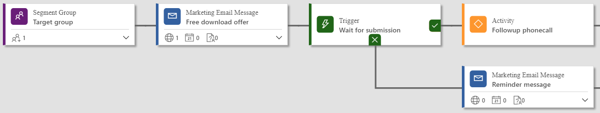
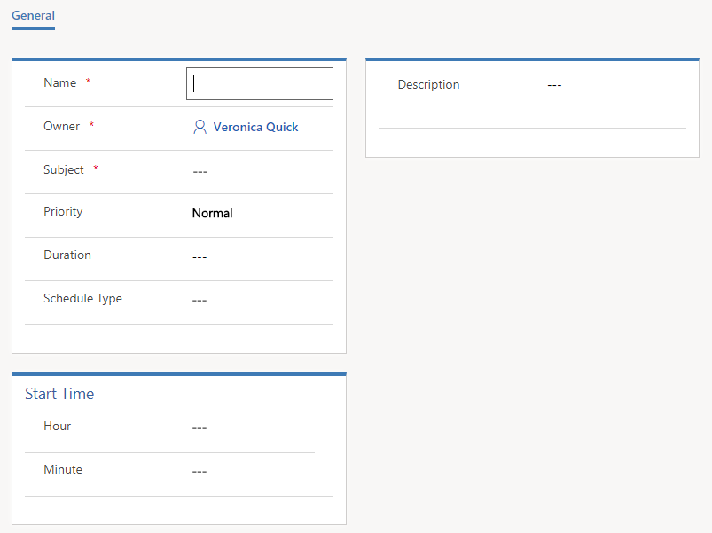
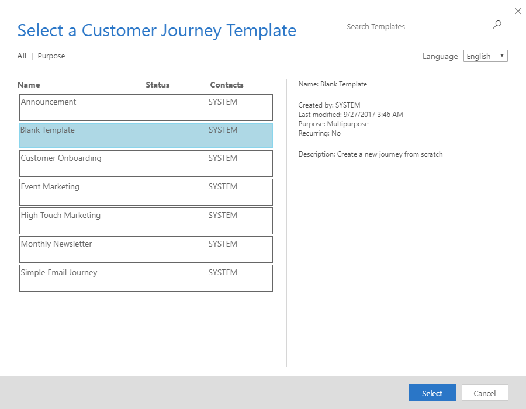
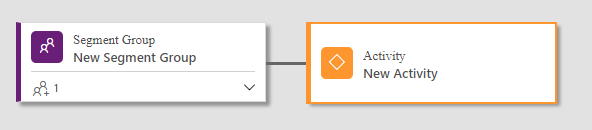
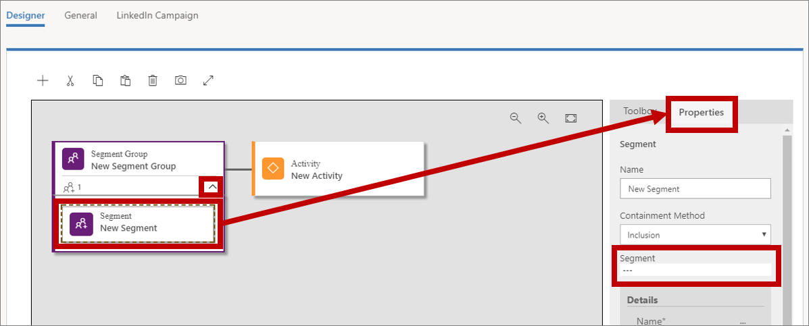
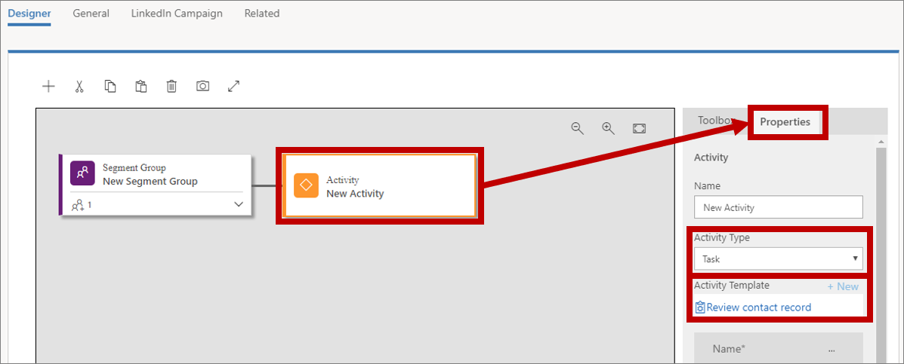
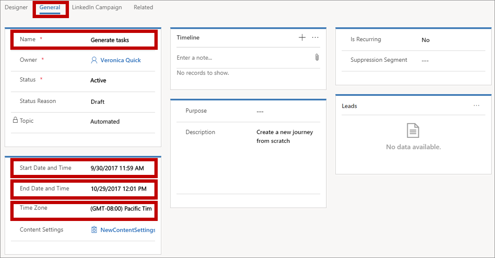
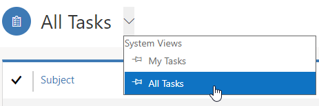

# Generate activities from a customer journey

In [!INCLUDE[pn-crm-2016-shortest](../includes/pn-crm-2016-shortest.md)] you use activities to plan and record customer interactions such as phone calls, tasks, or appointments. Your customer journeys can also generate these for you—usually for planning purposes. For example, you might create a journey like the one you made in [Create an interactive customer journey with triggers and signup](create-interactive-customer-journey.md) and then add an **Activity** tile behind the trigger that creates a phone-call task associated with each contact that submits the registration form.  

  

When you add an **Activity** tile to a customer journey, you’ll choose an activity template, which establishes which type of activity it is, what it should be called, and more. Each contact that enters the tile during the journey will trigger creation of the activity, and that activity will also be associated with that specific contact. The contact is then forwarded immediately to the next tile in the journey.

For this exercise, you’ll set up a template to create task activities and then set up a simple customer journey that generates a task associated with each member of a selected segment.

1.  Go to **Marketing &gt; Templates &gt; Task Activity Marketing Templates**.

2.  Choose **+New** from the command bar. The **New Task Activity Marketing Template** page opens.

>   

1.  The settings here establish the initial settings that will apply to each task created using this template. Enter the following (at least):

    - **Name**: Enter a name for the template itself. This is the only setting here that doesn’t affect the tasks created by the template.

    - **Subject**: This will become the subject for each task created by the template. This is probably the most important setting.

2.  Choose **Save** from the command bar to save your template.

3.  Go to **Marketing &gt; Marketing Execution &gt; Customer Journeys**.

4.  Choose **+New** from the command bar to create a new journey.

5.  The **Select a Customer Journey Template** dialog opens. Choose the **Blank Template** and then **Select**.

>   

1.  Drag a Segment Group tile into the first position on the canvas, and then add an Activity tile right after it.

>   

1.  Expand the **Segment Group** tile to expose its child **Segment** tile. Then select the child tile, open the **Properties** tab and configure the tile to reference the segment you want to target.

>   
>
> [!INCLUDE[proc-more-information](../includes/proc-more-information.md)] [Create a dynamic segment](create-segment.md) and [Create a simple customer journey with email messaging](#create-a-simple-customer-journey-with-email-messaging).  

1.  Select the **Activity** tile, open the **Properties** tab.

>   
>
> Make the following settings:

- **Activity Type**: Set to **Task**.

- **Activity Template**: Set to the name of the template you created earlier in this procedure.

- **Assigned To**: (You might need to scroll down in the **Properties** tab to find this setting.) This is the person that each task will be assigned to. As you can see from the options here, you can assign each task to the customer journey owner, the owner of each contact or to the creator of each contact. The best choice will depend on how your company is organized. For this exercise, choose **Customer journey owner** (which is you); this means that all tasks will be assigned to the same person—the other choices allow tasks to be assigned to different people based on values from the relevant contact record.

1.  Choose **Save** from the command bar.

2.  Go to the **General** tab and set the **Name**, **Time Zone**, **Start Date and Time,** and **End Date and Time**. You can set it to start right away, but allow it a few hours to run, just in case.

>   

|                                                                                                                                                                                                                                                                                                                                                                              |
|------------------------------------------------------------------------------------------------------------------------------------------------------------------------------------------------------------------------------------------------------------------------------------------------------------------------------------------------------------------------------|
| **TIP:** A simple journey like this one could be useful for reminding staff to review key contacts each week. You could set this up by creating a segment that finds interesting contacts to work on for the week, and then use the **Is Recurring** settings on the **General** tab of your journey to re-run the journey once a week for as long as the journey is active. |

1.  Choose **Check for Errors** from the command bar, then read the results and fix any problems reported.

2.  Choose **Go Live** from the command bar to activate the journey.

3.  Go to **Marketing &gt; My Work &gt; Tasks**. Choose **All Tasks** from the view menu to make sure you can see all tasks in the system.

>   

1.  You should now see a list of tasks. Once your journey has had time to run, you’ll start to see your generated tasks here, with the **Subject** you specified for the template shown as the **Subject**, and the **Regarding** value set to a contact from the segment you targeted with your journey.

>   

