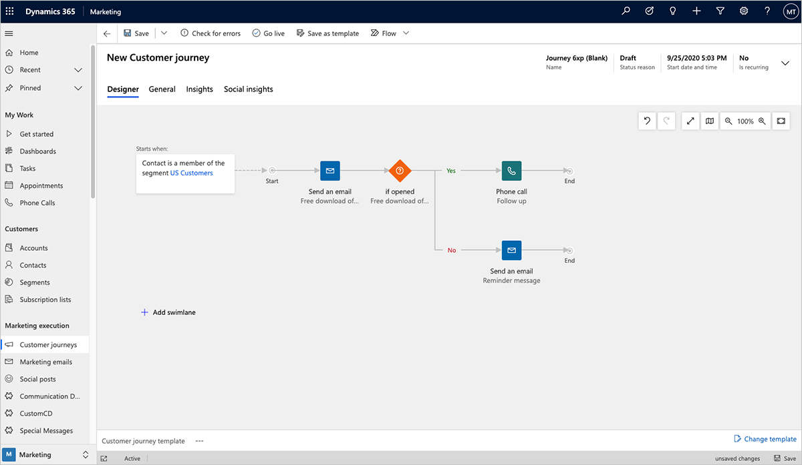
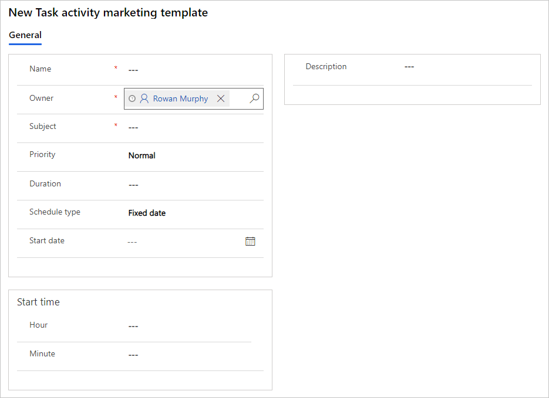
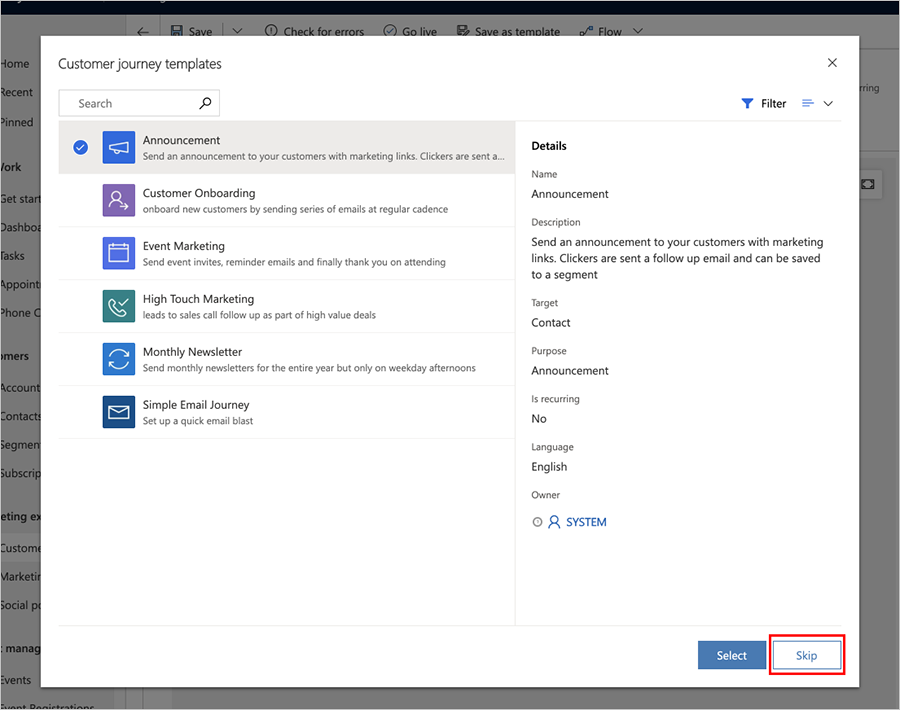
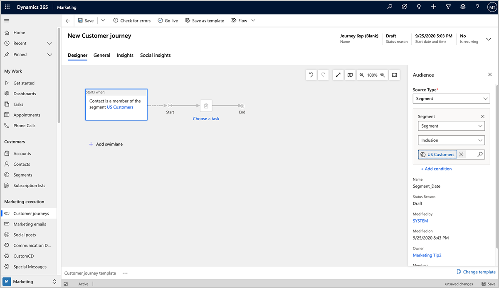
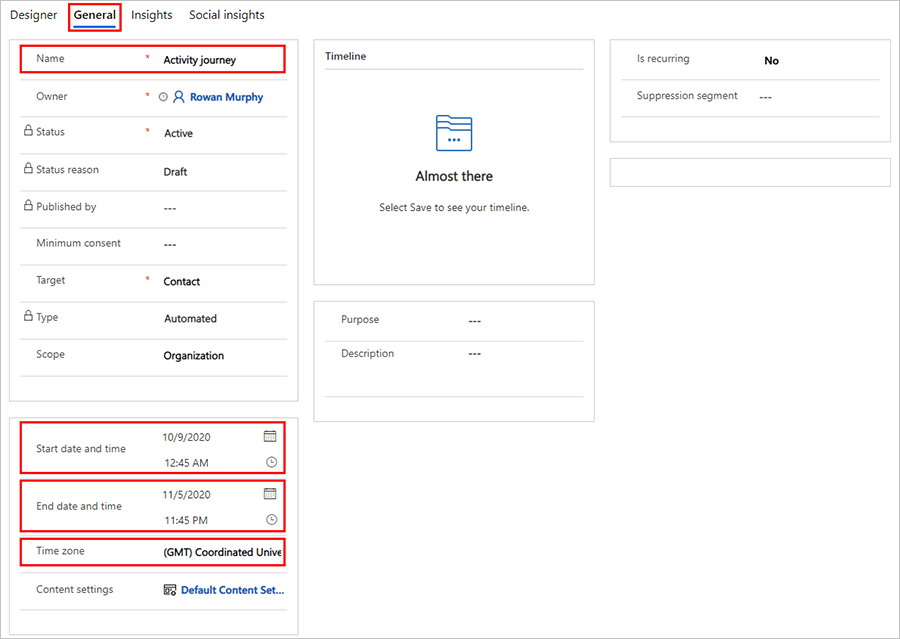
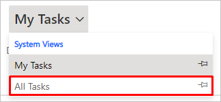
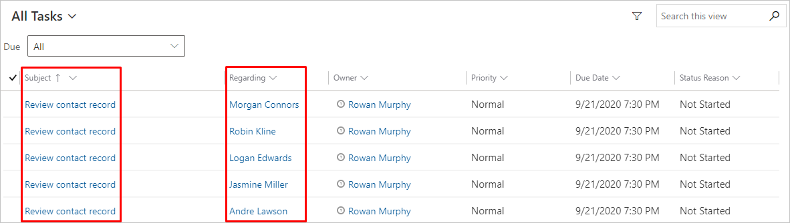

# Generate activities from a customer journey

Use activities to plan and record customer interactions such as phone calls, tasks, or appointments. Your customer journeys can also generate these for you—usually for planning purposes. For example, you might create a journey like the one you made in [Create an interactive customer journey with conditions and signup](create-interactive-customer-journey.md), and then add an **Activity** tile behind the if/then condition that creates a phone-call task associated with each contact who submits the registration form.

  

When you add an **Activity** tile to a customer journey, you'll choose an activity template, which establishes the type of activity it is, what it should be called, and more. Each contact who enters the tile during the journey will trigger creation of the activity, and that activity will also be associated with that specific contact. The contact is then forwarded immediately to the next tile in the journey.

For this exercise, you'll set up a template to create task activities, and then set up a simple customer journey that generates a task associated with each member of a selected segment.

1. Go to **Marketing** > **Marketing templates** > **Task templates**.

1. On the command bar, select **+New**. The **New Task activity marketing template** page opens.

      

1. The settings here establish the initial settings that will apply to each task created by using this template. Enter the following (at minimum):
    - **Name**: Enter a name for the template itself. This is the only setting here that doesn't affect the tasks created by the template.
    - **Subject**: This will become the subject for each task created by the template. This is the most important setting.

1. On the command bar, select **Save** to save your template.

1. Go to **Marketing** > **Marketing Execution** > **Customer Journeys**.

1. On the command bar, select **+New** to create a new journey.

1. The **Customer Journey templates** dialog box opens. Choose the **Skip** button to work without a template (and create a customer journey from scratch).

    

1. Select the the **Audience** tile to set it up. The audience **Properties** pane will automatically appear to the right of the canvas. Configure the the audience tile to reference the segment you want to target.

    

    More information: [Create a simple customer journey with email messaging](create-simple-customer-journey.md)

1. Add a **Task** tile to the right of the **Audience** tile using the **in-place menu**.

1. Select the **Task** tile to set it up. The task **Properties** pane will automatically appear to the right of the canvas.

       

     Make the following settings:
     - **Task**: Select the template you created earlier in this procedure.
     - **Assign to**: This is the person to whom each task will be assigned. As you can see from the options here, you can assign each task to the customer journey owner, the owner of each contact, or to the creator of each contact. The best choice will depend on how your company is organized. For this exercise, choose **Customer journey owner** (which is you). This means that all tasks will be assigned to the same person—the other choices allow tasks to be assigned to different people based on values from the relevant contact record.

1. On the command bar, select **Save**.

1. Go to the **General** tab, and set the **Name**, **Start date and time**, **End date and time**, and **Time zone**. You can set it to start right away, but allow it a few hours to run, just in case.
  
     

     > [!TIP]
     > A simple journey like this one might be useful for reminding staff to review key contacts each week. You can set this up by creating a segment that finds interesting contacts to work on for the week, and then use the **Is Recurring** settings on the **General** tab of your journey to rerun the journey once a week for as long as the journey is active.

1. On the command bar, select **Check for Errors**, and then read the results and fix any problems reported.

1. On the command bar, select **Go Live** to activate the journey.

1. Go to **Marketing** > **My Work** > **Tasks**. From the view menu, select **All Tasks** to make sure you can see all tasks in the system. 
 
     

1. You should now see a list of tasks. After your journey has had time to run, you'll start to see your generated tasks here, with the **Subject** you specified for the template shown as the **Subject** and the **Regarding** value set to a contact from the segment you targeted with your journey.

     

### See also

[Organize your work](organize-daily-work.md)  
[Create activity marketing templates for activity tiles](activity-templates.md)  
[Create a simple customer journey](create-simple-customer-journey.md)  
[Create an interactive customer journey](create-interactive-customer-journey.md)  
[Working with segments](segmentation-lists-subscriptions.md)  
[Use customer journeys to create automated campaigns](customer-journeys-create-automated-campaigns.md)  
[Customer journey tiles reference](customer-journey-tiles-reference.md)

[!INCLUDE[footer-include](../includes/footer-banner.md)]