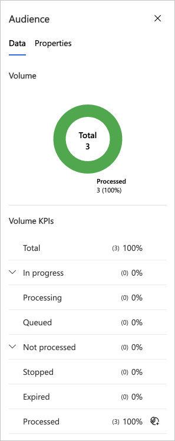
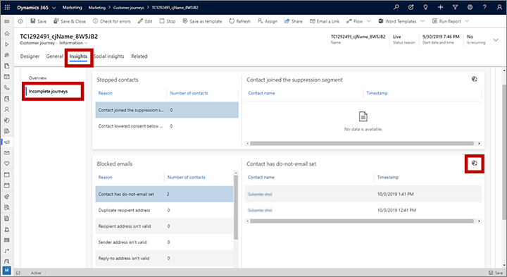

# Generate dynamic behavioral segments from customer journey results

After going live with a customer journey, you'll be able to [monitor the progress of contacts](insights.md#journey-insights) through the journey pipeline. You can use many of these results to automatically generate [behavioral segments](segments-interaction.md) that find all contacts that are being counted by a given result. This provides a handy way to find all contacts that did certain things in a particular journey. Because behavioral segments are dynamic, they will continue to grow as the journey processes more contacts.

> [!TIP]
> You might use this to split long, complex journeys into shorter, easier to manage journeys. For example, you might create a standard demographic segment to target the initial journey, and then create auto-generated segments that find contacts that ended on a particular tile or did a particular thing in that journey. Finally, you'd create follow-up journeys that target the appropriate segments that were auto-generated based on what each contact did on the initial journey.

> [!NOTE]
> The segments you create using the procedures in this topic are initially saved in the draft state. You must [go live](go-live.md) with each segment before you can use it to target a journey.

> [!TIP]
> You'll be able to see and edit the full logic for each segment created in this way, so you can also use these techniques to get started creating custom segments, or to learn how to create segmentation logic for use in other contexts.

## Generate segments based on customer journey tiles

You can generate dynamic segments that find contacts that got a specific result at a specific tile in the journey. To do this:

1. Go to **Marketing** > **Marketing execution** > **Customer journeys** and open a journey from the list. The journey must already be live for the required data to be available.

1. Select a tile from the journey pipeline and inspect the **Data** panel, which shows how many contacts that tile has processed and, sometimes, more other information about what they did there. Here’s the **Data** panel for an email tile:

    

1. Identify the type of information you'd like to use in your new segment and select the **Save as segment** button  for that value. For example:
    - **Processed**: Nearly all types of tiles provide this value and a **Save as segment** button for it. This will find all contacts who were successfully processed by this tile in this journey.
    - **Unique clicks**: This is only shown for email tiles. This will find all contacts that clicked on this email when sent by this journey.
    - **Hard bounces**: This is only shown for email tiles. This will find all contacts that produced a hard bounce after this email was sent by this journey.

1. A quick-create flyout slides in from the side of the screen. Use it to assign a **Name** and **Description** of the segment you are creating.

1. Select **Save and Close** at the bottom of the quick-create flyout to create the segment. You'll now be able to find it under **Marketing** > **Customers** > **Segments**. If you're fast, you can open the new segment right away by selecting **View record** in the pop-up announcement.

    

## Generate segments based on incomplete journeys

There are several reasons why a contact may be unable to complete a journey. In some cases, the contact may get stopped due to changing permissions or suppression segments. In other cases, the contact may be able to complete a journey, but one or more email messages may have been blocked along the way. In each case, you may want to generate a segment with these contacts so you can analyze them and possibly reach out to these contacts with another journey, by telephone, or in some other way.

To generate segments based on incomplete journeys:

1. Go to **Marketing** > **Marketing execution** > **Customer journeys** and open a journey from the list. The journey must already be live for the required data to be available.

1. Go to the **Insights** tab for the journey and then select **Incomplete journeys** from the side panel.

1. Select one of the rows under the **Stopped contacts** or **Blocked emails** headings to view a list of contacts stopped or blocked for that reason.

1. select the **Save as segment** button  at the top of the relevant list to generate a segment containing all contacts who were stopped or blocked on that journey for that reason. The segment will continue to track the list if more contacts join it later.

    

1. A quick-create flyout slides in from the side of the screen. Use it to assign a **Name** and **Description** of the segment you are creating.

1. Select **Save and Close** at the bottom of the quick-create flyout to create the segment. You'll now be able to find it under **Marketing** > **Customers** > **Segments**. If you're fast, you can open the new segment right away by selecting **View record** in the pop-up announcement.

    

### See also

[Design behavioral segments](segments-interaction.md)  
[Use customer journeys to create automated campaigns](customer-journeys-create-automated-campaigns.md)  
[Analyze results to gain insights from your marketing activities](insights.md)

[!INCLUDE[footer-include](../includes/footer-banner.md)]