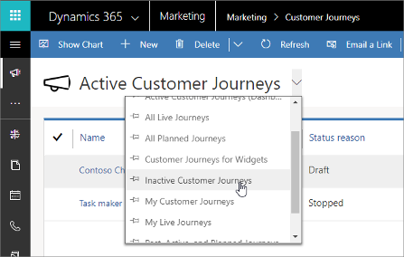
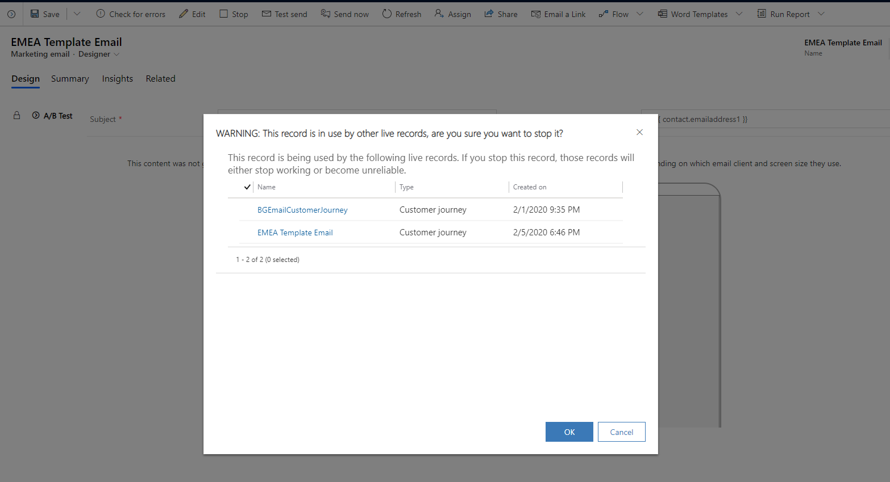

# Go live with publishable entities and track their status

Many of the entities that you work with in Dynamics 365 Marketing require you to _go live_ with a record before you can it them in your live marketing initiatives. The go-live process takes a record you are working with, checks it for errors, prepares it for use, and marks it as available. In some cases, the go-live process ends by moving the final record to a marketing service, which runs in parallel to your application instance and processes data-intensive features like bulk email sending, collecting and analyzing results, or populating dynamic segments. The go-live process is sometimes also referred to as _publishing_.

Some types of entities require a live records to be stopped before you can edit it, while others let you push updates from the app without stopping the live process. In some cases, you won't be able to make certain types of changes (or even any changes at all) once you have gone live with a given record.

## Monitor go-live status with status and status reason

Nearly all entities in Dynamics 365 have both **Status** and **Status reason** fields. The **Status** is always either _active_ or _inactive_, which indicates whether the record is in use and can affect where it is visible and selectable in the UI. The **Status reason** gives more information about the **Status**, and often functions as a sub-status (which it usually does for publishable entities in Marketing).

For most types of entities, you can manually assign the active/inactive **Status** for each record using buttons on the command bar. You might use this, for example, to mark a contact as inactive, which hides that contact from most views but keeps it in your database for future or historical reference. For publishable entities in Marketing, the system usually manages the **Status reason** value (which is therefore read-only) to give you more information about the publish status. For some publishable entities in Marketing, the **Status** field is also managed by the system and therefore may not be editable directly either. See the remaining sections of this topic for details.

All entities provide a view selector for list views, where you can choose a saved query such as "Active journeys," "All live journeys," "Inactive journeys," and so on. In most cases, you can find inactive records by going to the "Inactive …" view, where you can usually reactivate a record if needed.

## Customer journey go-live operations and status

For customer journeys, both the **Status** and a **Status reason** are managed by the system to indicate the journey's current go-live and operational status. Both values are read-only.

| Status | Status&nbsp;reason | Description |
| --- | --- | --- |
| Active | Draft | The journey has never been live and can be edited, saved, or deleted without restrictions.  To publish a draft journey, open it and then choose **Go Live** on the command bar. |
| Active | Live | The journey is currently live. If the current date is between the journey start and end dates, then it is processing contacts. The journey will automatically go to the stopped state when its end date passes.  To stop a live journey, open it and then choose **Stop** on the command bar.  To edit a live journey without stopping it, open it and then choose **Edit** on the command bar.  You can't delete a journey while it's live. |
| Active | Stopped | The journey was once live, and may have already processed some contacts, but is now stopped, so it won't process any more contacts or take any other actions. It may have stopped because the end date passed, or because you stopped it manually.  Thirty days after the end date, the journey will automatically change from _active/stopped_ to _inactive/expired_. Once a journey has expired, you can no longer edit or restart it, but until then you could extend the end date and restart it if needed.  While stopped, you can edit and save the journey without going live. Select **Go live** to start running the journey again.  You can delete a stopped journey even if its end date hasn't passed. |
| Active | Live, editable | The journey is currently live, but you have chosen to edit it locally. The live journey will continue to process contacts and take other actions while you work with the local version.  Make the required changes and then choose **Save** to update the live journey automatically (after an error check) and return to the active/live state. You can't delete a journey while it's in this state.|
| Active | Error | An error occurred while the journey was going live. This is usually a temporary issue, so you should wait a short time, then try again to go live again. |
| Active | Going live | The journey is currently in the process of going live. |
| Active | Stopping | The journey has been live but is currently in the process of stopping due to a stop request. |
| Inactive | Expired | The journey end date passed at least 30 days ago, and the journey can't be restarted. You can delete expired journeys if needed. |

Some customer journey settings become locked (read-only) based on the journey's status reason. Some settings become permanent after you've gone live once. The following table summarizes these effects.

| Field | Draft | Live-editable and Stopped | Live and others |
| --- | --- | --- | --- |
| Name | Editable | Editable | Locked |
| Start date and time | Editable | Editable only if the journey hasn't started yet. | Locked |
| End date and time | Editable | Editable | Locked |
| Is recurring | Editable | Locked | Locked |
| Recurrence count | Editable | Editable | Locked |
| Recurrence interval | Editable | Editable (see note) | Locked |
| Content settings | Editable | Locked | Locked |
| Suppression segment | Editable | Locked | Locked |
| Time zone | Editable | Locked | Locked |
| Template | Editable | Editable | Locked |
| Pipeline (tile positions) | Editable | Locked | Locked |
| Tile settings | Editable | Editable (see note) | Locked |

If you attempt to delete emails, forms, or segments used in live customer journeys, a warning dialog will pop up to prevent you from accidentally deleting or stopping live entities.

> [!NOTE]
> If you change the recurrence interval after the journey has already started, then the current iteration will continue to run using the previous interval. Your new interval will take effect starting at the next iteration.

> [!NOTE]
> If you change the segment source for one or more segment tiles after a journey has started, then the journey won't process any contacts that are no longer part of the segment and that haven't yet left the segment group tile. However, removed contacts that have already started the journey (that *have* left the segment group tile) will continue to be processed to the end. This means that the removed segment might be fully unprocessed, partially processed, or fully processed, depending on how far it had gotten by the time you removed it. New contacts added by a new segment will join the journey as usual, and contacts that were part of both the replaced and new segment will continue where they left off.

## Marketing email go-live operations and status

You can manually set the **Status** of a message to _active_ or _inactive_ by using the buttons on the command bar (as with most entities). The **Status reason** indicates the message's go-live state and is read-only.

| Status | Status&nbsp;reason | Description |
| --- | --- | --- |
| Active | Draft | The message has never been live and can be edited and saved locally without restrictions.  To publish a draft message, open it and then choose **Go Live** on the command bar. |
| Active | Live | The message is currently live and can't be edited locally. It is available to be sent at any time by a customer journey.  To stop a live message, open it and then choose **Stop** from the command bar.  To edit a live message without stopping it, open it and then choose **Edit** on the command bar. |
| Active | Stopped | The message was once live, and may have already been delivered to some contacts, but is now stopped so no new copies are being sent. If the message is used in a customer journey, then the message won't be sent by the journey until you start it again (and contacts will wait at the related email tile).  While stopped, you can edit and save the content without going live. Select **Go live** to republish it. |
| Active | Live, editable | The message is currently live (and that version could be sent by a customer journey at any time), but you have chosen to edit it locally at the same time.  Make the required changes and then choose **Save** to update the live message automatically (after an error check) and return it to the _active/live_ state. |
| Inactive | Expired | A user has manually deactivated the message using the **Deactivate** button on the command bar. If the message was previously live, then this operation also stops it. |

Some email settings become locked (read-only) based on the message's status reason. Some settings become permanent after you've gone live once. The following table summarizes these effects.

| Field | Draft | Live-editable and Stopped | Live and expired |
| --- | --- | --- | --- |
| Legal designation | Editable | Locked | Locked |
| Content type | Editable | Locked | Locked |
| Name | Editable | Editable | Locked |
| Subject | Editable | Editable | Locked |
| Design | Editable | Editable | Locked |
| From user | Editable | Editable | Locked |
| From name | Editable | Editable | Locked |
| From address | Editable | Editable | Locked |
| To | Editable | Editable | Locked |
| Reply to | Editable | Editable | Locked |
| Template | Editable | Editable | Locked |
| Generate plain text | Editable | Editable | Locked |
| Plain text content | Editable | Editable | Locked |

## Content settings go-live operations and status

You can manually set the **Status** of a content-settings record to _active_ or _inactive_ by using the buttons on the command bar (as with most entities). The **Status reason** indicates the content-settings record's go-live state and is read-only.

| Status | Status&nbsp;reason | Description |
| --- | --- | --- |
| Active | Draft | The record has never been live and can be edited and saved locally without restrictions.  To publish a draft content-settings record, open it and then choose **Go Live** on the command bar. |
| Active | Live | The record is currently live and can't be edited locally. It is available for use at any time by a customer journey.  To stop a live content-settings record, open it and then choose **Stop** from the command bar.  To edit a live content-settings record without stopping it, open it and then choose **Edit** on the command bar. |
| Active | Stopped | The record was once live, and may have been used, but is now stopped. If the record is used in a customer journey, then the journey won't send any messages until you start it again (and contacts will wait at the related email tile).  While stopped, you can edit and save the record without going live. Select **Go live** to republish it. |
| Active | Live, editable | The record is currently live (and that version could be used by a customer journey at any time), but you have chosen to edit it locally at the same time.  Make the required changes and then choose **Save** to update the live record automatically (after an error check) and return it to the _active/live_ state. |
| Inactive | Expired | A user has manually deactivated the record using the **Deactivate** button on the command bar. If the record was previously live, then this operation also stops it. |

All settings for content-settings records are editable when the record has a status reason of Draft, Live-editable, or Stopped, but all are locked when the record is Live or Expired. No settings become permanent as a result of the record going live once.

## Lead-scoring model go-live operations and status

You can manually set the **Status** of a lead-scoring model to _active_ or _inactive_ by using the buttons on the command bar (as with most entities). The Status&nbsp;reason indicates the model's current go-live state and is read-only.

| Status | Status&nbsp;reason | Description |
| --- | --- | --- |
| Active | Draft | The model is either new or stopped and you can edit all its settings.  To publish a draft model, open it and then choose **Go Live** on the command bar. |
| Active | Error |An error has occurred. |
| Active | Going live | The model is currently in the process of going live. |
| Active | Live | The model is currently live and scoring your leads. The model can't be edited locally while in this state, but you can stop it at any time by choosing **Stop** on the command bar, then edit and go-live again if needed. |
| Active | Stopping | The model has been live but is currently in the process of stopping due to a stop request. After stopping, the model returns to the **Draft** state. |
| Inactive | Expired | A user has manually deactivated the model using the **Deactivate** button on the command bar.  If the model is live, then you must stop it (by choosing **Stop** on the command bar) before you can deactivate it. |

## Segment go-live operations and status

The **Status reason** indicates the segment's current go-live state and is read-only.

| Status | Status&nbsp;reason | Description |
| --- | --- | --- |
| Active | Draft | The segment is new and has never been live. You can edit all settings.  To publish a draft segment, open it and then choose **Go Live** on the command bar. |
| Active | Live | The segment is currently live and continuously updating its contacts list. It might be in use for targeting a customer journey.  The segment can't be edited locally while in this state, but you can stop it at any time by choosing **Stop** on the command bar, then edit and go live again if needed. |
| Active | Live, editable | The segment is currently live, and can still be used, but you have chosen to edit it locally at the same time.  Make the required changes and then choose **Save** to update the live segment automatically (after an error check) and return to the active/live state. |
| Active | Stopped | The segment was once live but is now stopped and can be edited if needed.  While stopped, you can edit and save the segment without going live. Select **Go live** to republish it. |
| Inactive | (none) | Segments should never have an inactive status. |

Some segment settings become locked (read-only) based on the segment's status reason. Some settings become permanent after you've gone live once. The following table summarizes these effects.

| Field | Draft | Stopped | Live and others |
| --- | --- | --- | --- |
| Segment type | Editable | Locked | Locked |
| Segment name | Editable | Locked | Locked |
| Segment ID | Editable | Locked | Locked |
| Dynamic query | Editable | Editable | Locked |
| Filter (for finding static members) | Editable | Editable | Locked |
| Static members | Editable | Editable | Locked |
| Owner ID | Editable | Locked | Locked |
| Description | Editable | Locked | Locked |

## Marketing page go-live operations and status

You can manually set the **Status** of a marketing page to _active_ or _inactive_ by using the buttons on the command bar (as with most entities). The **Status reason** indicates the page's go-live state and is read-only.

| Status | Status&nbsp;reason | Description |
| --- | --- | --- |
| Active | Draft | The page has never been live and can be edited and saved locally without restrictions.  To publish a draft page, open it and then choose **Go Live** on the command bar. |
| Active | Live | The page is currently live and available publicly on the internet.  To stop a live page, open it and then choose **Stop** on the command bar.  To edit a live page without stopping it, open it and then choose **Edit** on the command bar. |
| Active | Stopped | The page was once live, and may have already been used, but is now stopped and unavailable publicly on the internet.  While stopped, you can edit and save the page without going live. Select **Go live** to publish the page again. |
| Active | Live, editable | The page is currently live, and can still be used, but you have chosen to edit it locally at the same time.  Make the required changes and then choose **Save** to update the live page automatically (after an error check) and return to the active/live state. |
| Active | Error | An error occurred while the page was going live. This is usually a temporary issue, so you should wait a short time, then try to go live again. |
| Active | Going live | The page is currently in the process of going live. |
| Active | Stopping | The page has been live but is currently in the process of stopping due to a stop request. |
| Inactive | Expired | A user has manually deactivated the page using the **Deactivate** button on the command bar.  If the page is live, then you must stop it (by choosing **Stop** on the command bar) before you can deactivate it. |

All marketing-page settings are editable when the page has a status reason of Draft, Live-editable, or Stopped, but all are locked when Live, Expired, or transitioning. No settings become permanent as a result of the record going live once.

## Marketing forms go-live operations and status

Marketing forms are reusable form elements that you can embed in your marketing pages. They get published to the marketing services, where they are made available to marketing pages running on the portal. The forms can also be embedded onto any web page, such as on your own website, rather than on a Dynamics 365 Marketing page.

You can manually set the **Status** of a draft or stopped marketing form to _active_ or _inactive_ by using the buttons on the command bar (as with most entities). The **Status reason** indicates the page's go-live state and is read-only.

| Status | Status&nbsp;reason | Description |
| --- | --- | --- |
| Active | Draft | The form has never been live and can be edited and saved locally without restrictions.  To publish a draft form, open it and then choose **Go Live** on the command bar. |
| Active | Live | The form is currently live and available publicly on the internet.  To stop a live form, open it and then choose **Stop** on the command bar.  To edit a form page without stopping it, open it and then choose **Edit** on the command bar. |
| Active | Stopped | The form was once live, and may have already been used, but is now stopped and unavailable publicly on the internet.  While stopped, you can edit and save the form without going live. Select **Go live** to publish the form again. |
| Active | Live, editable | The form is currently live, and can still be used, but you have chosen to edit it locally at the same time.  Make the required changes and then choose **Save** to update the live form automatically (after an error check) and return to the active/live state. |
| Active | Error | An error occurred while the form was going live. This is usually a temporary issue, so you should wait a short time, then try to go live again. |
| Inactive | Expired | A user has manually deactivated the form using the **Deactivate** button on the command bar.  If the form is live, then you must stop it (by choosing **Stop** on the command bar) before you can deactivate it. |

All marketing-form settings are editable when the page has a status reason of Draft, Live-editable, or Stopped, but all are locked when Live. No settings become permanent as a result of the record going live once.

## Events, session, and tracks go-live operations and status

When you go live with an event, Dynamics 365 Marketing makes that event available to the event website. The event website displays many types of information that are defined on, and linked to, the event record. The event and all its settings remain editable even after you go live, and any changes you make to a live event, and its related live records, will immediately be reflected on the website too.

Event sessions work similarly to the event itself, and essentially function as sub-events that, taken together, create the overall event schedule. The event website shows a schedule of live sessions that belong to each event. An event can include both live and not-live sessions, but only live sessions belonging to live events are shown on the website.

Event tracks are collections of sessions, usually related by theme or audience. Tracks provide a convenient way for attendees to register for several related sessions at once. Like event sessions, you must publish each track to make it appear on the website for its related event. An event can include both live and not-live tracks, but only the live tracks belonging to live events are shown on the website.

Event, session, and tracks all have a **Status** field, which works the same way as it does for most entities, but their go-live functionality works slightly differently than for other types of entities. For details, see [Publish events, sessions, tracks, and related records to the website](set-up-event-portal.md#publish-event).

### See also

[Design your digital content](design-digital-content.md)  
[Email marketing overview](prepare-marketing-emails.md)  
[Use content settings](dynamic-email-content.md#content-settings)  
[Create and deploy marketing pages](create-deploy-marketing-pages.md)  
[Segmentation, lists, and subscriptions](segmentation-lists-subscriptions.md)  
[Create automated campaigns with customer journeys](customer-journeys-create-automated-campaigns.md)  
[Design lead-scoring models](score-manage-leads.md)  
[Set up the event website](set-up-event-portal.md)
