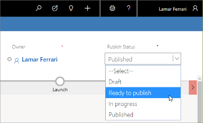

# Go live with publishable entities and track their status

[!INCLUDE[cc_applies_to_update_9_0_0](../includes/cc_applies_to_update_9_0_0.md)]

Many of the entities that you work with in [!INCLUDE[pn-marketing-business-app-module-name](../includes/pn-marketing-business-app-module-name.md)] require you to _go live_ before you can use them in your live marketing initiatives. The go-live process takes a record you are working with on your application server (such as an email message or customer journey), checks it for errors, prepares it for use, and moves the result to one of the external services used by [!INCLUDE[pn-marketing-app-module](../includes/pn-marketing-app-module.md)] to process data-intensive features like bulk email sending, collecting and analyzing results, or populating dynamic segments. The go-live process is sometimes also referred to as _publishing_.

Once a record is live, the version you have on your application server (the version you can open and edit in the [!INCLUDE[pn-marketing-app-module](../includes/pn-marketing-app-module.md)] UI), is just a local representation of a live process running on an external service. Some types of entities require the live process to be stopped before you can edit them, while others let you push updates from the app without stopping the live process. In some cases, you won't be able to make certain types of changes (or even any changes at all) once you have gone live with a given record.

The following table lists all entities that have a go-live function and which services they are published to.

| Entity | Live service |
| --- | --- |
| Marketing email messages | Marketing services |
| Customer journeys | Marketing services |
| Lead-scoring models | Customer-insights services |
| Segments | Customer-insights services |
| Marketing pages | Marketing services, shared with portals |
| Marketing forms | Portals |
| Events | Portals |

## Monitor go-live status with status and status reason

Nearly all entities in [!INCLUDE[pn-dynamics-365](../includes/pn-dynamics-365.md)] have both **Status** and **Status reason** fields. The **Status** is always either _active_ or _inactive_, which indicates whether the record is in use and can affect where it is visible and selectable in the UI. The **Status reason** gives more information about the **Status**, and often functions as a sub-status (which it usually does for publishable entities in [!INCLUDE[pn-marketing-app-module](../includes/pn-marketing-app-module.md)]).

For most types of entities, you can manually assign the active/inactive **Status** for each record using buttons on the command bar. You might use this, for example, to mark a contact as inactive, which hides that contact from most views but keeps it in your database for future or historical reference. For publishable entities in [!INCLUDE[pn-marketing-app-module](../includes/pn-marketing-app-module.md)], the system usually manages the **Status reason** value (which is therefore read-only) to give you more information about the publish status. For some publishable entities in [!INCLUDE[pn-marketing-app-module](../includes/pn-marketing-app-module.md)], the **Status** field is also managed by the system and therefore may not be editable directly either. See the remaining sections of this topic for details.

All entities provide a view selector for list views, where you can choose a saved query such as "Active journeys", "All live journeys", "Inactive journeys", and so on. In most cases, you can find inactive records by going to the "Inactive …" view, where you can usually reactivate a record if needed.

## Customer journey go-live operations and status

For customer journeys, both the **Status** and a **Status reason** are managed by the system to indicate the journey's current go-live and operational status. Both values are read-only.

| Status | Status&nbsp;reason | Description |
| --- | --- | --- |
| Active | Draft | The journey has never been live and can be edited and saved locally without restrictions.  To publish a draft journey, open it and then choose **Go Live** on the command bar. |
| Active | Live | The journey is currently live. If the current date is between the journey start and end dates, then it is processing contacts. The journey will automatically go to the stopped state when its end date passes.  To stop a live journey, open it and then choose **Stop** on the command bar.  To edit a live journey without stopping it, open it and then choose **Edit** on the command bar. |
| Active | Stopped | The journey was once live, and may have already processed some contacts, but is now stopped, so it won't process any more contacts or take any other actions. It may have stopped because the end date passed, or because you stopped it manually.  Thirty days after the end date, the journey will automatically change from _active/stopped_ to _inactive/expired_. Once a journey has expired, you can no longer edit or restart it, but until then you could extend the end date and restart it if needed.  While stopped, you can edit and save the journey without going live. Select **Go live** to start running the journey again. |
| Active | Live, editable | The journey is currently live, but you have chosen to edit it locally. The live journey will continue to process contacts and take other actions while you work with the local version.  Make the required changes and then choose **Save** to update the live journey automatically (after an error check) and return to the active/live state. |
| Active | Error | An error occurred while the journey was going live. This is usually a temporary issue, so you should wait a short time, then try again to go live again. |
| Active | Going live | The journey is currently in the process of going live. |
| Active | Stopping | The journey has been live but is currently in the process of stopping due to a stop request. |
| Inactive | Expired | The journey end date passed at least 30 days ago, and the journey can't be restarted. |

## Marketing email go-live operations and status

You can manually set the **Status** of a message to _active_ or _inactive_ by using the buttons on the command bar (as with most entities). The **Status reason** indicates the message's go-live state and is read-only.

| Status | Status&nbsp;reason | Description |
| --- | --- | --- |
| Active | Draft | The message has never been live and can be edited and saved locally without restrictions.  To publish a draft message, open it and then choose **Go Live** on the command bar. |
| Active | Live | The message is currently live and can't be edited locally. It is available to be sent at any time by a customer journey.  To stop a live message, open it and then choose **Stop** from the command bar.  To edit a live message without stopping it, open it and then choose **Edit** on the command bar. |
| Active | Stopped | The message was once live, and may have already been delivered to some contacts, but is now stopped so no new copies are being sent. If the message is used in a customer journey, then the message won't be sent by the journey until you start it again (and contacts will wait at the related email tile).  While stopped, you can edit and save the content without going live. Select **Go live** to republish it. |
| Active | Live, editable | The message is currently live (and that version could be sent by a customer journey at any time), but you have chosen to edit it locally at the same time.  Make the required changes and then choose **Save** to update the live message automatically (after an error check) and return it to the _active/live_ state. |
| Inactive | Expired | A user has manually deactivated the message using the **Deactivate** button on the command bar. If the message was previously live, then this operation also stops it. |

## Lead-scoring model go-live operations and status

You can manually set the **Status** of a lead-scoring model to _active_ or _inactive_ by using the buttons on the command bar (as with most entities). The Status&nbsp;reason indicates the model's current go-live state and is read-only.

| Status | Status&nbsp;reason | Description |
| --- | --- | --- |
| Active | Draft | The model is either new or stopped and you can edit all its settings.  To publish a draft model, open it and then choose **Go Live** on the command bar. |
| Active | Error |An error has occurred. |
| Active | Going live | The model is currently in the process of going live. |
| Active | Live | The model is currently live and scoring your leads. The model can't be edited locally while in this state, but you can stop it at any time by choosing **Stop** on the command bar, then edit and go-live again if needed. |
| Active | Stopping | The model has been live but is currently in the process of stopping due to a stop request. After stopping, the model returns to the **Draft** state. |
| Inactive | Expired | A user has manually deactivated the model using the **Deactivate** button on the command bar.  If the model is live, then you must stop it (by choosing **Stop** on the command bar) before you can deactivate it. |

## Segment go-live operations and status

The **Status reason** indicates the segment's current go-live state and is read-only.

| Status | Status&nbsp;reason | Description |
| --- | --- | --- |
| Active | Draft | The segment is new and has never been published. You can edit all settings.  To publish a draft segment, open it and then choose **Go Live** on the command bar. |
| Active | Live | The segment is currently live and continuously updating its contacts list. It might be in use for targeting a customer journey.  The segment can't be edited locally while in this state, but you can stop it at any time by choosing **Stop** on the command bar, then edit and go live again if needed. |
| Active | Stopped | The segment was once live but is now stopped and can be edited if needed.  While stopped, you can edit and save the segment without going live. Select **Go live** to republish it. |
| Inactive | (none) | Segments should never have an inactive status. |

## Marketing page go-live operations and status

You can manually set the **Status** of a marketing page to _active_ or _inactive_ by using the buttons on the command bar (as with most entities). The **Status reason** indicates the page's go-live state and is read-only.

| Status | Status&nbsp;reason | Description |
| --- | --- | --- |
| Active | Draft | The page has never been live and can be edited and saved locally without restrictions.  To publish a draft page, open it and then choose **Go Live** on the command bar. |
| Active | Live | The page is currently live and available publicly on the internet.  To stop a live page, open it and then choose **Stop** on the command bar.  To edit a live page without stopping it, open it and then choose **Edit** on the command bar. |
| Active | Stopped | The page was once live, and may have already been used, but is now stopped and unavailable publicly on the internet.  While stopped, you can edit and save the page without going live. Select **Go live** to publish the page again. |
| Active | Live, editable | The page is currently live, and can still be used, but you have chosen to edit it locally at the same time.  Make the required changes and then choose **Save** to update the live page automatically (after an error check) and return to the active/live state. |
| Active | Error | An error occurred while the page was going live. This is usually a temporary issue, so you should wait a short time, then try to go live again. |
| Active | Going live | The page is currently in the process of going live. |
| Active | Stopping | The page has been live but is currently in the process of stopping due to a stop request. |
| Inactive | Expired | A user has manually deactivated the page using the **Deactivate** button on the command bar.  If the page is live, then you must stop it (by choosing **Stop** on the command bar) before you can deactivate it. |

## Marketing forms go-live operations and status

Marketing forms are reusable form elements that you can embed in your marketing pages. They get published to the marketing services, where they are made available to marketing pages running on the portal. The forms can also be embedded onto any web page, such as on your own website, rather than on a [!INCLUDE[pn-dynamics-365](../includes/pn-dynamics-365.md)] marketing page.

The publish process for marketing forms is entirely automated, so you don't need to explicitly select buttons to **Go live** or **Edit** a form. As soon as you save a form, it gets published automatically, and each time you open a form, you can start editing it right away.

You can deactivate (or reactivate) a marketing form record using buttons on the command line, as with most entities. But be careful—when you deactivate a form, any existing marketing pages that use it will stop working.

The **Status reason** field for marketing forms doesn't track the publish state; it just mirrors the **Status** itself.

## Event go-live operations and status

The event go-live functionality works a bit differently from the other entities described in this topic. When you publish an event, [!INCLUDE[pn-dynamics-365](../includes/pn-dynamics-365.md)] generates an event portal for that event rather than going live with the event record itself. The generated portal displays many types of information that are defined on, and linked to, the event record. The event and all its settings remain editable even after you publish the portal, and any changes you make to a published event will immediately be reflected on the portal too.

The events entity has a **Status** field, which works the same way as it does for most entities, but it doesn't use the **Status reason** field to monitor publish status. Instead, the events entity has a **Publish status** field, which is fully editable all the time you work with an event. This value is shown as a drop-down list in the upper-right corner when you are editing an event record.

<!--Is the name (Lamar Ferrari) in this image from a fictitious names list?-->

The default values for **Publish status** are _Draft_, _Ready to publish_, _In progress_, and _Published_. Other than _Published_, all these values are for information only, so you can use them to track your work progress and coordinate with coworkers as needed. However, when you set this to _Published_, then the event details will become available publicly on your portals server. Set the **Publish status** to any value other than _Published_ to hide the event on your portal.

### See also

[Design your digital content](design-digital-content.md)  
[Prepare marketing email messages](prepare-marketing-emails.md)  
[Create and deploy marketing pages](create-deploy-marketing-pages.md)  
[Segmentation, lists, and subscriptions](segmentation-lists-subscriptions.md)  
[Create automated campaigns with customer journeys](customer-journeys-create-automated-campaigns.md)  
[Score and manage leads](score-manage-leads.md)  
[Set up the event portal](set-up-event-portal.md)
