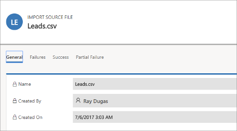

# Import data and control how duplicate records are identified

Bring your customer and sales data quickly into your app by importing it. You can import data into most record types.

Dynamics 365 processes imports in the background. After an import is completed, you can review which records were successfully imported, failed to be imported, or were partially imported. To fix the records that failed to be imported, export them into a separate file, fix them, and then try to import them again (if necessary, you can start over by deleting all records associated with the previous import).

## Supported file types

You can import data from the following file types:

- Comma-separated value (.csv) file
- Excel templates provided by Dynamics 365  
  More information: [Export data to Word or Excel files](export-data-word-excel.md)

## Prepare your file for import

Here are some guidelines to help make sure that your file will be imported successfully:

1. Put records for each record type in a separate file.

2. Make sure that the file is in one of the following formats:
   - .csv file: A data file with a .csv file extension. Typically a .csv file consists of fields and records, stored as text, in which the fields are separated from one other by commas.
   - Excel template

3. If your import file is a .csv file, make sure that it is correctly delimited. You can use double quotation marks (") or single quotation marks (') as data delimiters.

4. Make sure the first line of the file is a row of column headings. Add column headings (text used in the first row of a workbook or file that labels the data in each column) if they are not already present.

   > [!NOTE]
   > Make sure that the .csv file does not contain:
   > - Multiple lines in the first line (header row).
   > - Quotation marks in the first line. Dynamics 365 uses quotation marks as data delimiters.
   > - Data separated with a semicolon (;) or comma (,). Dynamics 365 uses semicolons and commas as field delimiters.
   > 
   > [!IMPORTANT]
   > Data can be imported more quickly if it can be automatically mapped during the import process. It helps to have your column headings match the display name of fields in Dynamics 365. The display name is the label that is used by default when an attribute is displayed on a form, in a list, or in a report. The **Display Name** for each attribute can be changed in the **Customization** area by a user who has an appropriate security role.

5. Make sure data exists for all required fields.

    A record will only be imported if all required fields are mapped, and if data exists in each of the source columns that are mapped to the required fields. A required field is an attribute that is required before a record can be saved. You can either determine the required fields in advance, or identify missing required mappings during the import. In either case, make sure you have required data in each record. To determine which fields are required, open the form for the record type as if you were creating a new record, and identify fields that are marked with a red asterisk (\*).

    The following list shows default required fields for commonly imported record types.

    - Account: **Account Name**
    - Contact: **Last Name**
    - Lead: **Topic, Last Name, Company Name**
    - Product: **Default Unit, Unit Group, Decimals Supported**

For example, the following lines show what the data might look like for a .csv format file containing leads. The first line contains the field names, and the remaining lines are imported as data.

```Excel
Company,Last Name,First Name,Topic,Email,Mobile Phone
"Designer Bikes""Groth""Brian""Mountain bikes""someone@example.com""555-555-0112"
"Major Sporting Goods""Bedecs""Anna""Components""555-555-0171"
```

> [!NOTE]
> By default, the maximum size of the files that you can import is 8 megabytes (MB).

## Import records from an Excel template

1. Start your import by doing either of the following:
   - Go to the list view for the entity you want to import to (such as the list of leads), and select **Import from Excel** on the command bar.
   - If you are an administrator, go to **Settings** > **Advanced Settings** > **Business Management** > **Import Data**. On the **Import Data** page, select the record type you want to import the data for, and then in the drop-down list, select Excel.

2. Select **Browse** to upload a file.
3. Select **Next**. All the fields in your source file are automatically mapped.
4. Select **Finish Import**.

## Import records from a .csv file

1. Prepare your import file as described in [Prepare your file for import](#prepare-your-file-for-import).

2. Start your import by doing either of the following:
    - Go to the list view for the entity you want to import to (such as the list of leads), and select **Import from CSV** on the command bar.
    - If you are an administrator, go to **Settings** > **Advanced Settings** > **Business Management** > **Import Data**. On the **Import Data** page, select the record type you want to import the data for, and then in the drop-down list, select **CSV**.

3. Choose a file to upload.

4. Select **Next**.

5. If you have an alternate key defined, select it from the **Alternate Key** drop-down list.

    The alternate key is used to uniquely identify and update records during import instead of using the primary key. Some external data systems do not store primary keys. In such cases, an alternate key can be used to uniquely identify records. More information: [How alternate key and duplicate detection work during import](#how-alternate-key-and-duplicate-detection-work-during-import)

6. In the **Data Delimiter** drop-down list, select the data delimiter that you've used in your .csv file.

7. Select **Review Mapping**.

8. On the **Review Mapping** page, review how your column headings are mapped to the fields in Dynamics 365.

    

   - On the left side, by default the **Primary Fields** section of the **Review Mapping** page shows all the required fields for the entity that must be mapped for the data to be imported successfully.
   - If you've selected an alternate key, all the fields of the alternate key also become required fields and must be mapped.
   - If the column headings of your source file match the field display names, these fields will be automatically mapped. All the mapped fields will be shown with a green check mark.
   - If the column headings don't match, the unmapped fields will be shown with a red exclamation point. Select a Dynamics 365 field to map to the unmapped column heading of your file.
   - To quickly filter on only the unmapped fields, select **Unmapped** from the **Map Attributes** drop-down list.

9. In the **Optional Fields** section of the **Review Mapping** page, the left side shows the column headings in your source file. If the column headings match the field display names, the fields will be automatically selected in the corresponding drop-down lists.

   - If the column headings don't match, the unmapped fields will be shown with a red exclamation point.
   - Select a Dynamics 365 field to map to the unmapped column heading of your file.
   - You can also choose **Ignore** from the drop-down list for one or more optional fields. Data from ignored columns won't be imported into Dynamics 365 Marketing.  
     

10. If any column in your source file includes a fixed set of values, you must map the column to a field of type **Option Set** type. A column of this type has values such as "Yes" or "No," or "Hot," "Warm," or "Cold." To do this, click the  button next to the option set field. The **Option set mapping** section opens:

     

    - For each **Source Option Values** item, click an item from the **Dynamics 365 Option Values** list to map it, and then click OK.
    - The **Dynamics 365 Option Values** drop-down list combines the values available in the incoming file with those already in the Dynamics 365 database. For example:
      - **Values in import file**: Low, High
      - **Values already in Dynamics 365**: Cold, Warm, Hot
      - **Resulting target values**: Cold, Warm, Hot, Low, High

    - After import, the import wizard will add all mapped values to Dynamics 365, but will drop unmapped values from the import file that aren't yet in Dynamics 365. For example, you could map the "Low" source value to the "Cold" target value, but map the "High" source value to the (new) "High" target value. Based on these mappings, the import wizard creates "High" as a Dynamics 365 target value. It does not create "Low" as a Dynamics 365 target value because you didn't map any source to this target value.

      > [!NOTE]
      > You can also map a column in your source file to a field of type "Two Options" and "Multiselect Option Set" (where a field can have multiple values). You must map each **Source Option Values** to the items in the **Dynamics 365 Option Values** list. When mapping to a field of type "Multiselect Option Set," if your source file includes values that aren't available in Dynamics 365 Marketing, new values won't be created in Dynamics 365 Marketing.

11. If some data in your source file references other existing records in Dynamics 365 Marketing, you must map the column in the source file to a lookup field of Dynamics 365 Marketing.

     For example, you might want to import a file named Leads.csv, which contains customer records. The **Customer** column in Leads.csv contains the associated account or contact data. To map this, select the  button next to the lookup field. The **Lookup Reference** section opens and lists the entities related to the current entity.

    

     For each entity, select the fields to search during import to retain the relationships between the records, and then select **OK**.

12. To save your mapping settings for next time, enter a name in the **Name your data map** box. This way, the next time you need to import a similar set of data, you'll be able to use this mapping again.

     

13. When you're ready to continue, select **Finish Import** to import that data by using your mappings.

## How alternate key and duplicate detection work during import

Note the following on how alternate key and duplicate detection works while importing records in Dynamics 365 Marketing:

- **When duplicate detection is disabled and an alternate key is not defined in Dynamics 365 Marketing**  
  The import process creates new records. If a matching GUID is found, the import process updates the record.
- **When duplicate detection is disabled and an alternate key is selected**  
  Records with the same alternate key data are updated, and other records are created in Dynamics 365 Marketing.
- **When duplicate detection is disabled and an alternate key is not selected**  
  In this scenario, the alternate key is considered as the primary key because it is available in Dynamics 365 Marketing. Records that have the same alternate key will fail with an error message during import.
- **When duplicate detection is enabled and an alternate key is not defined**  
  The duplicate detection rule is followed. The import process creates new records. If any matching GUID is found, the import process updates the records. If any records match the duplicate detection rule, an error message is shown.
- **When duplicate detection is enabled and an alternate key is not selected** 
  In this scenario, the alternate key is considered as the primary key because it is available in Dynamics 365 Marketing. Records with same alternate key will fail with an error message during import. Duplicate detection rules are also applied. If any records match the duplicate detection rule, an error message is shown. Records that do not match the duplicate detection rule will be created in Dynamics 365 Marketing.
- **When duplicate detection is enabled and an alternate key is selected**  
  The import process updates the records based on the alternate key and then applies duplicate detection. Records are updated if the alternate key matches; otherwise, they are created in the system.

## View the results of an import and correct errors

You must wait for an import job to be completed before you can repair failures.

1. Go to **Settings** > **Advanced Settings** > **Business Management** > **Import Data**. Import jobs for all recent imports are listed here.
1. Find your job in the list and check its progress. The **Status** column shows the status of the import by using the following values:
    - Submitted
    - Parsing
    - Transforming
    - Importing
    - Completed
1. After the import is complete, the **Success**, **Failure**, and **Partial Import** columns will show the number of records that were successfully imported, failed to be imported, or were partially imported.
1. Open the import file to view the records that were not imported or were partially imported. Double-click the import file record.
1. Use the tabs to see information about failures, success, or partial failure of records during import.  

1. On the **Failures** tab, select **Export Error Rows** to export rows that failed to be imported to a new .csv file. You can correct the errors in this file, and then import it.

## Delete imported records

1. Go to **Settings** > **Advanced Settings** > **Business Management** > **Import Data**. Import jobs for all recent imports are listed here.
1. Select the import file that you want to delete, followed by one of the following actions:
   - **Delete import source file**: Deletes the import log file and its details.
   - **Delete imported records**: Deletes all records that were imported from the selected file.
   - **Delete all**: Deletes the import file along with the records that were imported from the import file.

### See also

[Business management settings](business-management-settings.md) 
[Export data](export-data-Word-Excel.md)


[!INCLUDE[footer-include](../includes/footer-banner.md)]