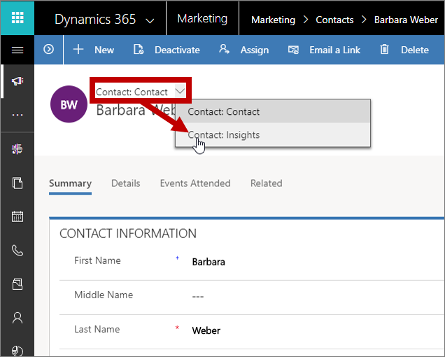
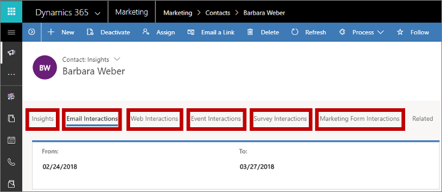
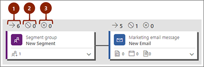

<!--Editing:  Is May 1 the day the update will be published? If sooner, please revise the ms.date. Also, put keywords into the description and remove the keywords entry.-->
# Analyze results to gain insights from your marketing activities

[!INCLUDE[pn-dynamics-365](../includes/pn-dynamics-365.md)] keeps track of the way your contacts react to your various marketing initiatives and provides detailed analytical views to help you understand your impact and learn what works best. For example, each of the following entities provides statistics, analytics, and key performance indicators (KPIs) based on your marketing results:

- Contacts
- Leads
- Segments
- Customer journeys
- Email messages
- Lead scoring models
- Marketing pages
- Marketing forms
- Websites
- Redirect URLs

## Open and use the insights form views

For nearly all entity types, you can view related results and analytics by opening a record and then switching to the **Insights** form view using the form-view selector above the record name. (Some entities, including redirect URLs and websites, don't provide this drop-down list and instead show analytics on the same form view as the settings.)

### Move between insight categories

Once you have an **Insights** form view open, you can navigate between the available categories of analytics using the tabs below the record name.

### Filter insights by date range and usage

At the top of most insights tabs, you'll find settings that let you filter the information shown—for example, by date ( **From** and **To** settings) or usage (such as which customer journey an email was used in).

   

## Contact insights

To view contact insights, go to **Marketing** > **Customers** > **Contacts** and then select a contact record and open its **Contact: Insights** form view.

Here you can find a complete history of how your selected contact has interacted with your marketing initiatives. This can help you to understand what this specific contact is interested in and which types of messages they respond to. Marketers might use this information to get deeper knowledge about specific decision makers so they can better target future initiatives, while salespeople might use this to find out how best to talk to this person should they choose to contact them directly.

Contacts provide the following insights tabs.

- **Insights**: View a timeline of all interactions the contact has made and a chart of interactions broken down by type.
- **Email interactions**: View complete details of email results for the selected contact, including a list of all messages sent to them, plus counts of all sends, opens, clicks, bounces, and more.
- **Web interactions**: See which pages and links from your websites the contact has selected. Only pages that include a [!INCLUDE[pn-marketing-app-module](../includes/pn-marketing-app-module.md)] tracking script are counted here (see also [Register contacts' engagement](register-engagement.md)).
- **Event interactions**: See event registration and check-in records for the current contact.
- **Survey interactions**: See how the contact responded to your surveys.
- **Marketing form interactions**: See which marketing forms the contact has submitted and the content of each submission.

## Lead insights

To view lead insights, go to **Marketing** > **Customers** > **Leads** and then select a lead record and open its **Lead: Insights** form view.

Most of the insights displayed for a lead are the same as those shown for contacts and are taken from the contact record associated with the current lead, as previously described in [Contact insights](#contact-insights). One exception to this is the **Insights** tab, which tracks lead-specific information such as the lead's age (how long the record has been active) and its progress over time.

## Segment insights
<!--Editing:  Changed "customer journey insights" to "segment insights" in the following sentence.-->
To view segment insights, go to **Marketing** > **Customers** > **Segments** and then select a segment record. Unlike most entities, segments provide insights as part of the main form view. Go to the **Insights** tab to see them.

## Customer journey insights

To view customer journey insights, go to **Marketing** > **Marketing execution** > **Customer journeys** and then select a journey and open its **Customer journey: Insights** form view. Insights are only available for customer journeys that are (or have been) live.

Customer journeys provide two insights tabs: **Designer** and **Insights**. The **Insights** tab provides a few overall statistics about that journey, while the **Designer** view lets you explore what happened at each step.

The **Designer** insights view is unique for customer journeys. Here, you can see your journey pipeline. It looks the same here as when you were designing the journey, but now it presents results and doesn't include a toolbox or editing controls. Above each tile, you can see an overview of how contacts flowed through that tile, as shown in the following illustration. By inspecting these values, you can get a quick overview of how your various contacts flowed through the structure, which path they chose, and which problems they may have had. (Each of these KPIs is also shown in the **Data** panel when a tile is selected.)

Legend:

1. **Inflow** : Shows the number of contacts that entered the tile.
1. **Blocked** : Shows the number of contacts that were blocked from continuing the journey at this tile. There are three main reasons that a contact might get blocked here: they unsubscribed from the mailing list targeted by the journey, they got added to the journey's suppression segment, or they lowered their consent level below the minimum threshold set for the journey. (This isn't related to the blocked KPI associated with email insights.)
1. **Failed** : Shows the number of contacts that failed to be processed by the tile, typically because of an internal error. 

For even more information about what happened on a tile, select it from the pipeline and look at the **Data** panel. The information shown here depends on the tile type.

All types of tiles provide a **Volume** section on the **Data** panel with the following information:

- **Volume** > **Inflow**: Counts how many contacts entered the tile. This value is also displayed as the first value shown above the tile in the pipeline.
- **Volume** > **Processing**: Counts how many contacts are still waiting for that tile to finish processing them. For trigger tiles, for example, this value probably indicates the number of contacts that are waiting for the trigger condition to be met or for the timeout to arrive.
- **Volume** > **Blocked**: Counts the number of contacts that were blocked from continuing the journey at this tile. There are three main reasons that a contact might get blocked at a tile during a journey: they [unsubscribed](set-up-subscription-center.md#target-subscription-list) from the mailing list targeted by the journey, they got added to the journey's [suppression segment](customer-journeys-create-automated-campaigns.md#general-options), or they lowered their [consent level](gdpr.md#view-and-set-the-consent-level-for-each-contact) below the [minimum threshold](gdpr.md#journey-consent-level) set for the journey. This value is also displayed as the second value shown above the tile in the pipeline. (This _isn't_ related to the _blocked_ KPI associated with [email insights](#email-insights).) Some tile types provide a floppy-disk button here; select this button to generate a segment that includes all contacts that were blocked at exactly this tile of this journey.
- **Volume** > **Failed**: Counts the number of contacts that failed to be processed by the tile, typically because of an internal error. This value is also displayed as the third value shown above the tile in the pipeline. Some tile types provide a floppy-disk button here; select this button to generate a segment that includes all contacts that failed at exactly this tile of this journey.
- **Volume** > **Processed**: Counts the number of contacts that were successfully processed by this tile and passed on to the appropriate next tile. Some tile types provide a floppy-disk button here; select this button to generate a segment that includes all contacts that were successfully processed by exactly this tile of this journey.

In addition to the **Volume** section, some tiles also show additional sections and links in the **Data** tab, depending on the tile type. These can include the following:

- **KPIs**: For tile types that collect key performance indicators (KPIs), such as email tiles, you can read detailed results here. For a complete list of KPIs available for email messages, see [Email insights](#email-insights) (the **Data** panel shows many, but not all, of these).
- **Paths**: Trigger and splitter tiles include this section, which tells you how many contacts went down each available path.
- **View Details**: This link is provided at the bottom of the **Details** panel for tile types that have even more information available. Select this link to open the associated record, where you can explore its full insights panels. For example, email and event tiles provide this link, which opens the insights panels for the specific message or event associated with the tile.

  

## Email insights

To view email insights, go to **Marketing** > **Marketing execution** > **Marketing emails** and then select an email message and open its **Marketing email: Insights** form view. Insights are only available for email messages that are (or have been) live.

Here you can find a complete history of how various contacts have reacted to the selected message, which links they selected, and where they were when interacting with the message. You can also see delivery details.

Because you can reuse an email message in several different journeys, the filter controls for email insights include a field for specifying which journey you would like to analyze. If you don't select a journey, then the information you see applies to all journeys where the message was used. As with most other entities, you can also filter email insights by date range.

Marketing email messages provide the following insights tabs:
<!--Editing:  In the Links part below, what if someone is not using a mouse?-->
- **Insights**: Provides a general overview that includes KPIs, top-10 links, responses over time, geographical data, and more.
- **Delivery**: Provides details about your delivery results (such as processed, delivered, blocked, or bounced), plus a record of which contacts have received the message.
- **Links**: Provides a full analysis of each link included in the message, including a graphical reproduction of the message that shows a heat map highlighting your links (hover the mouse pointer to view details for each highlighted link). For each link you can see the number of total clicks, unique clicks, and the click-through rate (total number of unique clicks for a given link divided by the total number of unique clicks overall).
- **Interactions**: Provides full lists of recipients that were counted for each of several KPIs (such as opens, clicks, and forwards), plus a timeline of interactions.

Many different lists, statistics, and KPIs are provided to help you evaluate and improve the performance of your email messages. Consult the following glossary for a description of each of them.

<dl>
<dt>Blocked</dt><dd>Messages that were blocked (not sent) due to a contact's preferences or a problem with their email address. This can happen if the segment included contacts marked as <b>Do not bulk email</b>, or because the contact's email address was missing, invalid, or blacklisted. Examples of blacklisted address include known anonymous email servers and generic addresses such as do-not-repy@constoso.com or office@contoso.com.</dd>
<dt>Bounced (hard)</dt><dd>Messages that resulted in a hard bounce, which indicates that the address is invalid. A hard bounce might occur because the domain name doesn't exist or because the recipient is unknown. Multiple hard bounces can lower your server's send reputation, which will reduce your delivery rate, so you should remove hard-bouncing addresses from your contact records. When an address returns a hard bounce, Dynamics 365 will automatically stop sending new messages to that address for six months, but your email results will still show each attempt as a hard bounce.</dd>
  
  
<dt>Bounced (other)</dt><dd>Messages that bounced for some reason other than a hard or soft bounce. This result is rare, and might indicated a <em>remote bounce</em>, which occurs when a server initially accepting a message, but then returns a bounce message sometime later. These are otherwise treated as soft bounces.</dd>
<dt>Bounced (soft)</dt><dd>Messages that resulted in a soft bounce. A soft bounce occurs when an email is sent to a valid server, which recognizes the user, but still rejects the message for some reason, such as because the recipient's mailbox is full, the mail server is temporarily unavailable, or the recipient no longer has an email account at that address. If five messages in a row sent to a given address result in a soft bounce, then that address is treated as a hard-bounce address.</dd>
<dt>Clicked (total)</dt><dd>The total count of all the links clicked in all sent messages. Multiple clicks of the same link in a single message are counted multiple times, so the proportion of total clicks per total sent can sometimes be more than 100%.</dd>
<dt>Clicked (unique)</dt><dd>The number of sent messages where the recipient clicked at least one link at least once. Clicks on multiple links and multiple clicks on a single link are not counted after the first click, so the maximum unique clicks per message is one.
<dt>Click-through rate</dt><dd>This value is shown for each link included in a message. They are listed on the <strong>Marketing email: Insights &gt; Links</strong> tab, and can also be viewed on the heat map there. It is a ratio that shows the number of unique clicks on a given link divided by the number of unique clicks overall for the message. 
<dt>Delivered</dt><dd>Messages that were sent, not including hard- or soft-bounced messages. 
<em>(Delivered = Sent – TotalBounced)</em></dd>
<dt>Did not open</dt><dd>Messages for which no open was recorded. (Note that Marketing can only count opens when the email recipient allows images to load for the message, so some messages could be read and even clicked without an open being registered for them.)</dd>
<dt>Feedback loops</dt><dd>Message for which Dynamics 365 received a feedback message. When a recipient uses their email client to mark a message as spam, the client typically sets up a filtering rule and then returns feedback to the sender that the message has been marked as spam. If you continue to send messages to an address that has returned this feedback, you risk lowering your server's send reputation, which will reduce your delivery rate. When feedback is received, Dynamics 365 will automatically stop sending new messages to that address, but your email results will still show each attempt as a feedback loop.</dd>
<dt>Forwarded</dt><dd>Forwards made by recipients using the forward-to-a-friend link included in the message. The submitted forwarding addresses were not necessarily unique. (This value does not record forwards made using the mail-client forward feature.)</dd>
<dt>Opened (total)</dt><dd>The total number of times a message was opened, including multiple opens of a single message by a single recipient. (Note that Marketing can only count opens when the email recipient allows images to load for the message, so some messages could be read and even clicked without an open being registered for them.)</dd>
<dt>Opened (unique)</dt><dd>The total number of messages that were opened by a contact at least once. This value does not count multiple opens of the same message by the same contact. (Note that Marketing can only count opens when the email recipient allows images to load for the message, so some messages could be read and even clicked without an open being registered for them.)</dd>
<dt>Sending failed</dt><dd>Messages that were blocked due to a system failure or other unexpected error that occurred during sending.</dd>
<dt>Sent</dt><dd>Sent messages, including bounced messages, but not including blocked messages. 
<em>(Sent = TotalTargetedContacts – TotalBlockedQuantity)</em></dd>
<dt>Subscription submitted</dt><dd>These are messages where a contact clicked on the subscription center link and then submitted the subscription center at least once, regardless of whether the contact changed their subscriptions or contact details. 
<dt>Total generated leads</dt><dd>The number of leads generated as a result of an email message. A new lead is counted when a recipient clicks a landing-page link in the message and then submits the landing page, which generates a new lead for that contact as a result. Landing page submissions that don't generate a new lead aren't counted (for example, because a matching lead already exists or because the landing page isn't set up to generate leads).
<dt>Unsubscribed</dt><dd>Messages where a recipient clicked on the subscription center link and then unsubscribed from one or more mailing lists. This value counts, at most, one unsubscribe per message per recipient.
</dl>

## Lead scoring model insights

To view lead-scoring model insights, go to **Marketing** > **Lead management** > **Lead scoring models** , then select a model and open its **Lead scoring model: Insights** form view. Insights are only available for models that are (or have been) live.

Here you can find a timeline showing the number of leads processed by the model.

## Marketing page insights

To view marketing-page insights, go to **Marketing** > **Internet marketing** > **Marketing pages** , then select a marketing page and open its **Marketing page: Insights** form view. Insights are only available for pages that are (or have been) live.

Here you can find a complete history of how various contacts have interacted with the page and the submissions made using it.

Because you can reuse each marketing page in several different journeys, the filter controls for page insights include a field for specifying which journey you would like to analyze. If you don't select a journey, then the information you see applies to all journeys where the page was used. As with most other entities, you can also filter marketing page insights by date range.

Marketing pages provide the following insights tabs.

- **Summary**: Provides a general overview that includes KPIs, responses over time, geographical data, and more.
- **Submissions**: Provides a table that lists the full content of each submission made through the page. Metadata and several important field values are shown in the table columns for each submission; hover your mouse pointer over a value in the **Form submissions** column to open a tooltip that shows all values included in a given submission.
- **Visits**: Provides a table that lists information about each time the page was opened.

## Marketing form insights

To view marketing-form insights, go to **Marketing** > **Internet marketing** > **Marketing forms** , then select a form and open its **Marketing form: Insights** form view. Here you can find a complete history of how various contacts have interacted with the form and the submissions made using it.

Although you can use each form on multiple pages and in multiple journeys, all form insights combine data from all usages, though you can still filter results by date range.

Marketing forms provide the following insights tabs.

- **General info**: Provides basic information about the form (but no results).
- **Setup**: Provides KPIs such as the total number of form submissions, contacts created or updated, and leads created or updated by the form.
- **Submissions**: Provides a table that lists the full content of each submission made through the form. Metadata and several important field values are shown in the table columns for each submission; hover your mouse pointer over a value in the **Form submissions** column to open a tooltip that shows all values included in a given submission.

## Website insights

To view website insights, go to **Marketing** > **Internet marketing** > **Websites** , then select a website record. Unlike most entities, websites provide insights as part of their main form view, which provides the following tabs.

- **General info**: Shows the settings you made when creating the website and the JavaScript code that you must include on each web page that you want to track with this website setup. You can also see a list of the most popular pages that include this script, and a map that shows where people were when opening those pages.
- **Timeline**: Shows a table that provides details about each time a page tracked as part of this website was loaded.

## Redirect URL insights

To view redirect-URL insights, go to **Marketing** > **Internet marketing** > **Redirect URLs** , then select a redirect-URL record. Unlike most entities, redirect-URLs provide insights as part of their main form view, which provides the following tabs.

- **General info**: Shows the settings you made when creating the redirect URL and a map that shows where people were when the clicked the redirected link.
- **Timeline**: Shows a table that provides details about each time the redirect URL was clicked.
