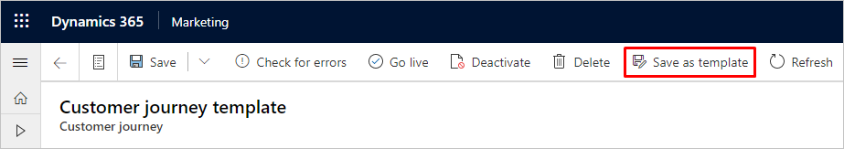
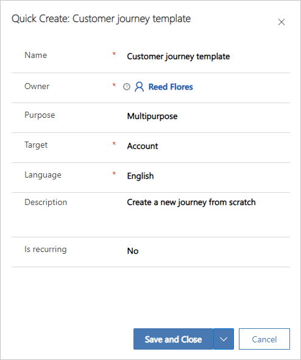
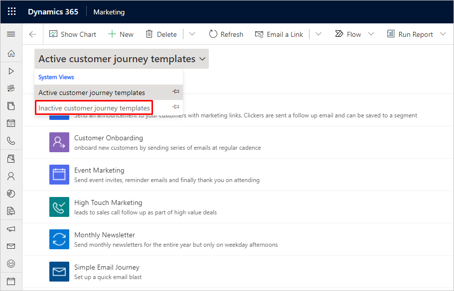

# Create and manage customer journey templates

Each time you create a new customer journey, you're asked to select from a gallery of _customer journey templates_ that are available on your instance.

Each template is assigned a language and purpose, and you can filter the gallery by these values to make the template you're looking for easier to find. You can view details about any listed template by selecting it in the list.

You can establish your own collection of custom templates to meet the needs of your organization. Also, the only way to create a copy of an existing customer journey is to first save it as a template, and then create a new journey based on that template.

## Save an existing customer journey as a template

If you've created a customer journey structure that you think you'd like to use again as a starting point for future campaigns, then you can save your journey as a template. Once your template is created, you'll be able to select it from the template browser each time you create a new journey.

When you save an existing customer journey as a template, the pipeline structure, all tile settings, and all journey settings are saved in the template. Depending on how you want to use it, it might make sense to edit the template after you save it to clear some of the settings that you'll most likely want to customize for each new journey (such as the specific email messages assigned to the email tiles).

To save an existing customer journey as a template:

1. Go to **Marketing** > **Marketing execution** > **Customer journeys**.

1. Open your existing customer journey.

1. Select **Save as template** on the command bar.

    

1. A quick-create form opens at the side of the window.

    

    Make the following settings:

    - **Name**: Specify a name for the template. Users will see this name when selecting the template from the template gallery on creating a new journey.
    - **Owner**: Specify the user that owns the template (by default, this will be you). This can affect which other users will be able to see and use the template.
    - **Purpose**: Select the word that best describes how and where to use this template. Users can filter the template gallery based on this value to make it easier to find in the right template.
    - **Target**: Choose whether this template should [target contacts or accounts](customer-journeys-create-automated-campaigns.md#general-options). This value is taken from the current customer journey that you are saving as a template.
    - **Language**: Choose the language the template is in. Users can filter the template gallery based on this value to make it easier to find in the right template.
    - **Description**: Enter a brief description of the template and what it's for. This description is shown in the template gallery when a template is selected.
    - **Is recurring**: Choose whether the template should create a [recurring journey](customer-journeys-create-automated-campaigns.md#general-options) or not. This value is taken from the current customer journey that you are saving as a template.

1. Select **Save and Close** to create your template.

## Create a new template from scratch

If you are planning for future, not yet existing, customer journeys, then you can create templates from scratch rather than starting from an existing customer journey.

To create a template from scratch:

1. Go to **Marketing** > **Marketing templates** > **Journey templates**.

1. Select **New** on the command bar.

1. Set up the template and make all settings just as you would a [standard customer journey](customer-journeys-create-automated-campaigns.md).

1. Save your template when you're done.

## Edit, delete, or deactivate an existing template

If you've got a template that you don't use anymore, then you can remove it from your system to keep it from cluttering up your template gallery. You might choose to hide the template by making it inactive, or to delete it permanently. You can also edit any existing template if you've discovered an error or your needs have changed.

To edit or delete an existing template:

1. Go to **Marketing** > **Marketing templates** > **Journey templates**.
2. Find the template in the list that you want to delete or edit
      - To _delete_ a template, mark it in the list by selecting any part of the row other than the template name. Then select **Delete** on the command bar. The template is permanently deleted.
      - To _deactivate_ a template, mark it in the list by selecting any part of the row other than the template name. Then select **Deactivate** on the command bar. The template will no longer be shown in the gallery but can still be reactivated if you need it again.
      - To _edit_ a template, select the relevant template name in the list to open the standard customer journey editor. Make the required settings and then save.

To reactivate an inactive template:

1. Go to **Marketing** > **Marketing templates** > **Journey templates**.

1. Open the system-view selector and switch to the **Inactive customer journey templates** view.

    

1. Mark the template that you want to reactivate by selecting any part of the row other than the template name. Then select **Activate** on the command bar. This moves the selected template back to the **Active customer journey templates** system view and will also make it available in the customer journey template gallery.

[!INCLUDE[footer-include](../includes/footer-banner.md)]