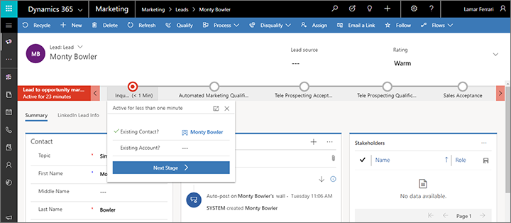

# The lead lifecycle

Read this topic to learn how Dynamics 365 Marketing handles leads and uses them to support your marketing and sales processes.

## Establish your marketing contacts

All marketing activities in Dynamics 365 Marketing focus on _contacts_, and Marketing treats each lead record as an expression of interest that is linked to a specific contact record.

The marketing segments that you set up to establish the target group for a customer journey are likewise populated with contact records, not lead or account records. That means that leads or accounts that aren't related to a contact record can't be targeted by a customer journey. However, you can still set up segmentation logic that starts by finding records such as accounts, leads, or opportunities based on their local values and then resolves to find the contacts that are linked to those records. For more information about how to implement a leads-based marketing strategy, see [Market to leads](market-to-leads.md). For more information about how to implement an account-based marketing strategy, see [Account-based marketing](account-based-marketing.md).

Dynamics 365 Marketing provides automated lead scoring, but this feature also requires each scored lead to be associated with either a contact or an account record. Leads that don't link to a contact or account record can't be scored by Marketing.

So, the starting point for engaging potential customers in Dynamics 365 Marketing is to establish your collection of contact records through the following mechanisms:

- Create contacts manually in the Dynamics 365 Marketing UI.
- Import contacts from a file.
- Customer opt-in from a landing page (typically created together with a linked lead).
- Customer opt-in from an event registration (typically created together with a linked lead).
- Created together with (and linked to) a lead synced from LinkedIn Lead Gen Forms.

## Lead generation

As contacts interact with your marketing initiatives, you'll generate leads to represent expressions of interest made by those contacts. You might generate a lead manually (such as after a meeting or phone conversation), or you might allow the system to generate them automatically (such as in response to an event registration). Leads are usually generated in one of the following ways:

- Use the Dynamics 365 Marketing UI to create a lead record and then manually link it to a new or existing contact record.
- Import leads from a file and then manually map each lead to a contact or account.
- Customer opt-in from a landing page (matched to an existing contact or creates a new, linked contact).
- Customer opt-in from an event registration (matched to an existing contact or creates a new, linked contact).
- Synced from LinkedIn Lead Gen Forms (matched to an existing contact or creates a new, linked contact).
- Created by a create-lead tile in a customer journey. These leads can be linked to either a contact or an account, depending on the tile and customer journey settings.

## Lead and contact matching strategies

When generating contacts and leads automatically (such as after a page submission or event registration), Marketing applies matching strategies to decide whether a matching lead and/or contact already exists before it creates new ones. Each matching strategy compares field values for the lead or contact that the system is about to create against the matching field values for existing records, and only creates a new record if no match is found. This helps ensure that:

- You will avoid creating duplicate leads or contacts.
- You can use landing page submissions to update existing lead and/or contact records.
- New leads can be associated with existing contacts when they are available.
- The new interaction is still recorded and credited to the correct contact for lead-scoring purposes.

You can choose which fields to consider in your matching strategies—the standard settings use just the email address for contacts and both email address and marketing-page ID for leads. You can establish any number of matching strategies and can even use different strategies for different marketing forms. At minimum, you'll have a default set of lead and contact matching strategies (one of each), which is automatically applied to all new marketing forms.

More information: [Configure marketing pages](/dynamics365/customer-engagement/marketing/marketing-settings#config-mkt-pages)

## Lead nurturing and scoring

Once generated, there are many ways that organizations can decide how to nurture and qualify their leads.

The lead represents an expressed interest in that specific campaign or initiative (this is called the *marketing context* of the lead). Some contacts might have several lead records activated at the same time, each tracking a different level of interest in a different campaign or product. Even a well-known contact with a long history of purchases might get a new lead created when they interact with a newer campaign.

After a single interaction, a new lead is usually still considered *unqualified*, which means that you don't have enough confidence in it to ask a salesperson to engage. Marketers typically put contacts with leads like these into a *nurturing campaign*, which seeks to build interest by supplying additional information and new offers.

The [automated scoring system](/dynamics365/customer-engagement/marketing/score-manage-leads) enables Marketing to calculate a score for each lead based on demographic details, firmographic details, and actions taken by the associated contact (or for account-based leads, contacts belonging to the associated account). Scorable interactions include, for example: opening an email, submitting a landing page, visiting your website, or attending an event. You can design your segments and customer journeys to react to promising patterns in contacts' behavior, so you can engage them further with targeted messaging and enticing offers that nurture their interest.

Each scoring model includes a sales-ready threshold. When a lead's score passes this threshold, it gets marked as sales ready, which can trigger other events within Dynamics 365, including advancing the lead through its business process and alerting teleprospectors or salespeople to pick it up.

## The lead business process

Like many entities in Dynamics 365, lead records support _business processes_. A sample lead process for marketing is provided out of the box, but most organizations will customize this or create a custom one that matches their own internal processes. The supplies process creates a timeline that tracks the progress of the lead from generation to sales acceptance. Each stage of the business process timeline provides a drop-down menu of fields that support that stage of the process and a button for marking that stage complete and activating the next stage of the process.

The following image shows the out-of-box business process, which creates the horizontal bar in the page header. The Inquiry stage is currently active, and the menu for this stage is shown open. Select any stage of the process to open its menu, where you can enter values, switch to that stage, or advance to the next stage as needed.

If you don't see the marketing business process on your lead record, then select **Process** > **Switch process** on the command bar and then choose the **Lead to opportunity marketing sales process** in the **Switch process** dialog box. This is the out-of-box process supplied with Marketing; your organization might have its own to match your internal process, in which case you should select that one instead (the rest of this section describes the out-of-box process).

The standard process guides users through the following stages:

1. **Inquiry**: Indicates a new lead. Open the menu to read or set the parent contact and/or account. The parent contact or parent account is usually assigned automatically if the lead was created by a landing page or event registration, but this is the only way to manually associate a lead with its parent contact or account.
2. **Automated marketing qualification**: When the lead receives a score from a lead-scoring model, it usually advances to this stage automatically, though you can also move it here manually (as with all stages). The lead waits here while Marketing nurtures and scores it. Marketing continues to apply your lead-scoring models to the lead until it reaches the sales-ready threshold defined by a model. On reaching that threshold, the lead is usually marked as sales ready automatically, though users can also manually mark the lead as sales-ready and/or teleprospecting ready here. If the lead gets marked as sales ready (whether by automated scoring or manual assignment), then it skips over the teleprospecting stages and goes straight to **Sales acceptance**.
3. **Teleprospecting acceptance**: When a lead gets marked as ready for teleprospecting, it comes to the attention of one of your phone operators, for example by showing up on their dashboard or through a generated task. If the lead meets their minimum criteria of engaging on the phone, they select the **Teleprospect accepted** check box here, which advances the lead to the next stage.
4. **Teleprospecting qualification**: When a phone operator gets in contact with the lead, they fill out the fields here to hold important information gathered during the conversation. If the phone operator concludes that the lead is promising, then they select the **Sales ready** check box, which advances the lead to the next stage.
5. **Sales acceptance**: When a lead gets marked as sales ready, it comes to the attention of a salesperson, for example by showing up on their dashboard or through a generated task. If the lead meets their minimum criteria for qualification, the manager assigns it to a salesperson and selects the **Sales accepted** check box here. The salesperson can then start working on the lead, possibly going on to convert it to an opportunity and eventually closing the sale.

Business processes are highly customizable and can be used to drive further automation. They are a standard feature of many Dynamics 365 apps. You'll typically also customize your system to support other aspects of this process, such as by setting up dashboards and custom views for teleprospectors and salespeople to discover their newly qualified leads, and by setting up workflows that automate other aspects of your internal sales processes. More information: [Business process flows overview](/flow/business-process-flows-overview)

> [!NOTE]
> If you are integrating Dynamics 365 Marketing with Dynamics 365 Sales, then you should probably also customize the lead views and dashboards shown to salespeople to ensure that only sales-ready leads are shown to them. More information: [Understand model-driven app views](/powerapps/maker/model-driven-apps/create-edit-views) and [Create or edit model-driven app dashboards](/powerapps/maker/model-driven-apps/create-edit-dashboards)

[!INCLUDE[footer-include](../includes/footer-banner.md)]