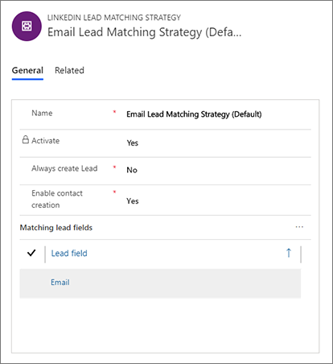

# Set up the LinkedIn Lead Gen integration and define a lead matching strategy

Use the settings pages under the **Settings** > **Advanced settings** > **LinkedIn Lead Gen** heading to configure the LinkedIn feature. A few LinkedIn security roles are also provided to let administrators control access to these features.

[!INCLUDE [cc-linkedin-disclaimer](../includes/cc-linkedin-disclaimer.md)]

## Enable users to work with the connector and assign security roles to users

The LinkedIn Lead Gen connector provides dedicated security roles, which you assign to users so they can work with LinkedIn ads that generate leads in Dynamics 365:

- **LinkedIn Lead Gen Forms Administrator.** Users with this role can configure lead matching strategies, LinkedIn field mapping, and solution settings for Dynamics 365 Connector for LinkedIn Lead Gen Forms.
- **LinkedIn Lead Gen Forms Salesperson.** These users can authorize LinkedIn user profiles to sync data to Dynamics 365, and view details about the synced submissions.

A third role, LinkedIn Lead Gen S2S Inbound, is an internal security role used to sync data.

Assign these security roles to users who you want to provide access to the **LinkedIn Lead Gen** menu item. To learn how to assign a security role to users, see [Create users and assign security roles](https://docs.microsoft.com/power-platform/admin/create-users-assign-online-security-roles).

## Configure a strategy to match incoming LinkedIn leads to existing leads

Manage your LinkedIn matching strategy to establish the rules for when and how Dynamics 365 Marketing will create or match leads for incoming LinkedIn form submissions.

When a new LinkedIn form submission arrives, Dynamics 365 Marketing tries to match the submission to an existing lead. If a match is found, the system will associate the new submission to the existing lead (which adds information and may increase its score). If no match is found, the system creates a new lead for the new LinkedIn submission.

### Create or edit a LinkedIn lead matching strategy

1. Go to **Settings** > **Advanced settings** > **LinkedIn Lead Gen** > **Lead matching strategy**. A list of exsting strategy opens.
1. Do one of the following:
    - To create a new matching strategy, select **New** on the command bar. Then enter a **Name** and select **Save** on the command bar to save your record and enable the matching table.
    - To edit an existing matching strategy, select the target strategy from the list.
1. Make the following settings as needed:
    - **Name**: Specify a name for the strategy. This is only used to identify the strategy in the list.
    - **Activate**: Set to **Yes** to activate the current strategy. Set to **No** to keep the currently active strategy while you work with this one. Only the active strategy has any effect. You must always have exactly one active strategy, but you can have as many inactive ones as you want. You can't change this setting if it's already been saved with it set to **Yes**, so if you want to change to a new strategy, first create the new one (if needed), and then edit this setting of that strategy to activate it.
    - **Always create lead**: Do one of the following:
        - Choose **No** to match incoming LinkedIn leads to existing leads according to the other settings for this matching strategy (this is the most common setting). If a match is found, the incoming LinkedIn submission is added to the matching lead. If no match is found, then a new lead is created with the LinkedIn submission associated with it.
        - Choose **Yes** to create a new lead for each LinkedIn form submission, even if a lead already exists according to other settings for this strategy. This will create exactly one lead for each LinkedIn form submission, so the lead won't be created again if you re-sync with LinkedIn. However, this setting may produce new leads for contacts that already have non-LinkedIn leads and/or LinkedIn leads created for other form submissions.
    - **Enable contact creation**: Usually, you should have a contact record associated with each lead record you use with Dynamics 365 Marketing because Marketing features including lead scoring, segmentation, and customer journeys rely on this. Therefore you should usually create a new contact for each new lead you plan to use with Marketing (see also [Market to leads with Dynamics 365 Marketing](market-to-leads.md) and [Design lead-scoring models](score-manage-leads.md)). Do one of the following:
        - Choose **Yes** to create a new contact for each lead created in response to a LinkedIn form submission (recommended).
        - Choose **No** if you prefer to allow the system to create leads based on LinkedIn form submissions without creating associated contacts (each of these will be considered an *orphaned lead* from a Marketing perspective until it has a contact associated with it).
1. Establish your matching strategy by adding one or more fields to the **Matching lead fields** table. When a new LinkedIn form submission arrives, the system will match incoming values for these fields against the matching fields for existing lead records. A match is found only when *all* the fields listed here have matching values, so your matches will be more precise (but less likely) if you include more than one field. Often, the email field alone is sufficient. Do the following to establish the fields list:
    - To add a new field, select the ellipsis button next to the **Matching lead fields** heading to open the **More commands** menu, and then select **Add existing LinkedIn field** from the menu. A flyout opens at the side of the window; use it to select an existing LinkedIn field mapping. If you don't see the mapping you need, you may need to create it as described in [Configure LinkedIn field mappings](#field-mappings).
    - To remove a field from the list, select the target field to highlight it, select the ellipsis button next to the **Matching lead fields** heading to open the **More commands** menu, and then select **Remove** from the menu.
1. Select **Save** at the bottom corner of the window to save your settings.

### Activate a different LinkedIn lead matching strategy

1. Go to **Settings** > **Advanced settings** > **LinkedIn Lead Gen** > **Lead matching strategy**.
1. In the list, select the matching strategy that you want to activate.
1. In the **Activate** menu in the matching strategy details, select **Yes**.
1. If another matching strategy is active, it will become deactivated.

### Delete a LinkedIn lead matching strategy

1. Go to **Settings** > **Advanced settings** > **LinkedIn Lead Gen** > **Lead matching strategy**.
1. Select the check box for the lead matching strategy you want to delete.
    You can't delete the activated lead matching strategy.
1. Select **Delete**, and then confirm your deletion.

## Configure LinkedIn field mappings

Field mappings establish how incoming field names from LinkedIn map to the lead fields in Dynamics 365 Marketing. Sometimes, the field names might happen to be the same on both systems, but often they are at least a little different.

Only mapped fields can be saved with your lead record in Dynamics 365, and when you're setting up your matching strategy, you can only choose fields that are included in the mapping list (it's also important to map each field used in a mapping strategy or else your strategy won't work).

### Create or edit a new field mapping

1. Go to **Settings** > **Advanced settings** > **LinkedIn Lead Gen** > **Lead field mappings**. A list of existing field mappings opens; some of these may have been discovered automatically when you set up the LinkedIn integration but not all may be mapped yet.
1. Do one of the following:
    - To create a new field mapping, select **New** on the command bar.
    - To edit an existing field mapping, select the mapping from the list.
1. Make the following settings:
    - **Name**: Enter the name of the field exactly as it's identified on your LinkedIn form.
    - **Lead field**: Use this lookup field to identify the Dynamics 365 lead field in which to store the incoming value from LinkedIn.
1. If you're creating a new field mapping, select **Save & Close** on the toolbar. If you're editing an existing field, select **Save** at the bottom corner of the window.

### Remove an existing field mapping

1. Go to **Settings** > **Advanced settings** > **LinkedIn Lead Gen** > **Lead field mappings**.
2. Select the field mapping that you want to remove.
3. Select **Delete** on the command bar and confirm the deletion.

### See also
[LinkedIn Lead Gen integration](linkedin-lead-gen-integration.md)

[!INCLUDE[footer-include](../includes/footer-banner.md)]