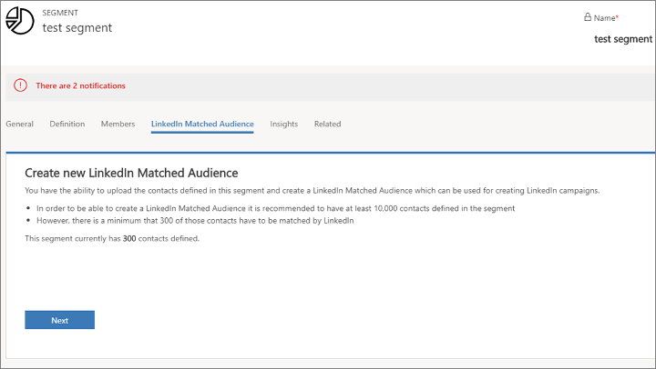
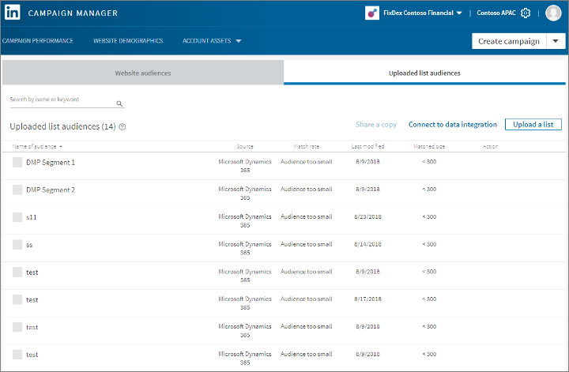

# Market to Dynamics 365 Marketing segments on LinkedIn with LinkedIn Matched Audiences

[LinkedIn Matched Audiences](https://www.linkedin.com/help/lms/answer/86492/linkedin-matched-audiences-overview?lang=en) is a LinkedIn feature that lets you match a collection of contacts stored on an external system, like Dynamics 365 Marketing, to an audience of LinkedIn members with matching email addresses. Dynamics 365 Marketing comes ready to take advantage of this capability, so you can leverage your Dynamics 365 Marketing static segments to create a matching audience of LinkedIn members. Then, when you run a campaign on LinkedIn, you can target the same segments that you set up in Dynamics 365 Marketing and also turn any leads generated on LinkedIn into Dynamics 365 leads through the [LinkedIn Lead Gen Forms integration](linkedin-lead-gen-integration.md) feature also offered by Dynamics 365 Marketing.

[!INCLUDE [cc-linkedin-disclaimer](../includes/cc-linkedin-disclaimer.md)]

> [!IMPORTANT]
> Dynamics 365 Marketing encrypts each email address using a one-way hash before sending it to LinkedIn. LinkedIn will be able to match these addresses to existing LinkedIn members but cannot decode the email addresses themselves. This important technique helps protect the privacy of your Dynamics 365 contacts.

> [!IMPORTANT]
> LinkedIn members can use their LinkedIn settings to opt-out of having their data shared with external apps. LinkedIn members who have enabled this opt-out option won't be matched to incoming Dynamics 365 Marketing audiences and therefore won't be included in your LinkedIn Matched Audiences even if they would otherwise match your Dynamics 365 Marketing segment.

To create a LinkedIn Matched Audience from a Dynamics 365 Marketing segment, the segment must meet the following requirements:

- The segment must be static (not dynamic).
- The segment must be live.
- LinkedIn requires that Matched Audiences contain at least 300 contacts, so if fewer than 300 matches are found to your Dynamics 365 Marketing segment, the matched audience won't be usable on LinkedIn.
- For best results we recommend segments of 10,000 contacts or more, but 300 matching contacts is the absolute minimum.

To create a LinkedIn Matched Audience from a Dynamics 365 Marketing segment:

1. [Open your segment](segmentation-lists-subscriptions.md) in Dynamics 365 Marketing.

1. Open the **LinkedIn Matched Audience** tab.  

    

1. Select **Next** to initiate the matched-audience wizard, which will walk you through all the steps needed to sign in to your LinkedIn account and authorize the integration.

1. Follow the instructions on your screen to complete the integration. When you're done, you'll be in the LinkedIn campaign manager, where you can see your new audience and all the other audiences  you have uploaded so far.  

    

1. You can now use your new audience to target a LinkedIn campaign. Please see the [LinkedIn documentation](https://www.linkedin.com/help/lms) for details.

> [!NOTE]
> If your segment changes in Dynamics 365 Marketing, those changes won't be reflected in its LinkedIn Matched Audience. If you want to use an updated Dynamics 365 Marketing segment on LinkedIn, you must create a new Matched Audience using the previous procedure.

### See also
[LinkedIn Lead Gen Forms integration](linkedin-lead-gen-integration.md)  
[Configure LinkedIn Lead Gen](linkedin-configuration.md)  

[!INCLUDE[footer-include](../includes/footer-banner.md)]