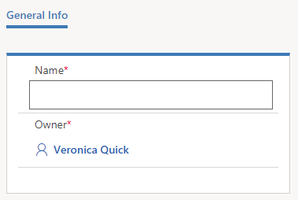
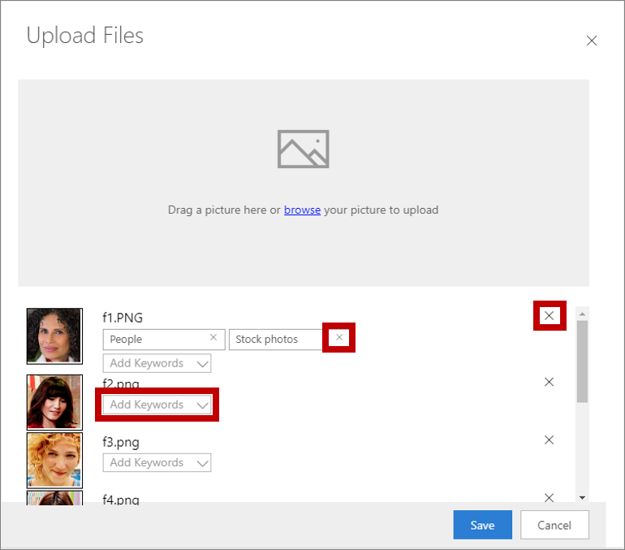

# Manage images for landing pages and email messages

[!INCLUDE[cc_applies_to_update_9_0_0](../includes/cc_applies_to_update_9_0_0.md)]

[!INCLUDE[cc-beta-prerelease-disclaimer](../includes/cc-beta-prerelease-disclaimer.md)]

In [Create a marketing email and go live](create-marketing-email.md), you saw how to upload an image while adding it to an email message. You can use similar techniques to add images to your marketing page designs too. But you can also establish a library of images (and other files) that users can include in their designs. Your library will typically include brand-identity graphics such as logos, product images, and clip art.

Here are some best practices for working with images for your marketing materials:

- Sketch out your email messages and marketing pages in an image-editing program before you start trying to design them in [!INCLUDE[pn-crm-2016-shortest](../includes/pn-crm-2016-shortest.md)]. This will make it easier to experiment, enable you to get your image sizes right, and should speed your work in [!INCLUDE[pn-crm-2016-shortest](../includes/pn-crm-2016-shortest.md)].
- Always crop and size your images before you upload them.
- When sizing your images, use the dimensions that will apply when viewed on the largest expected customer display.
- Choose your keywords carefully, and remember to apply them to images. As your library grows, this will become increasingly important.

## Manage keywords

To help you organize your images, and to help other users find them, [!INCLUDE[pn-crm-2016-shortest](../includes/pn-crm-2016-shortest.md)] also supports a system of keywords that you can use to tag each image. You manage the keywords centrally to ensure that the number of keywords remains manageable and the spelling consistent. When uploading an image, users can choose a keyword, but they can't create new one on the fly.

To manage keywords:

1. Go to **Marketing** &gt; **Internet Marketing** &gt; **Keywords**. You now see a list of all existing keywords.

1. On the command bar, select **New** to create a new keyword. Its only setting is **Name**.  
    

1. Select **Save** to save your keyword.

## View, edit, and add images to your library

To view and edit your image library:

1. Go to **Marketing** &gt; **Internet Marketing** &gt; **Files**. You now see a list of all existing images and files. Choose any row in the table here to view information about the file and edit its settings (including keywords).

1. On the command bar, select **New** to upload a new file. The **Upload Files** dialog box opens.

1. Either drag a file from File Explorer to this dialog box or choose **browse** to locate and choose an image by using a file browser window.  
    

1. While working here, you can:
    - Drag several images to add more than one image at a time.
    - Apply keywords to each image by using the **Add Keywords** drop-down list.
    - Remove a keyword from an image by selecting the close button **(X)** for the keyword.
    - Remove an image by selecting its close button **(X)** on the right (also an X).

1. Select **Save** to upload your images to [!INCLUDE[pn-crm-2016-shortest](../includes/pn-crm-2016-shortest.md)].

1. If you want to edit the display name for an image, go back to **Marketing** &gt; **Internet Marketing** &gt; **Files**.

### See also

[Upload and use images and files](upload-images-files.md)