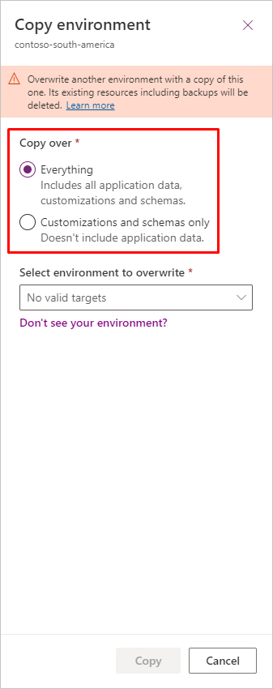
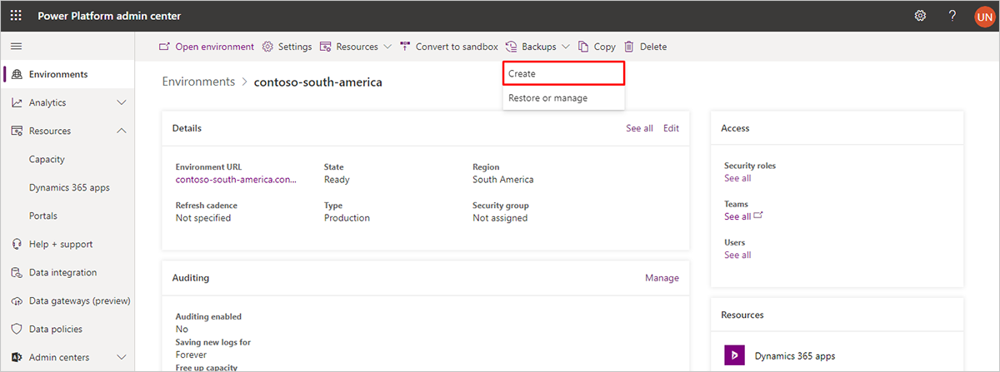
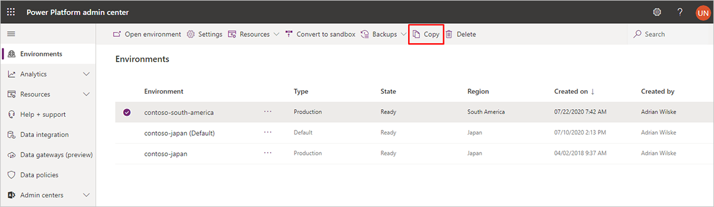
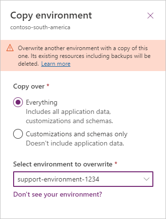

# Manage your Dynamics 365 Marketing environments

Environment-management operations are a standard feature of model-driven apps in Dynamics 365 (Dynamics 365 Sales, Dynamics 365 Customer Service, Dynamics 365 Field Service, Dynamics 365 Marketing, and Dynamics 365 Project Service Automation). Dynamics 365 Marketing, however, adds significant complexity to the system, so there are several extra considerations to keep in mind when you have Marketing installed.

> [!IMPORTANT]
> This topic provides details about the exceptions that apply when working with environments where the Marketing app is installed—for all other management tasks, see [Environments overview](https://docs.microsoft.com/power-platform/admin/environments-overview), but read this topic first.

> [!NOTE]
> *Environments* are sometimes also known as *organizations* or *environments*. Each of these terms refers to the same concept. The Power Apps user interface and documentation usually use the term *environment*, while Dynamics 365 Marketing documentation usually uses the term *environment* (though you'll sometimes also see the terms *organization* or *org* here). Because this article relies on Power Platform Admin Center functionality, it refers exclusively to environments.

## Elements in a Marketing environment

Dynamics 365 Marketing is composed of several components that you must be aware of to understand how the environment-management operations work when Marketing is installed. These include the following elements:

- **Dynamics 365 environment**. This provides the basic platform for the Marketing app and includes both a _platform server_ and an _organizational database_. This database is also shared by the Marketing app, which reads and stores much of its data here.
- **Dynamics 365 Marketing application**. This is a collection of solutions that are installed on the platform server and add marketing features to Dynamics 365. It's installed on the platform server to add marketing features to Dynamics 365. It's also referred to as the _Marketing app_.
- **Marketing services**. This is a collection of services that the Marketing app interacts with. They run in parallel with your Dynamics 365 environment. Among other things, live customer journeys and marketing email messages run on marketing services. Also, all images uploaded to Dynamics 365 Marketing for use in emails and marketing pages are stored and served from here.
- **Marketing-insights service**. This provides big data services such as resolving segment queries, collecting and storing interaction data, and providing analytics based on this data. The marketing-insights service is just one of the marketing services already mentioned, but it's worth calling out separately because it comes up often.

> [!IMPORTANT]
> Marketing services (including the marketing-insights service) run in parallel with your Dynamics 365 Marketing environment, and thus follow their own lifecycle. These services aren't directly accessible to users, and the data they contain isn't included when copying, backing up, or restoring a Marketing environment. This means that interaction records (such as email clicks and website visits) and files (such as those used in emails and marketing pages) aren't included when you copy, backup, or restore an environment.

## Content of the target environment after a copy or restore

After copying or restoring an environment, as described later in this article, your target environment will be set up as follows:

- All apps, settings, and customizations from your source environment will be present on the target environment.
- For copies, if you chose to do an "Everything" copy, the entire organizational database of your source environment will be copied to the target environment. This means that copied data from your source environment will be visible on the target environment, but your work in the target environment won't affect your source database from now on.
- For copies, if you chose to do a "Customizations and schemas only" copy, all your apps and customizations will still be present on the target environment, but the organizational database will be nearly empty, so none of your source data (including email messages, portal content, and customer journeys) will be there.
- All records that were live on the source environment (such as customer journeys, emails, lead-scoring records, and more) will revert to the draft state on the target environment. You must go live again with any of these records that you want to use on the target environment.
- After any copy or restore operation, you must [run the setup wizard](purchase-setup.md#run-wizard) on the target environment. This will create a new set of Marketing services (including a new marketing-insights service) and link them to the target environment. If you don't run the wizard, all features that require services (such as insights and email sending) won't work, and you'll still see information about images in the files library for which the source files aren't available.
- Because a new set of Marketing services is created on the target environment, interaction data from your source environment (such as email clicks or website visits) won't be available to the target environment. Most insights data will be initialized. You can freely generate new interaction data on the target environment without affecting your source environment.
- Files uploaded to your source environment (such as images used in emails and landing pages) won't be available to the target environment. If you go live with an email or page that was previously published on the source environment, the published design will continue to use the previous image URLs from the source environment&mdash;these images will still appear in the republished designs provided they are still available on the source environment, but to avoid confusion, we strongly recommend that you upload all the images you need to the new environment and edit your emails and pages to use those images before going live with them again.
- If the Marketing app on your source environment used a Power Apps portal, then you might choose to also set up a new portal on the target environment to host its marketing pages and event websites (requires an unconfigured Power Apps portals license to be available on your tenant). [Portals are optional](portal-optional.md), so you can choose not to use a portal with the copied environment if you prefer, even if the source environment was using one.

## Copy a Marketing environment to another environment

Because Marketing is more complex than most Dynamics 365 apps and interacts with several special services and other components, you must be extra careful when creating copies to or from environments that have Marketing installed on them.

> [!WARNING]
> You cannot do a simple copy of a Marketing environment like you can with most other Dynamics 365 environments that don't have Marketing installed. If you do a simple copy without following the steps here, the resulting copy won't work and may render the target environment unrecoverable.

> [!WARNING]
> This procedure will completely delete the target environment. If Dynamics 365 Marketing is installed on the target environment, then it will be completely uninstalled (which will release the license) and all data (including interaction records) will be deleted. Even if you backup the target environment first, the backup won't include interaction data or image files. If you need to preserve interaction data and/or images from the target environment, be sure to back up the database for your marketing services, either to blob storage to some other storage media. For more information about how to backup data to blob storage, see [Create custom analytics with Power BI](custom-analytics.md).

> [!IMPORTANT]
> Your copied environment requires its own Dynamics 365 Marketing license. If the target environment already has Marketing installed, the copy will automatically take over that license (you don't have to do anything). If the target environment doesn't have Marketing installed, we recommend that you have an unused Marketing license for your tenant before you start the copy, and purchase one if you don't. If you don't have a Marketing license available before copying, the copy will end in a *disconnected state*, which means that many key features won't work (relevant error messages will be shown). In this case, you can purchase a new Marketing license and [re-run the setup wizard](re-run-setup.md) to apply it to your new copy.

> [!NOTE]
> If you are copying to a support environment, see [Copy a production environment to a support environment](#support-copy) for instructions. For all other types of copies, continue reading here.

### Step 1: Prepare your source environment

The _source environment_ is the Marketing environment you are copying _from_. To prepare your source environment for copying, [Open the Power Platform admin center](power-platform-admin-center.md) and make sure that the Dynamics 365 Marketing application and its related solutions are all up to date on your source environment, as described in [Keep Marketing up to date](apply-updates.md).

### Step 2: Prepare your target environment

The _target environment_ is the environment you are copying _to_. As with the source environment, you must prepare the target environment before you copy _if Marketing is installed on the source environment, the target environment, or both_.

> [!NOTE]
> The target environment will almost always be a sandbox environment because copying to a production environment isn't supported (but you can easily [convert a sandbox into a production environment](#switch-sandbox-prod) after copying, if you wish). You must already have the target environment available on your tenant. You will be able to see it on the **Environments** page of the Power Platform admin center. If you don't have one, please  [contact Microsoft Support](https://docs.microsoft.com/power-platform/admin/get-help-support) for assistance.

To prepare your target environment, do the following _before_ starting the copy:

1. If the Marketing environment was [integrated with a Power Apps portal](portal-optional.md), reset the portal as described in [Reset a portal](../portals/reset-portal.md). This is important because it will free your portal license to be used elsewhere.
1. After the reset, the portal will still be shown as "configured" in the Power Platform admin center, but you will now be able to select it when you run the Marketing setup wizard to set up a new, copied, or restored environment.

### Step 3: Copy the environment

Once your source and target environments are prepared, you're ready to make the copy following the procedure described in [Copy an environment](https://docs.microsoft.com/power-platform/admin/copy-environment).

Pay special attention when choosing whether to create an [Everything or Customizations and schemas only copy](#target-content).

### Step 4: Prepare the target environment for use

After creating your copy, you must complete the following steps:

- Make sure the target environment isn't in administration mode. For more information about this setting and how to disable it, see [Administration mode](https://docs.microsoft.com/power-platform/admin/sandbox-environments).
- Run the Marketing setup wizard on the target environment. This is needed because the target environment must be set up with a new collection of marketing services (and, in some cases, supporting apps such as Customer Voice and/or Portals). For instructions, see [Run the Marketing setup wizard](purchase-setup.md#run-wizard). If you don't run the setup wizard, then the copy will end in a *disconnected state*, which means that many key features won't work until you do (relevant error messages will be shown).

## Create and restore backups

As with copy operations, backup and restore operations typically require a few extra steps when Marketing is installed.

> [!IMPORTANT]
> Backups **do not** include Marketing services or the data they contain. When you restore a backup, all organizational data, solutions, apps, and customizations will be present, but no interaction data, insights, or previously uploaded files will be available on the restored system. The situation is similar to that of [copying a Marketing environment](#copy-to-sandbox).

### Automatic system backups

Microsoft automatically makes daily backup copies of all Dynamics 365 environments, including those that have the Marketing app installed. Like other types of copies and backups, automatic system backups include the full organizational database, but not the interaction records or image files stored in the marketing services. System backups are kept for just a few days and then deleted.

For more information about automatic backups in Dynamics 365, see [System backups](https://docs.microsoft.com/power-platform/admin/backup-restore-environments#system-backups).

For more information about how to backup marketing-services data to blob storage, see [Create custom analytics with Power BI](custom-analytics.md).

### Create an on-demand backup

You can create an on-demand backup at any time, but when Marketing is installed on your source environment, you must take a few extra precautions by using the following procedure:

1. [Open the Power Platform admin center](/power-platform-admin-center.md) and make sure that the Dynamics 365 Marketing application and its related solutions are all up to date on your source environment, as described in [Keep Marketing up to date](apply-updates.md).
1. Create the on-demand backup as usual, as described in [Backup and restore environments](https://docs.microsoft.com/power-platform/admin/backup-restore-environments).

    

As with automatic backups, on-demand backups include the full organizational database, the interaction records or image files stored in the marketing services. For more information about how to backup marketing-services data to blob storage, see [Create custom analytics with Power BI](custom-analytics.md).

### Restore a backup onto another environment

You can easily restore any on-demand or automatic system backup to any available sandbox environment (other than the environment you took the backup from). But as with copy operations, you need to prepare the target environment first.

> [!WARNING]
> This procedure will completely erase the target environment. If Dynamics 365 Marketing is installed on the target environment, then it will be completely uninstalled (which will release the license) and all data (including files and interaction records) will be deleted. Even if you backup the target environment first, the backup won't include image files or interaction data, so if you need to preserve these, be sure to back up your marketing-services data, either to blob storage or to other storage media. For more information about how to backup marketing-services data to blob storage, see [Create custom analytics with Power BI](custom-analytics.md).

> [!IMPORTANT]
> Your copied environment requires its own Dynamics 365 Marketing license. If the target environment already has Marketing installed, the copy will automatically take over that license (you don't have to do anything). If the target environment doesn't have Marketing installed, we recommend that you have an unused Marketing license for your tenant before you start the copy, and purchase one if you don't. If you don't have a Marketing license available before copying, the copy will end in a *disconnected state*, which means that many key features won't work (relevant error messages will be shown). In this case, you can purchase a new Marketing license and [re-run the setup wizard](re-run-setup.md) to apply it to your new copy.

To restore a backup onto a sandbox environment:

1. If your target environment includes a [Power Apps portal](portal-optional.md), then reset the portal as described in [Reset a portal](../portals/reset-portal.md). This is important because it will free your portal license to be used elsewhere. After the reset, the portal will still be shown as "Configured" in the Power Platform admin center, but you will now be able to select it when you run the Marketing setup wizard to set up a new, copied, or restored environment.

1. Restore the backup onto the newly prepared sandbox as usual, as described in [Backup and restore environments](https://docs.microsoft.com/power-platform/admin/backup-restore-environments).

1. Prepare the restored environment for use by doing the following:

   - Make sure the restored environment is not in administration mode. For more information about this setting and how to disable it, see [Administration mode](https://docs.microsoft.com/power-platform/admin/sandbox-environments#administration-mode).
   - Run the Marketing setup wizard on the target environment. For instructions, see [Run the Marketing setup wizard](purchase-setup.md#run-wizard). If you don't run the setup wizard, the copy will end in a *disconnected state*, which means that many key features won't work until you do (relevant error messages will be shown).

### Don't try to restore a backup onto its original environment

When a backup contains Dynamics 365 Marketing, it isn't possible to restore a backup onto its original environment. If you need to do this, [contact Microsoft Support](https://docs.microsoft.com/power-platform/admin/get-help-support) for assistance.

## Switch an environment between sandbox and production status

Many environment management tasks only allow you to work on a sandbox environment as the source or destination of a copy, backup, or restore operation. However, you can easily switch any environment from sandbox to production, or production to sandbox, at any time. The Marketing app doesn't limit this standard platform operation. More information: [Change the environment type](https://docs.microsoft.com/power-platform/admin/switch-environment)

## Copy a production environment to a support environment

Microsoft Support offers a service for testing pending changes (usually updates) on a copy of your production environment. If you wish to use this service, contact Microsoft Support to find out if you are eligible. If you are eligible, Microsoft Support will create a support environment on your tenant and then ask you to copy your production environment onto it. More information: [Manage Support environments](https://docs.microsoft.com/power-platform/admin/support-environment)

> [!NOTE]
> When you copy to a support environment, you don't need to make any special preparations that were mentioned in other sections of this article.

> [!IMPORTANT]
> Support environments remain available for 14 days and are then deleted.

To copy a production environment to a support environment:

1. If you don't already have a support environment available, contact Microsoft Support to request one. Once your support environment is available on your tenant, you'll be able to see it in the Power Platform admin center.

1. Select the production environment that you want to copy and then select **Copy** in the top ribbon.

    

1. The **Copy environment** pane opens on the right side of the page. Make the following settings:

   - **Copy environment**: This should already show the name of the environment you have chosen to copy at the top of the pane.
   - **Copy over**: Select **Everything**.
   - **Select environment to overwrite**: Select the name of the support environment that was created for you. The name of your support environment includes your case number.

    

1. When you select the target environment, most of the other settings here are set automatically, and a notice is shown to alert you that Microsoft Support will be able to access the support environment. Read the notice and select **OK** if you agree with the terms.

1. Your production environment is now copied to the support environment.

## Delete or reset a Marketing environment

For standard Dynamics 365 environments (without Marketing installed), you can use the Power Platform admin center to delete or reset an environment. However, if you do have Marketing installed, you should also do the following:

1. If the Marketing environment was [integrated with a Power Apps portal](portal-optional.md), reset the portal as described in [Reset a portal](../portals/reset-portal.md). This is important because it will free your portal license to be used elsewhere. After the reset, the portal will still be shown as "Configured" in the Power Platform admin center, but you will now be able to select it when you run the Marketing setup wizard to set up a new, copied, or restored environment.
1. Delete or reset the environment as usual. More information: [Delete environment](https://docs.microsoft.com/power-platform/admin/delete-environment)

> [!NOTE]
> Your Dynamics 365 Marketing license is automatically released when you delete or reset its environment, so you'll be free to install it on another environment.

## Do not change the URL for an environment with Marketing installed

For standard Dynamics 365 environments (without Marketing installed), you can use the Power Platform admin center to change the URL of an environment. However, _you can't currently do this if you have Marketing installed_.

> [!IMPORTANT]
> Do not attempt to change the URL for a Marketing environment. If you require a different URL, you must set up a new Dynamics 365 environment at the new URL and then reinstall Marketing there.

### See also

[Open the Power Platform admin center](power-platform-admin-center.md)  
[Keep Marketing up to date](apply-updates.md)  
[Uninstall Marketing](uninstall-marketing.md)
[Transfer data between environments](transfer-data.md)  
[Transfer customizations between environments](transfer-solution.md)  
[Environments overview](https://docs.microsoft.com/power-platform/admin/environments-overview)  
[Import data (all record types) from multiple sources](https://docs.microsoft.com/power-platform/admin/import-data-all-record-types)  
[Move configuration data across environments and organizations](https://docs.microsoft.com/power-platform/admin/manage-configuration-data)  
[Solutions overview](https://docs.microsoft.com/powerapps/maker/common-data-service/solutions-overview)  
[Import, update, and export solutions](https://docs.microsoft.com/powerapps/maker/common-data-service/import-update-export-solutions)
