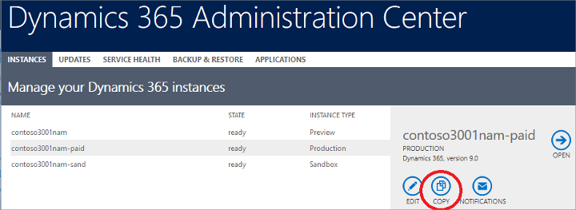
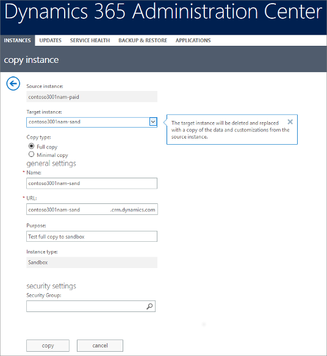
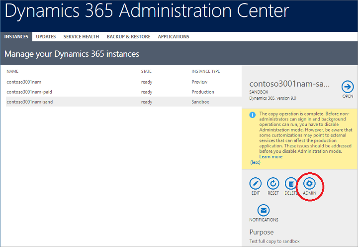
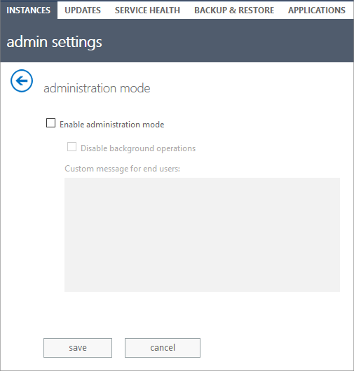

# Manage your [!INCLUDE[pn-marketing-business-app-module-name](../includes/pn-marketing-business-app-module-name.md)] instances

General instructions for how to manage [!INCLUDE[pn-microsoftcrm](../includes/pn-dynamics-365.md)] instances are available in [Manage instances](../admin/manage-online-instances.md) and its subtopics, but for instances where you also have [!INCLUDE[pn-marketing-business-app-module-name](../includes/pn-marketing-business-app-module-name.md)] installed, some exceptions and added procedures apply. This topic provides details about the exceptions&mdash;for all other management tasks, see [Manage instances](../admin/manage-online-instances.md), but read this topic first.

## Elements in a [!INCLUDE[pn-marketing-app-module](../includes/pn-marketing-app-module.md)] instance

Instance-management operations are a standard feature of [!INCLUDE[pn-microsoftcrm](../includes/pn-dynamics-365.md)]. However, [!INCLUDE[pn-marketing-business-app-module-name](../includes/pn-marketing-business-app-module-name.md)] adds significant complexity to the system, so there are several extra considerations you need to keep in mind when you have [!INCLUDE[pn-marketing-app-module](../includes/pn-marketing-app-module.md)] installed. 

[!INCLUDE[pn-marketing-business-app-module-name](../includes/pn-marketing-business-app-module-name.md)] is composed of several components that you should be aware of to understand how the instance-management operations work when [!INCLUDE[pn-marketing-app-module](../includes/pn-marketing-app-module.md)] is installed.

- **[!INCLUDE[pn-microsoftcrm](../includes/pn-dynamics-365.md)] instance**: provides the basic platform for the [!INCLUDE[pn-marketing-app-module](../includes/pn-marketing-app-module.md)] app and includes both a _platform server_ and an _organizational database_. This database is also shared by the [!INCLUDE[pn-marketing-app-module](../includes/pn-marketing-app-module.md)] app, which reads and stores much of its data here. The standard [!INCLUDE[pn-microsoftcrm](../includes/pn-dynamics-365.md)] backup and restore functionality only applies to these components.
- **[!INCLUDE[pn-marketing-business-app-module-name](../includes/pn-marketing-business-app-module-name.md)] application**: a collection of solutions installed on the platform server that add marketing features to [!INCLUDE[pn-microsoftcrm](../includes/pn-dynamics-365.md)].  Also referred to as the _[!INCLUDE[pn-marketing-app-module](../includes/pn-marketing-app-module.md)] app_.
- **[!INCLUDE[pn-marketing-business-app-module-name](../includes/pn-marketing-business-app-module-name.md)] services**: a collection of external services running on another server, which the [!INCLUDE[pn-marketing-app-module](../includes/pn-marketing-app-module.md)] app interacts with. Among other things, live customer journeys and marketing email messages run here.
- **[!INCLUDE[pn-customer-insights-full](../includes/pn-customer-insights-full.md)]**: another external service that [!INCLUDE[pn-marketing-app-module](../includes/pn-marketing-app-module.md)] uses. This service provides big-data services such as resolving segment queries, storing interaction data, and providing analytics based on this data.

Marketing services and [!INCLUDE[pn-customer-insights-short](../includes/pn-customer-insights-short.md)] are external to the [!INCLUDE[pn-microsoftcrm](../includes/pn-dynamics-365.md)] platform server, and thus follow their own lifecycle. These services are not directly accessible to users, so when backup and restore operations are used on the organization database, you must consider their impact on these connected services.

## Prepare for copies and manual backups

The basic [!INCLUDE[pn-microsoftcrm](../includes/pn-dynamics-365.md)] instance and its database are automatically backed up every day by Microsoft. However, processes that are running in [!INCLUDE[pn-customer-insights-short](../includes/pn-customer-insights-short.md)] and the external marketing services aren't back up by this operation.

Processes running on the marketing services, such as live customer journeys and email marketing messages, aren't affected by the backup or copy operations, so these will continue to run normally, and [!INCLUDE[pn-customer-insights-short](../includes/pn-customer-insights-short.md)] will continue to collect data from them even while the organization database gets copied or backed up.

When you restore from a backup (or start running a copy), any data that was created or modified since that backup was taken will be reverted (or lost). But the processes running on the marketing services will still be active, and the data that was generated and saved in [!INCLUDE[pn-customer-insights-short](../includes/pn-customer-insights-short.md)] since the backup will also still be there. This means that if you want to make a copy, or to make manual backup to be restored later or on another instance, you should first stop all your running live entities by moving them to a _stopped_ state. This includes:

- Customer journeys
- Marketing emails
- Content settings
- Segments
- Marketing pages

This ensures that when you finish the copy or restore the data (especially on a different instance), no unwanted processes will get started without your knowledge.

> [!NOTE]
> Automatic daily backups don't pause any of your live entities. This ensure that your customer journeys and other live features aren't interrupted by these backups, which are primarily made for purposes of disaster recovery.

## Restoring a backup onto a different instance

Each time you set up a new [!INCLUDE[pn-marketing-app-module](../includes/pn-marketing-app-module.md)] instance, including when restoring a backup to a new instance and when copying a production instance to a sandbox instance, you must rerun the [!INCLUDE[pn-marketing-app-module](../includes/pn-marketing-app-module.md)] setup wizard on the new instance. This is because the new instance needs to be set up with a new [!INCLUDE[pn-customer-insights-short](../includes/pn-customer-insights-short.md)] hub, portal, and collection of external services.

> [!NOTE]
> Because a new [!INCLUDE[pn-customer-insights-short](../includes/pn-customer-insights-short.md)] hub is created for your new instance, all interaction data stored in the original [!INCLUDE[pn-customer-insights-short](../includes/pn-customer-insights-short.md)] hub will not be available to the new instance.

For details about how to copy a production instance to a sandbox and then run the [!INCLUDE[pn-marketing-app-module](../includes/pn-marketing-app-module.md)] setup wizard on the sandbox, see  [Copy your current production instance to a sandbox](#copy-to-sandbox). The process is similar when you restore a backup to a new instance.

## Reset an instance

For standard (non-[!INCLUDE[pn-marketing-app-module](../includes/pn-marketing-app-module.md)]) [!INCLUDE[pn-microsoftcrm](../includes/pn-dynamics-365.md)] instances you can use the [!INCLUDE[pn-dyn-365-admin-center](../includes/pn-dyn-365-admin-center.md)] to reset an instance. However, if you have [!INCLUDE[pn-marketing-app-module](../includes/pn-marketing-app-module.md)] installed, you must contact [!INCLUDE[pn-microsoft-support](../includes/pn-microsoft-support.md)] for assistance with this operation because some extra cleanup is required that isn't available to end users.

> [!NOTE]
> You can change the URL for an instance without contacting Microsoft Support because no additional cleanup is needed for this operation.

## Copy your current production instance to a sandbox

A sandbox instance is where you safely can test new customizations, features, and settings without affecting your production instance. Most [!INCLUDE[pn-microsoftcrm](../includes/pn-dynamics-365.md)] licenses include both a production and sandbox instance. You'll usually want to start your experiments using a system that is as close as possible to your production instance, so the first step will usually be to copy your existing production instance to the sandbox. 

After the copy, your sandbox instance will be set up as follows:

- All settings and customizations from your production instance will be present in the sandbox.
- A new portal will be created to host marketing pages and event portals for the sandbox instance.
- A new [!INCLUDE[pn-customer-insights-full](../includes/pn-customer-insights-full.md)] hub will be created and linked to your sandbox instance. Interaction data from your production instance will not be available to the sandbox, so most insights data will be initialized. You can freely generate new interaction data using the sandbox without affecting your production instance.
- If you choose to do a full copy:
  - The entire core database of your production instance will be copied and linked to the sandbox instance. This means that your previous production data will be available to the sandbox, but your work in the sandbox instance will not affect your production database from now on. 
  - Any live entities from your production portal (such as marketing pages and the event portal) will be republished on the new portal created for the sandbox instance.
  - Any live entities that run on external marketing services (such as marketing email messages and customer journeys) will also be copied and enabled as live entities on the sandbox instance.
- If you choose to do a minimal copy, then all your customizations will still be present on the sandbox instance, but none of your production data (including email messages, portal content, and customer journeys) will be there.

To copy a production instance to a sandbox:

1. [Open the Dynamics 365 admin center](dynamics-365-admin-center.md) and make sure that the [!INCLUDE[pn-marketing-business-app-module-name](../includes/pn-marketing-business-app-module-name.md)] application and its related solutions are all up to date on your production instance, as described in [Keep Marketing up to date](apply-updates.md).

1. As mentioned in [Prepare for copies and manual backups](#prepare-backup), move all your running live entities to a _stopped_ state.

1. Return to the [!INCLUDE[pn-dyn-365-admin-center](../includes/pn-dyn-365-admin-center.md)] and go to the **Instances** tab. Select your production instance (the instance you are copying from) and then choose **Copy** from the side panel.  
    

    > [!NOTE]
    > You must already have a sandbox instance available before you can copy a production instance to it. Make sure you see a sandbox listed on your Instances tab. If you don't have one, then please contact Microsoft Support for assistance.

    > [!WARNING]
    > This operation will completely delete your current sandbox instance and replace it with a copy of your production instance.

1. The **Copy instance** page opens.   
    
 
    Do the following:
    1. Select your sandbox instance from the **Target instance** drop-down list
    1. Set the **Copy type** to **Full copy** or **Minimal copy**. A _full copy_ will contain a copy of all production data, while a _minimal copy_ will only include customizations and a mostly empty database. See the intro to this section for details.
    1. Select **Copy** to start copying.

1. [!INCLUDE[pn-microsoftcrm](../includes/pn-dynamics-365.md)] starts copying your instance, which can take some time. You can monitor its progress in the admin center. When the sandbox shows a **State** of **Ready**, select it and then select **Admin** from the side panel.   
    

1. The **Admin settings** page opens. Clear the **Enable administration mode** check box, if needed, and then select **Save**. (For more information about this setting, see [Administration mode](../admin/manage-sandbox-instances.md#administration-mode).)  
    
 
1. Select the **Applications** tab in the admin center to see a list of applications you have installed.  
    
 
1. Select the **[!INCLUDE[pn-marketing-business-app-module-name](../includes/pn-marketing-business-app-module-name.md)] Application** item and then select the **Manage** button  in the side panel.
.
1. The [!INCLUDE[pn-marketing-app-module](../includes/pn-marketing-app-module.md)] setup wizard opens. Select your sandbox instance from drop-down list and choose a new and unique prefix for your sandbox portal.  
    
    
    > [!NOTE]
    > You must rerun the [!INCLUDE[pn-marketing-app-module](../includes/pn-marketing-app-module.md)] setup wizard on your sandbox because your sandbox needs a new portal and [!INCLUDE[pn-customer-insights-short](../includes/pn-customer-insights-short.md)] hub that are separate from your production portal and hub.

1. Select **Continue** and work through the rest of the setup wizard as usual. [!INCLUDE[proc-more-information](../includes/proc-more-information.md)] [First-time setup](purchase-setup.md)

1. When the setup wizard tells you the installation is complete, you can start working with your sandbox instance.

### See also

[Open the Dynamics 365 admin center](dynamics-365-admin-center.md)  
[Keep Marketing up to date](apply-updates.md)  
[Uninstall Marketing](uninstall-marketing.md)