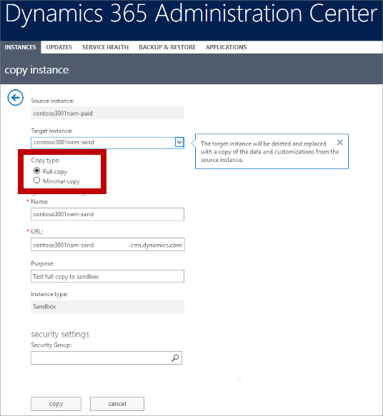
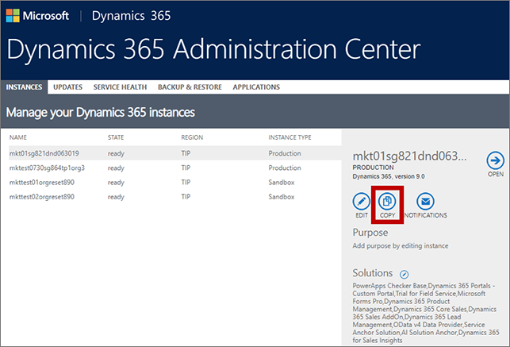
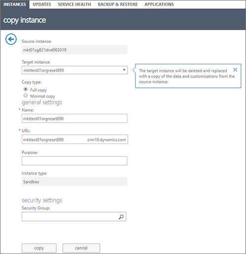
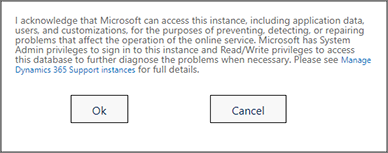

# Manage your Dynamics 365 Marketing instances

Instance-management operations are a standard feature of model-driven apps in Dynamics 365 (Dynamics 365 Sales, Dynamics 365 Customer Service, Dynamics 365 Field Service, Dynamics 365 Marketing, and Dynamics 365 Project Service Automation). However, Dynamics 365 Marketing adds significant complexity to the system, so there are several extra considerations to keep in mind when you have Marketing installed.

> [!IMPORTANT]
> This topic provides details about the exceptions that apply when working with instances where the Marketing app is installed—for all other management tasks, see [Manage instances](https://docs.microsoft.com/dynamics365/admin/new-instance-management), but read this topic first.

> [!NOTE]
> *Instances* are sometimes also known as *organizations* or *environments*. Each of these terms refers to the same concept. The Power Apps user interface and documentation usually use the term *environment*, while Dynamics 365 Marketing documentation and the Dynamics 365 admin center usually use the term *instance* (though you'll sometimes also see the terms *organization* or *org* here).

## Elements in a Marketing instance

Dynamics 365 Marketing is composed of several components that you must be aware of to understand how the instance-management operations work when Marketing is installed. These include the following elements:

- **Dynamics 365 instance**. This provides the basic platform for the Marketing app and includes both a _platform server_ and an _organizational database_. This database is also shared by the Marketing app, which reads and stores much of its data here.
- **Dynamics 365 Marketing application**. This is a collection of solutions that are installed on the platform server and add marketing features to Dynamics 365. It's installed on the platform server to add marketing features to Dynamics 365. It's also referred to as the _Marketing app_.
- **Marketing services**. This is a collection of services that the Marketing app interacts with. They run in parallel with your Dynamics 365 instance. Among other things, live customer journeys and marketing email messages run on marketing services. Also, all images uploaded to Dynamics 365 Marketing for use in emails and marketing pages are stored and served from here.
- **Marketing-insights service**. This provides big-data services such as resolving segment queries, collecting and storing interaction data, and providing analytics based on this data. The marketing-insights service is just one of the marketing services already mentioned, but it's worth calling out separately because it comes up often.

> [!IMPORTANT]
> Marketing services (including the marketing-insights service) run in parallel with your Dynamics 365 Marketing instance, and thus follow their own lifecycle. These services aren't directly accessible to users, and the data they contain isn't included when copying, backing up, or restoring a Marketing instance. This means that interaction records (such as email clicks and website visits) and files (such as those used in emails and marketing pages) aren't included when you copy, backup, or restore an instance.

## Content of the target instance after a copy or restore

After copying or restoring an instance, as described later in this topic, your target instance will be set up as follows:

- All apps, settings, and customizations from your source instance will be present on the target instance.
- For copies, if you chose to do a *full copy*, the entire organizational database of your source instance will be copied to the target instance. This means that copied data from your source instance will be visible on the target instance, but your work in the target instance won't affect your source database from now on.
- For copies, if you chose to do a *minimal copy*, all your apps and customizations will still be present on the target instance, but the organizational database will be nearly empty, so none of your source data (including email messages, portal content, and customer journeys) will be there.
- All records that were live on the source instance (such as customer journeys, emails, lead-scoring records, and more) will revert to the draft state on the target instance. You must go live again with any of these records that you want to use on the target instance.
- After any copy or restore operation, you must [run the setup wizard](purchase-setup.md#run-wizard) on the target instance. This will create a new set of marketing services (including a new marketing-insights service) and link them to the target instance.  If you don't run the wizard, than all features that require services (such as insights and email sending) won't work, and you'll still see information about images in the files library for which the source files aren't available.
- Because a new set of marketing services is created on the target instance, interaction data from your source instance (such as email clicks or website visits) won't be available to the target instance. Most insights data will be initialized. You can freely generate new interaction data on the target instance without affecting your source instance.
- Because a new set of marketing services is created on the target instance,  files uploaded to your source instance (such as images used in emails and landing pages) won't be available to the target instance. If you go live with an email or page that was previously published on the source instance, the published design will continue to use the previous image URLs from the source instance&mdash;these images will still appear in the republished designs provided they are still available on the source instance, but to avoid confusion, we strongly recommend that you upload all the images you need to the new instance and edit your emails and pages to use those images before going live with them again.
- If the Marketing app on your source instance used a Dynamics 365 Portal, then you might choose to also set up a new portal on the target instance to host its marketing pages and event websites (requires an unconfigured Dynamics 365 Portals license to be available on your tenant). [Portals are optional](portal-optional.md), so you can choose not to use a portal with the copied instance if you prefer, even if the source instance was using one.

## Copy a Marketing instance to another instance

Because Marketing is more complex than most Dynamics 365 apps, and interacts with several special services and other components, you must be extra careful when creating copies to and/or from instances that have Marketing installed on them.

> [!WARNING]
> You must not do a simple copy of a Marketing instance like you can with most other Dynamics 365 instances that don't have Marketing installed. If you do a simple copy without following the steps here, the resulting copy won't work and may render the target instance unrecoverable.

> [!WARNING]
> This procedure will completely delete the target instance. If Dynamics 365 Marketing is installed on the target instance, then it will be completely uninstalled (which will release the license) and all data (including interaction records) will be deleted. Even if you backup the target instance first, the backup won't include interaction data or image files. If you need to preserve interaction data and/or images from the target instance, be sure to back up the database for your marketing services, either to blob storage to some other storage media. For more information about how to backup  data to blob storage, see [Create custom analytics with Power BI](custom-analytics.md).

> [!IMPORTANT]
> Your copied instance requires it's own Dynamics 365 Marketing license. If the target instance already has Marketing installed, then the copy will automatically take over that license (you don't have to do anything). If the target instance doesn't have Marketing installed, then we recommend you make sure you have an unused Marketing license for your tenant before you start the copy, and purchase one if you don't. If you don't have a Marketing license available before copying, then the copy will end in a *disconnected state*, which means that many key features won't work (relevant error messages will be shown); in this case, you can just purchase a new Marketing license and then [re-run the setup wizard](re-run-setup.md) to apply it to your new copy.

> [!NOTE]
> If you are copying to a support instance, then see [Copy a production instance to a support instance](#support-copy) for instructions instead of reading this section. For all other types of copies, continue reading here.

### Step 1: Prepare your source instance

The _source instance_ is the Marketing instance you are copying _from_. To prepare your source instance for copying, [Open the Dynamics 365 admin center](dynamics-365-admin-center.md) and make sure that the Dynamics 365 Marketing application and its related solutions are all up to date on your source instance, as described in [Keep Marketing up to date](apply-updates.md).

### Step 2: Prepare your target instance

The _target instance_ is the instance you are copying _onto_. As with the source instance, you must prepare the target instance before you copy _if Marketing is installed on the source instance, the target instance, or both_.

> [!NOTE]
> The target instance will almost always be a sandbox instance because copying to a production instance isn't supported (but you can easily [convert a sandbox into a production instance](#switch-sandbox-prod) after copying if you wish). You must already have the target instance available on your tenant, and should be able to see it on the **Instances** tab of the Dynamics 365 admin center. If you don't have one, please  [contact Microsoft Support](https://docs.microsoft.com/power-platform/admin/get-help-support) for assistance.

To prepare your target instance to be copied onto, do the following _before_ starting the copy:

1. If the Marketing instance was [integrated with a Dynamics 365 Portal](portal-optional.md), then reset the portal as described in [Reset a portal](../portals/reset-portal.md). This is important because it will free your portal license to be used elsewhere. After the reset, the portal will still be shown as "configured" in the Dynamics 365 admin center, but you will now be able to select it when you run the Marketing setup wizard to set up a new, copied, or restored instance.

1. We highly recommend that you reset your target instance as described in [Reset a Sandbox instance](https://docs.microsoft.com/dynamics365/admin/manage-sandbox-instances#reset-a-sandbox-instance). This will return the target instance to its factory settings, which may prevent problems later on, and may also release additional app licenses.

### Step 3: Copy the instance

Once your source and target instances are prepared, you're ready to make the copy following the usual procedure described in [Copy an instance to a Sandbox instance](https://docs.microsoft.com/dynamics365/admin/copy-instance).

Pay special attention when choosing whether to create a [full or minimal copy](#target-content).

### Step 4: Prepare the target instance for use

After creating your copy, you must do the following:

- Make sure the target instance isn't in administration mode. For more information about this setting and how to disable it, see [Administration mode](https://docs.microsoft.com/dynamics365/admin/manage-sandbox-instances#administration-mode).
- Run the Marketing setup wizard on the target instance. This is needed because the target instance must be set up with a new collection of marketing services (and, in some cases, supporting apps such as Voice of the Customer and/or Portals). For instructions, see [Run the Marketing setup wizard](purchase-setup.md#run-wizard). If you don't run the setup wizard, then the copy will end in a *disconnected state*, which means that many key features won't work until you do (relevant error messages will be shown).

## Create and restore backups

As with copy operations, backup and restore operations typically require a few extra steps when Marketing is installed.

> [!IMPORTANT]
> Backups **do not** include marketing services or the data they contain. When you restore a backup, all organizational data, solutions, apps, and customizations will be present, but no interaction data, insights, or previously uploaded files will be available on the restored system. The situation is similar to that of [copying a Marketing instance](#copy-to-sandbox).

### Automatic system backups

Microsoft automatically takes daily backup copies of all Dynamics 365 instances, including those that have the Marketing app installed. Like other types of copies and backups, automatic system backups include the full organizational database, but not the interaction records or image files stored in the marketing services. System backups are usually kept for just a few days and then deleted again.

For more information about automatic backups in Dynamics 365, see [System backups](https://docs.microsoft.com/dynamics365/admin/backup-restore-instances#system-backups).

For more information about how to backup marketing-services data to blob storage, see [Create custom analytics with Power BI](custom-analytics.md).

### Create an on-demand backup

You can create an on-demand backup at any time, but when Marketing is installed on your source instance, you must take a few extra precautions by using the following procedure:

1. [Open the Dynamics 365 admin center](/dynamics-365-admin-center.md) and make sure that the Dynamics 365 Marketing application and its related solutions are all completely up to date on your source instance, as described in [Keep Marketing up to date](apply-updates.md).
1. Create the on-demand backup as usual, as described in [Backup and restore instances](https://docs.microsoft.com/dynamics365/admin/backup-restore-instances).

As with automatic backups, on-demand backups include the full organizational database, the interaction records or image files stored in the marketing services. For more information about how to backup marketing-services data to blob storage, see [Create custom analytics with Power BI](custom-analytics.md).

### Restore a backup onto another instance

You can easily restore any on-demand or automatic system backup to any available sandbox instance (other than the instance you took the backup from). But as with copy operations, you need to prepare the target instance first.

> [!WARNING]
> This procedure will completely delete the target instance. If Dynamics 365 Marketing is installed on the target instance, then it will be completely uninstalled (which will release the license) and all data (including files and interaction records) will be deleted. Even if you backup the target instance first, the backup won't include image files or interaction data, so if you need to preserve these, be sure to back up your marketing-services data, either to blob storage to some other storage media. For more information about how to backup marketing-services data to blob storage, see [Create custom analytics with Power BI](custom-analytics.md).

> [!IMPORTANT]
> Your restored instance requires it's own Dynamics 365 Marketing license. If the target instance already has Marketing installed, then the restored instance will automatically take over that license (you don't have to do anything). If the target instance doesn't have Marketing installed, then we recommend you make sure you have an unused Marketing license on your tenant before you start the restore, and purchase one if you don't. If you don't have a Marketing license available before restoring, then the restored instance will end in a *disconnected state* which means that many key features won't work (relevant error messages will be shown); in this case, you can just purchase a new Marketing license and then [re-run the setup wizard](re-run-setup.md) to apply it to your restored instance.

To restore a backup onto a sandbox instance:

1. If your target instance includes a [Dynamics 365 Portal](portal-optional.md), then reset the portal as described in [Reset a portal](../portals/reset-portal.md). This is important because it will free your portal license to be used elsewhere. After the reset, the portal will still be shown as "configured" in the Dynamics 365 admin center, but you will now be able to select it when you run the Marketing setup wizard to set up a new, copied, or restored instance.

1. We highly recommend that you reset your target instance as described in [Reset a Sandbox instance](https://docs.microsoft.com/dynamics365/admin/manage-sandbox-instances#reset-a-sandbox-instance).

1. Restore the backup onto the newly prepared sandbox as usual, as described in [Backup and restore instances](https://docs.microsoft.com/dynamics365/admin/backup-restore-instances).

1. Prepare the restored instance for use by doing the following:

   - Make sure the restored instance is not in administration mode. For more information about this setting and how to disable it, see [Administration mode](https://docs.microsoft.com/dynamics365/admin/manage-sandbox-instances#administration-mode).
   - Run the Marketing setup wizard on the target instance. For instructions, see [Run the Marketing setup wizard](purchase-setup.md#run-wizard). If you don't run the setup wizard, then the copy will end in a *disconnected state*, which means that many key features won't work until you do (relevant error messages will be shown).

### Don't try to restore a backup onto its original instance

When a backup contains Dynamics 365 Marketing, it isn't possible to restore a backup onto its original instance. If you need to do this, please [contact Microsoft Support](https://docs.microsoft.com/power-platform/admin/get-help-support) for assistance.

## Switch an instance between sandbox and production status

Many instance-management tasks only allow you to work on a sandbox instance as the source and/or destination of a copy, backup, or restore operation. However, you can easily switch any instance from sandbox to production, or production to sandbox, at any time. The Marketing app doesn't add any limits on this standard platform operation. More information: [Switch and instance](https://docs.microsoft.com/dynamics365/admin/switch-instance)

## Copy a production instance to a support instance

Microsoft Support offers a service for testing pending changes (usually updates) on a copy of your production instance. If you wish to use this service, please contact Microsoft Support to find out if you are eligible. If so, Microsoft Support will create a support instance on your tenant and then ask you to copy your production instance onto it. More information: [Manage Support instances](https://docs.microsoft.com/dynamics365/admin/support-instance)

> [!NOTE]
> When you copy to a support instance, you don't need to make any special preparations that may be mentioned in some of the other sections in this topic.

> [!NOTE]
> Support instances remain available for 14 days and are then deleted.

To copy a production instance to a support instance:

1. If you don't already have a support instance available, then please contact Microsoft Support to request one. Once your support instance is available on your tenant, you'll be able to see it in the Dynamics 365 admin center.

1. Select the production instance that you want to copy and then select **Copy** in the side panel.

    

1. The **Copy instance** page opens. Make the following settings:

   - **Source instance** : This should already show the name of the instance you have chosen to copy.
   - **Target instance** : Select the name of the support instance that was created for you. The name of your support instance includes your case number.
   - **Copy type** : Select **Full copy**.

    

1. When you select the target instance, most of the other settings here are set automatically, and a notice is shown to alert you that Microsoft Support will be able to access the support instance. Read the notice and select **OK** if you agree with its terms.

    

1. Your production instance is now copied to the support instance.

## Delete or reset a Marketing instance

For standard Dynamics 365 instances (without Marketing installed) you can use the Dynamics 365 admin center to delete or reset an instance. However, if you do have Marketing installed, then you should also do the following:

1. If the Marketing instance was [integrated with a Dynamics 365 Portal](portal-optional.md), then reset the portal as described in [Reset a portal](../portals/reset-portal.md). This is important because it will free your portal license to be used elsewhere. After the reset, the portal will still be shown as "configured" in the Dynamics 365 admin center, but you will now be able to select it when you run the Marketing setup wizard to set up a new, copied, or restored instance.
1. Delete or reset the instance as usual. More information: [Delete an instance](https://docs.microsoft.com/dynamics365/admin/delete-instance)

> [!NOTE]
> Your Dynamics 365 Marketing license is automatically released when you delete or reset its instance, so you'll be free to install it on another instance.

## Do not change the URL for an instance with Marketing installed

For standard Dynamics 365 instances (without Marketing installed) you can use the Dynamics 365 admin center to change the URL of an instance. However, _you can't currently do this if you have Marketing installed_.

> [!IMPORTANT]
> Do not attempt to change the URL for a Marketing instance. If you require a different URL, then you must set up a new Dynamics 365 instance at the new URL and then reinstall Marketing there.

### See also

[Open the Dynamics 365 admin center](dynamics-365-admin-center.md)  
[Keep Marketing up to date](apply-updates.md)  
[Uninstall Marketing](uninstall-marketing.md)
[Transfer data between instances](transfer-data.md)  
[Transfer customizations between instances](transfer-solution.md)  
[Manage instances](https://docs.microsoft.com/dynamics365/admin/new-instance-management)  
[Import data (all record types) from multiple sources](https://docs.microsoft.com/power-platform/admin/import-data-all-record-types)  
[Move configuration data across environments and organizations](https://docs.microsoft.com/power-platform/admin/manage-configuration-data)  
[Solutions overview](https://docs.microsoft.com/powerapps/maker/common-data-service/solutions-overview)  
[Import, update, and export solutions](https://docs.microsoft.com/powerapps/maker/common-data-service/import-update-export-solutions)