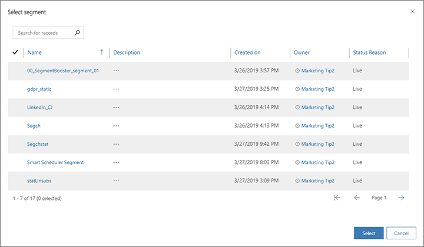

# Manage segment memberships from a contact record

Instead of working directly with a segment definition, you can add or remove a contact to/from any static segment while viewing their contact record. This enables users such as salespeople, who know their contacts well but don't have access to the segment entity, to manage the segments a contact belongs to while working directly with that contact record.

> [!NOTE]
> You can only use contact records to add or remove contacts to or from *static segments*, not *dynamic segments*. Both live and draft segments are supported.

To add or remove a contact to/from a static segment using their contact record:

1. Go to **Marketing** > **Customers** > **Contacts**.
1. Open or create a contact record.
1. On the command bar, select one of the following:
    - **Add to segment**: To add the current contact to one or more existing static segments.
    - **Remove from segment**: To remove the current contact from one or more existing static segments.
1. A dialog box opens, showing a list of available segments. Select each segment that you'd like to update and then choose **Select** to apply your changes.

    

### See also

[Working with segments](segmentation-lists-subscriptions.md)  
[Define a static segment](segments-static.md)  
[Manage information about your current and prospective customers](manage-customer-information.md)

[!INCLUDE[footer-include](../includes/footer-banner.md)]