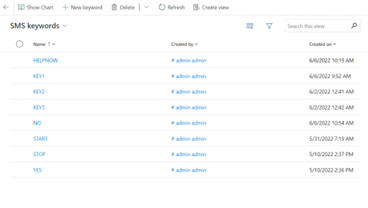

# Manage SMS (text message) keywords used in customer journeys

[!INCLUDE[consolidated-sku-rtm-only](../includes/consolidated-sku-rtm-only.md)]

The **SMS keywords** page includes all keywords that have been created and/or used in customer journeys. To access it, go to **Settings > Customer engagement > SMS keywords**.

From this page, you can delete obsolete keywords, update keywords to new ones that will improve your response rate, and add new keywords that will show up in the SMS editor and your customer journeys.

To add a new keyword:
1. Select the **New keyword** button.
2. Enter the keyword.
3. Select **Create** to save and add it.

To delete a keyword:
1. Select it from the keywords list.
2. Select the **Delete** button in the menu.
3. Confirm your action.

To update a keyword:
1. Select it from the keywords list.
2. Select the **Edit** button.
3. Add the new text and select **Update**.
 The following screenshot shows the **SMS keywords** page. 

> 

[!INCLUDE[footer-include](../includes/footer-banner.md)]
