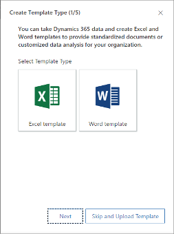
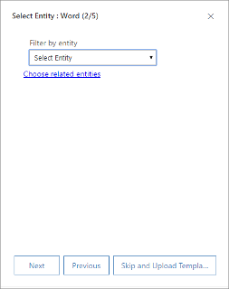
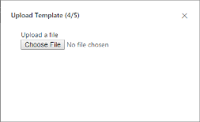

# Manage Word templates

Microsoft Word provides powerful ways to present your Dynamics 365 data in a standardized and well-formatted document. With Word templates, you can easily create and share your template with others, so all the documents that go out to your customers have a consistent look that matches your organization's branding.

When the templates are ready, users can generate standardized documents that are automatically populated with Dynamics 365 data with just one click.

## Step 1: Create a Word template

1. Sign in to Dynamics 365 as a user with the System Administrator role.

2. Go to **Settings** > **Advanced Settings** > **Organization** > **Excel & Word Templates** and choose **New Template**.

3. Select **Word Template**, and then select **Next**.

    

4. Select an entity to which the template applies. The template will use data from this entity.

    

5. To select the fields that you want to be included in the Word template, select **Choose Related Entities**.

6. The **Choose Related Entity** dialog box opens. The relationships you select on this screen determine what entities and fields are available later when you define the Word template. Only select the relationships you need to add Dynamics 365 data to the Word template. Here are some example relationships for the account entity:

   - 1:N Relationship. An account can have multiple contacts.
   - N:1 Relationship. A lead, account, or contact can have multiple accounts.
   - N:N Relationship. An account can have multiple marketing lists. A marketing list can have multiple accounts.

     When you're done choosing relationships, select **Done**.

     > [!NOTE]
     > To ensure that documents are downloaded in a timely matter, there is an upper limit of 100 for the number of related records returned for each relationship. For example, if you're exporting a template for an account and you want to include a list of its contacts, the document will return at most 100 of the account's contacts.

7. In the **Select Entity** dialog box, select **Next**.

8. Select **Download** to create a Word file on your local computer with the exported entity included as XML data.

9. To upload the template later, select **Upload the template later** check box, and then select **Next**.

10. To upload the template after you customize the data, go to the list of templates, and then select **Upload Template**. More information: [Step 4: Upload the Word template back into Dynamics 365](#step-4-upload-the-word-template-back-into-dynamics-365)

## Step 2: Enable the Developer tab

Open the Word template file. At this point, the document appears to be blank.

To see and add Dynamics 365 XML data, you need to enable the **Word Developer** tab.

1. Go to **File** > **Options** > **Customize Ribbon**, and then select the **Developer** check box.

    

1. Select **OK**.

The **Developer** tab now appears in the Word ribbon.

## Step 3: Define the Word template

Use the **XML Mapping Pane** to define the Word template by using Dynamics 365 entity fields.

1. In your Word template, select **Developer** > **XML Mapping Pane**.

    

    The **XML Mapping** pane opens with the default XML schema selected.

    

2. Select the Dynamics 365 XML schema. It will begin with "urn:microsoft-crm/document-template/".

    

   > [!IMPORTANT]
   > If you have frequent accidental edits that cause Word to freeze or degrade its performance, turn off the AutoCorrect options.

3. Expand the entity to see all available fields, right-click the field you want to add, and then select **Insert Content Control** > **Plain Text**.

    

    The field from Dynamics 365 is added to the Word template.

    

4. Add additional entity fields, add descriptive labels and text, and format the document. A completed template might look like this:

    

5. Some content control fields you entered are likely to have multiple lines of data. For example, accounts have more than one contact. To include all the data in your Word template, set the content control field to repeat as follows:

   1. Put fields with repeating data in a table row.

   2. Select the entire table row in the template.

       

   3. In the **XML Mapping** pane, right-click the relationship containing the content control fields, and then select **Repeating**.

       

      When you use the Word template in Dynamics 365 to create a document, the table will be populated with multiple rows of data.

6. When the template has the fields and formatting you want, save it and upload it into Dynamics 365.

## Step 4: Upload the Word template into Dynamics 365

When you have your Word template built the way you want, save it so you can upload it into Dynamics 365.

An administrator can use the **Settings** page to upload the Word template into Dynamics 365.

> [!NOTE]
> Users in your organization can see the templates available to them by selecting **Word Templates** on the command bar in the list of records.

1. In Dynamics 365 Marketing, go to **Settings** > **Advanced Settings** > **Organization** > **Excel & Word Templates**.

2. Select **Upload Template**.

3. Find and upload the file.

    

4. Select **Upload**. You'll see the summary of the file you're uploading.

5. Select **Finish**.

### See also

[Export data to Word or Excel docs](export-data-word-excel.md)  
[Business management settings](business-management-settings.md)

[!INCLUDE[footer-include](../includes/footer-banner.md)]