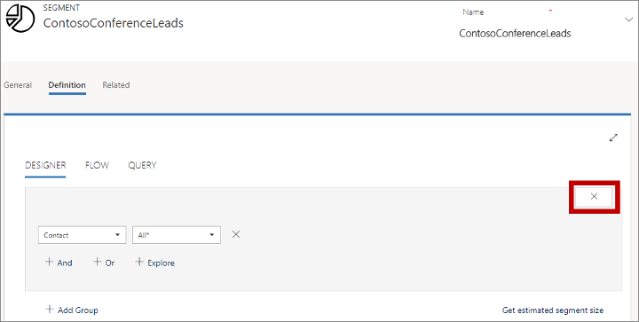
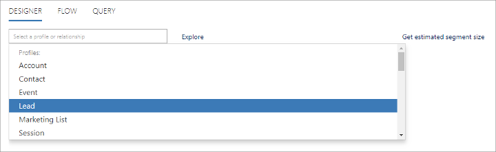
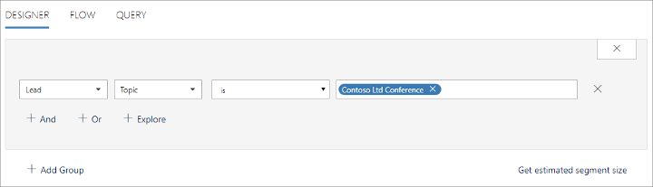
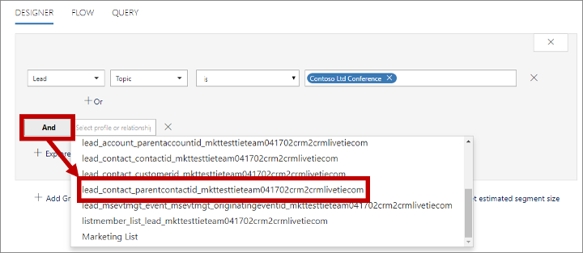
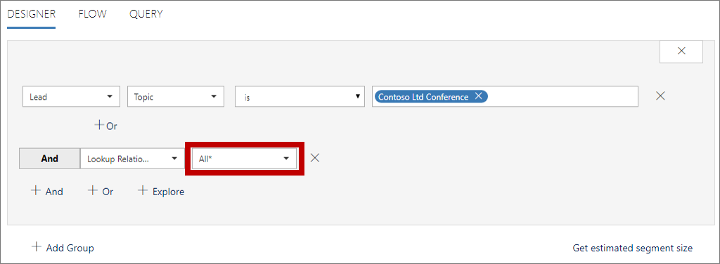

# Market to leads with [!INCLUDE[pn-marketing-business-app-module-name](../includes/pn-marketing-business-app-module-name.md)]

[!INCLUDE[pn-marketing-business-app-module-name](../includes/pn-marketing-business-app-module-name.md)] uses contact records to represent prospective customers and enables marketers to engage with those contacts through initiatives such as customer journeys, events, and landing pages. When a contact submits a lading page, [!INCLUDE[pn-marketing-app-module](../includes/pn-marketing-app-module.md)] typically auto-creates a lead for that contact, and marketers can manually add leads for contacts at any time. [!INCLUDE[pn-marketing-business-app-module-name](../includes/pn-marketing-business-app-module-name.md)] then nurtures and scores those leads through a qualification process, and hands off marketing-qualified leads to salespeople for further qualification into opportunities. In this way, [!INCLUDE[pn-marketing-app-module](../includes/pn-marketing-app-module.md)] uses contacts to represent _people_ and leads to represent _specific expressions of interest_ made by those people. You can read more about this process in [Manage customer information](manage-customer-information.md) and [Score and manage leads](score-manage-leads.md).

[!INCLUDE[pn-dynamics-365](../includes/pn-dynamics-365.md)] is a highly flexible and customizable system, where each organization can decide how to make use of the various types of records it contains. Some organizations may prefer, or already have in place, a more sales-driven process, where salespeople save new potential customers as lead records and only create a contact record based on a lead once that lead made a purchase or entered into an ongoing business relationship with the organization. So, does that mean you can't market to leads using [!INCLUDE[pn-marketing-business-app-module-name](../includes/pn-marketing-business-app-module-name.md)]&mdash;of course not!
<!--Editing:  I'm still learning this team's style choices, but I think "Follow the steps on this page" would be clearer than "Read this document."-->
Read this document to learn how to integrate sales-driven (lead-centered) and marketing-driven (contact-centered) processes using [!INCLUDE[pn-dynamics-365](../includes/pn-dynamics-365.md)]. Techniques include:

- Build marketing segments by querying lead records.
- Automatically generate contact records based on "orphaned" lead records and associate the two.
- Make marketing contacts easy to tell apart from sales contacts so you can set up custom views that show the right contacts to the right people.

The resulting system will align with industry best practices and provide many benefits for your customer-engagement process, including:

- By conceptualizing leads as _expression of interest_, you can ensure that they are first qualified from a marketing perspective, and then from a sales perspective. When a salesperson enters a lead, the system assumes that the sales team has already taken over the responsibility to engage with that lead, just as they would with an already marketing-qualified lead.
- You maintain a clean database that includes both qualified and non-qualified contacts while avoiding duplicates and ghost records.
- You can see a complete 360° view of each contact's engagements and touch points, including for contacts that have several associated leads tracking their interests in various products and campaigns.

## Build a segment of contacts associated with leads

[!INCLUDE[pn-marketing-business-app-module-name](../includes/pn-marketing-business-app-module-name.md)] lets you create segments based on queries against your customer database and then use those segments to target your customer journeys. The resulting segments must contain only contact records, but you can still set up query logic that starts by finding leads based on lead-record values and then populates the segment with the associated contact records.

For example, to set up a segment that finds all the leads collected at a recent conference, you could do the following:

1. Go to **Marketing** > **Customers** > **Segments**.

1. Choose **New** from the command bar to create a new segment.

1. Fill out the **General** tab to describe your new segment.

1. Go to the **Definition** tab to set up your query.

1. By default, the query designer opens with a segment group that already has the **Contact** entity selected. But we don't want to search on contacts, so choose the close button to remove the default query group.  
     
    

1. Choose **Lead** from the **Select a profile or relationship** drop-down list.  
     
    

1. Set up a query to find the leads you need. In this example, we'll look for leads collected at a recent conference; all were assigned a **Topic** of "Contoso Ltd Conference".  
     
    

1. All segments must end by making a connection to the contact entity, so choose **And** to add a new clause to your expression and set it to **lead\_contact\_parentcontactid\__&lt;ServerSuffix&gt;_**, which links from the lead record to the related contact record based on the lead's parent contact ID.  
     
    

1. Set the new relation to **All\*** to find all contacts that relate to the found leads.  
     
    

1. Choose **Go Live** from the command bar to publish the segment.

## Automatically generate contacts for orphaned leads

Segments, customer journeys, and other [!INCLUDE[pn-marketing-business-app-module-name](../includes/pn-marketing-business-app-module-name.md)] features require that each lead has a contact associated with it. However, sales-driven setups may follow a different model, where leads are created as the first touchpoint, without necessarily having contact records associated with them.

To solve this, you can use [!INCLUDE[pn-dynamics-365](../includes/pn-dynamics-365.md)] custom workflows to automatically generate and link a contact record for each new or existing unmatched lead record. For more information about workflows, start with the [Workflows overview](../customize/workflow-processes.md).

Also, any user can manually select or create a contact for a lead by using the **Inquiry** stage of the **Lead to opportunity marketing sales process** business process on the lead record.

## Keep automatically generated contacts from confusing users

Use the **marketingonly** flag on the contact entity to differentiate the automatically generated (marketing-only) contacts from other types of contacts. This makes it easy to tell these two types of contacts apart and to set up list views for salespeople that only show sales-qualified contacts without including the marketing-only contacts.
<!--Editing:  Is "*marketing* it as a sales-qualified contact" correct, or should it be "marking"?-->
If you are using a workflow to generate marketing-only contacts automatically, then your workflow should also set the **marketingonly** flag for the contacts it creates. Once the lead is qualified as an opportunity, another workflow could clear this flag from the related contact entity, thereby marketing it as a sales-qualified contact.

Marketing pages can create new leads when a known contact submits the page and no matching lead is found for that contact. To keep from generating duplicate leads, you should set the lead-matching strategy used by your landing pages to make sure existing leads will be found and scored when appropriate instead of creating new ones. For more information about how to set up your lead-matching strategy, see [Configure landing pages](configure-landing-pages.md).

## Looking forward

In the current version of [!INCLUDE[pn-marketing-business-app-module-name](../includes/pn-marketing-business-app-module-name.md)], the techniques described here must be custom implemented by admins and customizers to meet the specific needs of your organization. In the future, we hope to provide more out-of-the box functionality that will make these customizations faster and easier to implement. For example, by providing:

- An initial contact-creation workflow that is inactive by default, but which you can activate and customize as needed to support your in-house processes.
- Contact list views that are preconfigured to show or hide marketing-only contacts for various audiences as needed (for example, a marketing view that shows all contacts, and a sales view that hides marketing-only contacts).
- A built-in feature that creates and associates contacts when you import large numbers of leads at once.

Going forward, we will continue to gather market feedback to identify solutions for business scenarios that still are not supported by this marketing model.
