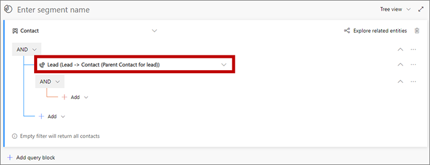
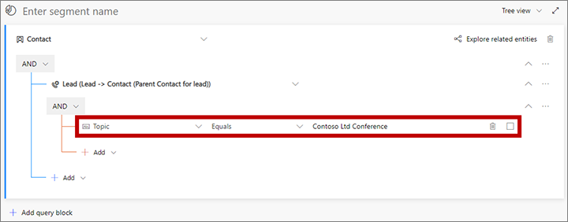
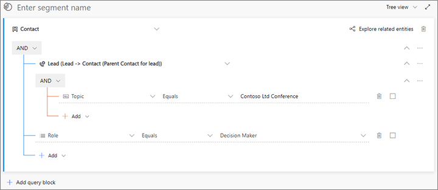

# Market to leads with Dynamics 365 Marketing

[!INCLUDE[cc-data-platform-banner](../includes/cc-data-platform-banner.md)]

Dynamics 365 Marketing uses contact records to represent prospective customers and enables marketers to engage with those contacts through initiatives such as customer journeys, events, and landing pages. When a contact submits a lading page, Marketing typically auto-creates a lead for that contact, and marketers can manually add leads for contacts at any time. Dynamics 365 Marketing then nurtures and scores those leads through a qualification process, and hands off marketing-qualified leads to salespeople for further qualification into opportunities. In this way, Marketing uses contacts to represent *people* and leads to represent *specific expressions of interest* made by those people. You can read more about this process in [Manage customer information](manage-customer-information.md) and [The lead lifecycle](lead-lifecycle.md).

Dynamics 365 is a highly flexible and customizable system, where each organization can decide how to make use of the various types of records it contains. Some organizations may prefer, or already have in place, a more sales-driven process, where salespeople save new potential customers as lead records and only create a contact record based on a lead once that lead made a purchase or entered into an ongoing business relationship with the organization. So, does that mean you can't market to leads using Dynamics 365 Marketing&mdash;of course not!

Read this topic to learn how to integrate sales-driven (lead-centered) and marketing-driven (contact-centered) processes using Dynamics 365. Techniques include:

- Build marketing segments by querying lead records.
- Automatically generate contact records based on "orphaned" lead records and associate the two.
- Make marketing contacts easy to tell apart from sales contacts so you can set up custom views that show the right contacts to the right people.

The resulting system will align with industry best practices and provide many benefits for your customer-engagement process, including:

- By conceptualizing leads as _expression of interest_, you can ensure that they are first qualified from a marketing perspective, and then from a sales perspective. When a salesperson enters a lead, the system assumes that the sales team has already taken over the responsibility to engage with that lead, just as they would with an already marketing-qualified lead.
- You maintain a clean database that includes both qualified and non-qualified contacts while avoiding duplicates and ghost records.
- You can see a complete 360° view of each contact's engagements and touch points, including for contacts that have several associated leads tracking their interests in various products and campaigns.

## Build a segment of contacts associated with leads

Dynamics 365 Marketing lets you create segments based on queries against your customer database and then use those segments to target your customer journeys. The resulting segments must contain only contact records, but you can still set up query logic that starts by finding leads based on lead-record values and then populates the segment with the associated contact records.

For example, to set up a segment that finds all the leads collected at a recent conference, you could do the following:

1. Go to **Marketing** > **Customers** > **Segments** and select **New** on the command bar. The **Segment templates** dialog box opens; select **Cancel** to close it, and then select **Demographic** on the **Let's create your segment** screen.

1. A new demographic segment opens. Check the view setting near the upper corner of the **Definition** tab and make sure it's set to **Tree view**. (You could use either view, but in this procedure we show and describe the tree view, so it's a good idea to use it for now.)

    

1. Open the **Add** drop-down list under the **Contact** entity and select **Add related entity**.

    

1. A new related entity is added to your query. Select the field with **Select related entity** in ghost text to open a large drop-down list of available relations. Type "lead" in the field to filter the list and then select **Lead (Lead -> Contact (Parent Contact for lead))** from the drop-down list. This relation links the parent **Contact** entity to the **Lead** entity through the **Parent Contact for lead** field of the **Lead** entity. The **Parent Contact for lead** field identifies the contact that Dynamics 365 Marketing associates with each lead. More information: [Move between entities with relationships](segments-profile.md#relationships)

    

1. Open the **Add** drop-down list indented under the new related entity and select **Add row** to begin defining the collection of waitlist items you are looking for.

1. In the group below the lead relationship, set up a query to find the leads you need. In the following example, we'll look for leads collected at a recent conference; each of these were assigned a **Topic** of "Contoso Ltd Conference".

    

1. Continue to add rows and groups as needed to define the collection of leads and contacts you are looking for.

    - To find leads, work in the space indented below the **Lead (Lead -> Contact (Parent Contact for lead))** related entity. The criteria that you add here will all refer to various fields of the lead entity.
    - To further filter the collection of contacts that are related to the found leads, work in the area directly under the **Contact** entity (outside of the **Lead (Lead -> Contact (Parent Contact for lead))** related entity).  The criteria that you add here will all refer to various fields of the contact entity.

    For example, the following query finds all the leads from the Contoso Ltd Conference, but then reduces the audience to only include contacts that have the role of decision maker.

    

1. Select the field above the query that shows **Enter segment name** as ghost text. Then type a name for your segment.

1. On the command bar, select **Save** to save your segment and then select **Go live**.

## Automatically generate contacts for orphaned leads

Segments, customer journeys, and other Dynamics 365 Marketing features require that each lead has a contact associated with it. However, sales-driven setups may follow a different model, where leads are created as the first touchpoint, without necessarily having contact records associated with them.

To solve this, you can use Dynamics 365 custom workflows to automatically generate and link a contact record for each new or existing unmatched lead record. To create the link, populate the `parentcontactid` field of each lead record with the GUID of the relevant contact record (this field is labelled as **Parent contact for lead** when you're designing a workflow in the UI). This field connects to the contact record through an N:1 relation called `lead_parent_contact`.

For more information about workflows, start with the [Classic Dataverse workflows](/flow/workflow-processes).

Also, any user can manually select or create a contact for a lead by using the **Inquiry** stage of the **Lead to opportunity marketing sales process** business process on the lead record.

## Keep automatically generated contacts from confusing users

Use the **marketingonly** flag on the contact entity to differentiate the automatically generated (marketing-only) contacts from other types of contacts. This makes it easy to tell these two types of contacts apart and to set up list views for salespeople that only show sales-qualified contacts without including the marketing-only contacts.

If you are using a workflow to generate marketing-only contacts automatically, then your workflow should also set the **marketingonly** flag for the contacts it creates. Once the lead is qualified as an opportunity, another workflow could clear this flag from the related contact entity, thereby marking it as a sales-qualified contact.

Marketing pages can create new leads when a known contact submits the page and no matching lead is found for that contact. To keep from generating duplicate leads, you should set the lead-matching strategy used by your landing pages to make sure existing leads will be found and scored when appropriate instead of creating new ones. For more information about how to set up your lead-matching strategy, see [Configure landing pages](mkt-settings-landing-pages.md).

## Looking forward

In the current version of Dynamics 365 Marketing, the techniques described here must be custom implemented by admins and customizers to meet the specific needs of your organization. In the future, we hope to provide more out-of-the box functionality that will make these customizations faster and easier to implement. For example, by providing:

- An initial contact-creation workflow that is inactive by default, but which you can activate and customize as needed to support your in-house processes.
- Contact list views that are preconfigured to show or hide marketing-only contacts for various audiences as needed (for example, a marketing view that shows all contacts, and a sales view that hides marketing-only contacts).
- A built-in feature that creates and associates contacts when you import large numbers of leads at once.

Going forward, we will continue to gather market feedback to identify solutions for business scenarios that still are not supported by this marketing model.

[!INCLUDE[footer-include](../includes/footer-banner.md)]